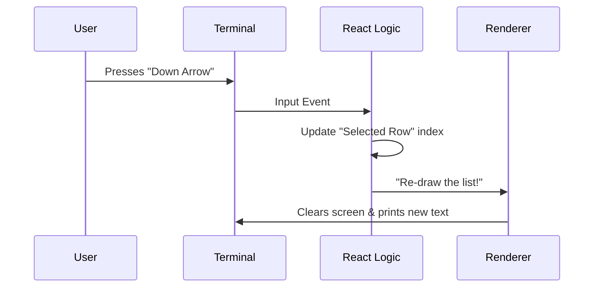

# Chapter 3: Interactive UI Composition

Welcome to Chapter 3!

In the previous chapter, [Global Theme State](02_global_theme_state.md), we wired up the "electricity" of our application. We gave it a brain that remembers the current color theme.

But right now, that brain has no body. Users can't *see* the theme, nor can they click a button to change it.

In this chapter, we will build the visual interface. We call this **Interactive UI Composition**.

### The Problem: Terminal Apps are Ugly
Traditionally, terminal tools are just plain text. If you want to ask a user for information, you usually get a boring blinking cursor:

`> Pick a theme: _`

We want something better. We want a rich, modern experience with borders, colors, and interactive lists that you can navigate with your arrow keys—just like a web app, but inside your terminal.

### The Solution: Lego Blocks
We solve this using **Composition**.

Instead of writing complex code to draw lines and handle keystrokes manually, we build our interface using pre-made "Lego blocks" (Components).
1.  **Structural Blocks:** Like `Pane`. These handle layout, borders, and titles.
2.  **Functional Blocks:** Like `ThemePicker`. These handle specific logic (like a list of choices).

---

## Building the Interface
We are working inside the `ThemePickerCommand` component (found in `theme.tsx`). Let's build it up step-by-step.

### Step 1: The Frame (`Pane`)
First, we need a container. In our design system, we use a component called `<Pane>`. Think of this as a picture frame or a window.

```tsx
import { Pane } from '../../components/design-system/Pane.js';

function ThemePickerCommand() {
  // We use 'permission' color to signal this is a settings change
  return (
    <Pane color="permission">
       {/* Content goes here */}
    </Pane>
  );
}
```

**Explanation:**
*   We don't need to calculate screen width or draw border characters like `|` or `+`.
*   The `<Pane>` component handles the drawing automatically.
*   The `color="permission"` prop tells the system to style the border (perhaps yellow or purple) to indicate a configuration task.

### Step 2: The Widget (`ThemePicker`)
Now that we have a frame, we need to put the picture inside. We use a specific widget called `<ThemePicker>`. This component already knows how to list colors and handle arrow keys.

```tsx
import { ThemePicker } from '../../components/ThemePicker.js';

// Inside the Pane...
<Pane color="permission">
  <ThemePicker 
    // We will handle events here shortly
  />
</Pane>
```

**Explanation:**
*   This is **Composition**: We placed the `ThemePicker` *inside* the `Pane`.
*   The `Pane` draws the box. The `ThemePicker` draws the list inside the box.

### Step 3: Handling Interaction
A UI is useless if it doesn't do anything. We need to tell the widget what to do when the user selects an option.

We combine the **UI** (this chapter) with the **Logic** (from [Global Theme State](02_global_theme_state.md)).

```tsx
// Inside ThemePickerCommand...
const [, setTheme] = useTheme(); // From Chapter 2

return (
  <Pane color="permission">
    <ThemePicker 
      onThemeSelect={(newSetting) => {
         setTheme(newSetting); // 1. Update the brain
         onDone(`Theme set to ${newSetting}`); // 2. Close the app
      }}
    />
  </Pane>
);
```

**Explanation:**
*   `onThemeSelect`: This is an event listener. It runs when you press "Enter" on a choice.
*   `onDone`: This is a function passed down to us. It tells the CLI, "We are finished here, you can exit now."

---

## Under the Hood: Rendering to Text

You might be wondering: *"How does React, which is usually for websites, work in a black-and-white terminal?"*

We use a library called **Ink**. It acts as a translator.

1.  **React:** "I want to render a `<Pane>` with a blue border."
2.  **Ink (Reconciler):** Translates "blue border" into special text characters (ANSI codes).
3.  **Terminal:** Displays the colored text.

### The Rendering Cycle
Here is what happens when you press the "Down Arrow" key:



### Internal Implementation Logic
The `Pane` component isn't magic. Under the hood, it's just a standard React Box with some borders.

```tsx
// Simplified concept of Pane.js
export const Pane = ({ children, color }) => {
  return (
    <Box borderStyle="round" borderColor={color} padding={1}>
      {children}
    </Box>
  );
};
```

Because we use this abstraction, we can change the design of `Pane` in *one file*, and every command in our CLI (login, deploy, theme) will update its look instantly.

---

## Putting it Together

Here is the final look of our component in `theme.tsx`. It combines the **Command Registration** (Ch 1), **Global State** (Ch 2), and **UI Composition** (Ch 3).

```tsx
// theme.tsx
export const call = async (onDone, _context) => {
  return <ThemePickerCommand onDone={onDone} />;
};

function ThemePickerCommand({ onDone }) {
  const [, setTheme] = useTheme();

  return (
    <Pane color="permission">
      <ThemePicker 
        onThemeSelect={(s) => { setTheme(s); onDone(...); }} 
        onCancel={() => onDone(...)}
        skipExitHandling={true} 
      />
    </Pane>
  );
}
```

**Explanation:**
*   `skipExitHandling`: We tell the picker *not* to kill the process immediately, so we can show a nice "Goodbye" message via `onDone`.

---

## Conclusion

You have just built a Graphical User Interface (GUI) purely out of text!

By using **Interactive UI Composition**:
1.  We separated layout (`Pane`) from logic (`ThemePicker`).
2.  We created a consistent look and feel.
3.  We made the code easy to read and modify.

Now we have a beautiful component, but... how does the CLI actually *run* this React code? It's not a standard JavaScript function.

In the next chapter, we will look at the machinery that takes this React component and executes it.

👉 **Next Chapter:** [Local JSX Execution Interface](04_local_jsx_execution_interface.md)

---

Generated by [Code IQ](https://github.com/adityasoni99/Code-IQ)