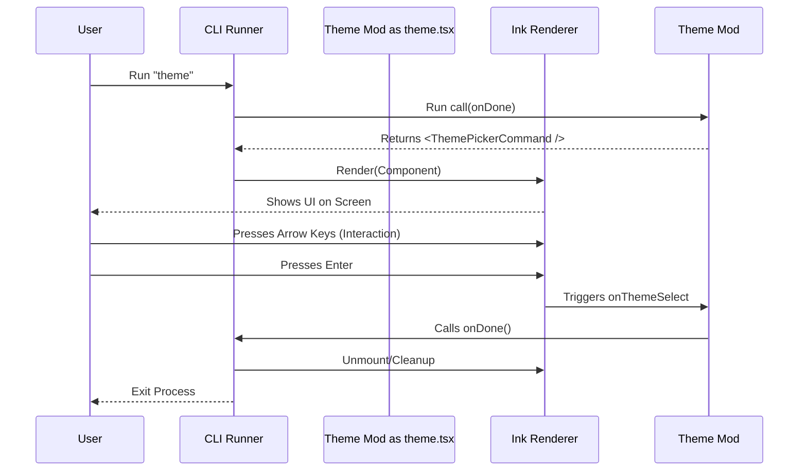

# Chapter 4: Local JSX Execution Interface

Welcome to Chapter 4!

In the previous chapter, [Interactive UI Composition](03_interactive_ui_composition.md), we built a beautiful, interactive `ThemePickerCommand` component using React. It has colors, borders, and logic.

However, a React component is just a definition. It's like a sheet of music. It doesn't make sound until a musician plays it.

In this chapter, we will look at the **Local JSX Execution Interface**. This is the "musician" or the "engine" that takes your React code and actually runs it in the terminal.

### The Problem: Scripts vs. Apps
Standard terminal commands are usually simple scripts. They run from top to bottom and then stop.
1.  Read input.
2.  Calculate.
3.  Print result.
4.  Exit.

But our Theme Picker is different. It needs to:
*   **Stay alive** (wait for user input).
*   **Re-draw** itself when the user presses an arrow key.
*   **Clean up** nicely when finished.

We can't just call a function and expect it to work like a web page. We need a special interface to handle this "Mini-App" lifecycle.

### The Solution: The Game Console
Think of the main CLI as a **Game Console** (like a Nintendo Switch or PlayStation).
Think of our `theme.tsx` file as a **Game Cartridge**.

The **Local JSX Execution Interface** is the slot where you insert the cartridge. It establishes a contract:
1.  **Start:** "Here is the game (JSX), please put it on the TV."
2.  **Play:** The console handles the electricity (rendering) and the controller (keyboard inputs).
3.  **End:** The game tells the console "Game Over," and the console returns to the home menu.

---

## The Contract: The `call` Function

To make our "cartridge" fit into the console, we must export a specific function named `call`.

Let's look at the bottom of our `theme.tsx` file.

```typescript
// theme.tsx
import type { LocalJSXCommandCall } from '../../types/command.js';

export const call: LocalJSXCommandCall = async (onDone, _context) => {
  // We return the React Component we want to show
  return <ThemePickerCommand onDone={onDone} />;
};
```

**Explanation:**
*   `export const call`: This is the standard entry point. The CLI looks specifically for a function with this name.
*   `async`: The CLI knows this might take time to set up.
*   `return <ThemePickerCommand ... />`: Instead of returning a number or text, we return **JSX** (Visual Elements).

### The "Game Over" Button: `onDone`
Notice the argument `onDone`. This is the most important tool we get from the system.

Since a React app loops forever (waiting for clicks), the system doesn't know when to stop. We must pass `onDone` down to our component so it can say, "I'm finished now!"

```typescript
// How we pass it down
<ThemePickerCommand onDone={onDone} />
```

If we look back at Chapter 3, this is why we called `onDone()` inside our component when the user selected a theme.

---

## Connecting to Registration

Remember in [Command Registration Pattern](01_command_registration_pattern.md), we defined the command type?

```typescript
// index.ts
const theme = {
  type: 'local-jsx', // <--- This line is key!
  name: 'theme',
  load: () => import('./theme.js'),
}
```

When the CLI sees `type: 'local-jsx'`, it knows:
1.  "I should load the file."
2.  "I should look for the `call` function."
3.  "I should expect that function to give me a React Element."
4.  "I should render that element using Ink."

---

## Under the Hood: The Runner

How does the CLI actually render this? It acts as the "Runtime Environment."

Here is the flow of data when you type `theme`:



### Internal Implementation Logic
The code inside the CLI framework that handles this looks roughly like this (simplified):

```typescript
// Framework logic (simplified)
import { render } from 'ink';

async function runLocalJSX(commandModule) {
  return new Promise((resolve) => {
    
    // 1. Define what happens when the app finishes
    const onDone = () => {
      app.unmount(); // Clear the screen
      resolve();     // Tell the CLI to move on
    };

    // 2. Get the JSX from the module's 'call' function
    const ui = await commandModule.call(onDone);

    // 3. Start the Ink Renderer (The Engine)
    const app = render(ui);
  });
}
```

**Explanation:**
*   `new Promise`: The CLI pauses here. It won't finish the command until `resolve` is called.
*   `render(ui)`: This starts the "Game Engine" (Ink). It takes over the terminal screen.
*   `app.unmount()`: When `onDone` runs, we clean up the memory and the screen artifacts.

---

## Why this matters
By using this **Execution Interface**, we gain three superpowers:

1.  **Consistency:** Every command (`login`, `theme`, `deploy`) is launched the exact same way.
2.  **Safety:** The CLI handles the messy parts of starting and stopping the rendering engine. We just write the UI.
3.  **Flexibility:** We can swap out the "Game Console" (the runner) without changing the "Cartridge" (our code).

---

## Conclusion

You have successfully learned how to launch a "mini-app" inside your terminal!

*   We learned that the `call` function is the entry point.
*   We learned that passing `onDone` allows the interactive app to exit cleanly.
*   We understood that the CLI acts as a "Runtime" that renders the JSX we provide.

Our application is now fully functional. It registers itself, manages state, renders a UI, and executes cleanly.

However, as our app grows, having all these commands might make startup slow. How do we ensure the user doesn't wait for code they aren't using?

👉 **Next Chapter:** [Dynamic Loading Strategy](05_dynamic_loading_strategy.md)

---

Generated by [Code IQ](https://github.com/adityasoni99/Code-IQ)