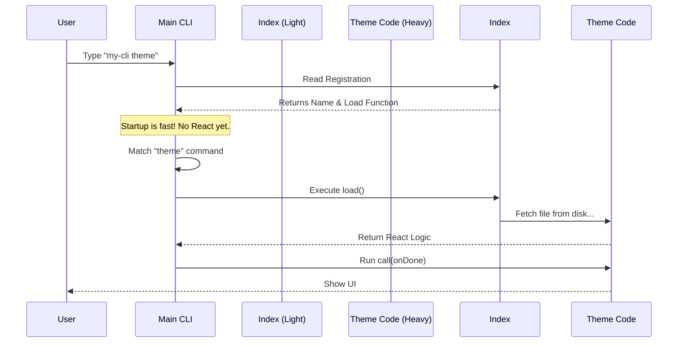

# Chapter 5: Dynamic Loading Strategy

Welcome to the final chapter of the **theme** project tutorial!

In the previous chapter, [Local JSX Execution Interface](04_local_jsx_execution_interface.md), we learned how to run our interactive "mini-app" inside the terminal. We have built a fully functional Theme Picker.

However, as we finish, we need to think about **Scale**.

### The Problem: The Overpacked Suitcase
Imagine you are going on a trip, but you don't know yet if you are going swimming, skiing, or to a formal dinner.

*   **The Bad Way:** You pack your skis, your swimsuit, your tuxedo, and your camping gear into one giant suitcase. It is so heavy that you can barely walk out the door.
*   **The Application Equivalent:** When you run a CLI tool, if it loads **all the code** for every single command (login, deploy, theme, logout, database) right at the start, the application will take several seconds just to wake up. This feels sluggish and broken.

### The Solution: Room Service
The **Dynamic Loading Strategy** is like staying at a hotel with excellent room service.
1.  You arrive with just a small wallet (lightweight).
2.  If you decide to swim, you pick up the phone and order a swimsuit.
3.  The hotel brings the swimsuit to you *at that exact moment*.

In our code, we want the CLI to start instantly. We only want to load the heavy React code for the `theme` command **if and only if** the user actually types `theme`.

---

## Static vs. Dynamic Imports

To understand this strategy, we need to see the difference between how we usually import code and how we *should* import it for performance.

### The Old Way (Static)
This is what you see at the top of most files.

```typescript
// ❌ This runs immediately when the app starts
import { heavyLogic } from './heavy-file.js';

const command = {
  name: 'theme',
  run: heavyLogic // The code is already loaded here
};
```

If we do this for 50 commands, the computer has to read 50 heavy files before it can print "Hello".

### The New Way (Dynamic)
We keep the import inside a function.

```typescript
// ✅ This waits until someone calls load()
const command = {
  name: 'theme',
  // The 'import' keyword is used as a function here
  load: () => import('./heavy-file.js')
};
```

This acts as a "Pause" button. The file `./heavy-file.js` is ignored until the `load()` function is actually executed.

---

## Implementing the Strategy

Let's look at our `index.ts` file again. This is the entry point we created in [Command Registration Pattern](01_command_registration_pattern.md), but now we understand *why* it looks this way.

### Step 1: The Lightweight Registration
We define the command without importing React, Ink, or any UI libraries.

```typescript
// index.ts
import type { Command } from '../../commands.js'

// No heavy imports here! Just text data.
const theme = {
  type: 'local-jsx',
  name: 'theme',
  description: 'Change the theme',
  // ...
```

**Explanation:**
*   This file is tiny. The computer can read it in milliseconds.

### Step 2: The Lazy Loader
We add the `load` function. This is the bridge between the lightweight world and the heavy world.

```typescript
// index.ts (continued)
  load: () => import('./theme.js'),
} satisfies Command

export default theme
```

**Explanation:**
*   `() => import(...)`: This is an arrow function. It wraps the import so it doesn't happen yet.
*   `'./theme.js'`: This file contains our `ThemePicker`, `Pane`, and all the React logic we wrote in [Interactive UI Composition](03_interactive_ui_composition.md).

---

## Under the Hood: The Timeline

How does this affect the user experience? Let's trace the execution flow.

1.  **Startup:** The CLI boots up. It reads `index.ts`. It sees `name: "theme"`. It ignores `theme.js`.
2.  **Routing:** The CLI checks what the user typed.
3.  **Loading:** The user typed `theme`. *Now* the CLI pulls the trigger on the `load()` function.



### Internal Implementation Logic
What does the CLI do with that `import()`?

In JavaScript, `import()` returns a **Promise**. You can think of a Promise as a "Ticket." You give the ticket to the system, and the system asks you to wait while it fetches the file.

Here is a simplified version of the internal runner:

```typescript
// Internal CLI Runner Logic
async function executeCommand(commandObj) {
  
  console.log("Loading code...");
  
  // 1. Trigger the dynamic import
  // The keyword 'await' pauses execution until the file arrives
  const module = await commandObj.load();

  // 2. Now we have the code from theme.tsx!
  // We can execute the logic we built in Chapter 4
  await module.call();
}
```

**Explanation:**
*   `await`: This is crucial. It tells JavaScript to pause this specific function until the file is fully loaded into memory.
*   Once loaded, `module` contains everything exported from `theme.tsx`.

---

## Why is this "Beginner Friendly"?

You might think, "This looks complicated." But it actually simplifies your life as a developer:

1.  **Isolation:** You can work on `theme.tsx` and break it completely. But because it's loaded dynamically, the `login` command will still work perfectly! The error is contained.
2.  **Speed:** You can add 1,000 commands to your CLI. As long as you use this pattern, the application will always start instantly.
3.  **Organization:** It forces you to keep your heavy logic (React components) separate from your definition logic (Command name).

---

## Conclusion

Congratulations! You have completed the **Dynamic Loading Strategy** chapter and the tutorial for the `theme` project!

Let's review what we built across these five chapters:
1.  We created an **ID Card** for our command ([Command Registration Pattern](01_command_registration_pattern.md)).
2.  We connected our command to the **Application Brain** ([Global Theme State](02_global_theme_state.md)).
3.  We built a beautiful **Visual Interface** ([Interactive UI Composition](03_interactive_ui_composition.md)).
4.  We learned how to **Run and Render** that interface ([Local JSX Execution Interface](04_local_jsx_execution_interface.md)).
5.  We optimized it to load **On-Demand** (this chapter).

You now have a fully modular, high-performance command-line feature that allows users to customize their experience. You can use this exact same pattern to build any other feature, from complex deployment forms to interactive dashboards.

Happy coding! 🚀

---

Generated by [Code IQ](https://github.com/adityasoni99/Code-IQ)