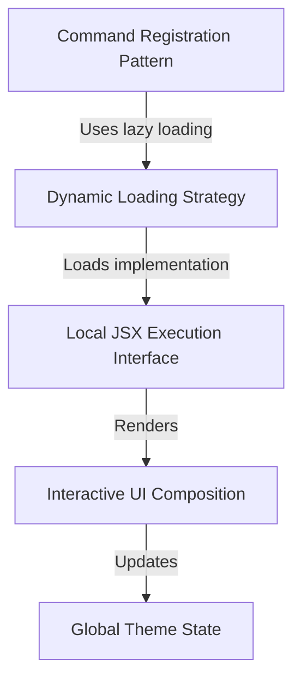

# Tutorial: theme

This project implements a **theme management** command for a CLI application. It allows users to interactively change the visual appearance of the tool by launching a temporary, **React-based** UI directly in the terminal. The command is designed to be lightweight, using a *dynamic loading* strategy to fetch the necessary code only when the user explicitly requests to change the theme.

## Chapters

1. [Command Registration Pattern](01_command_registration_pattern.md)
2. [Global Theme State](02_global_theme_state.md)
3. [Interactive UI Composition](03_interactive_ui_composition.md)
4. [Local JSX Execution Interface](04_local_jsx_execution_interface.md)
5. [Dynamic Loading Strategy](05_dynamic_loading_strategy.md)

---

Generated by [Code IQ](https://github.com/adityasoni99/Code-IQ)