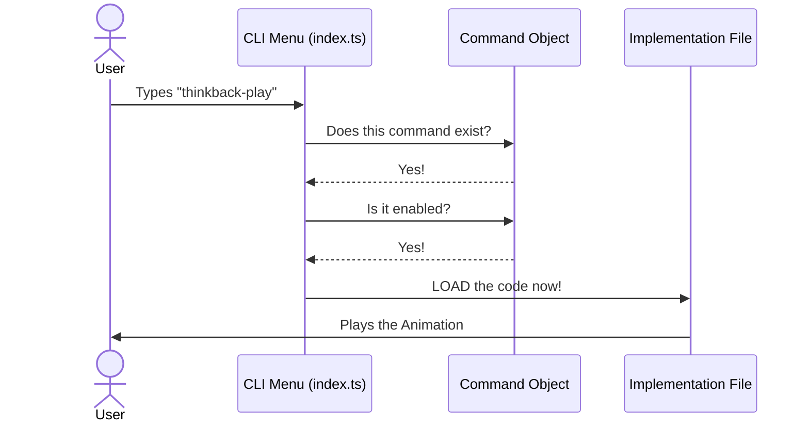

# Chapter 1: Local Command Registration

Welcome to the **thinkback-play** project! If you've ever wondered how a command-line interface (CLI) knows which commands exist without loading every single piece of code at once, you're in the right place.

## The Motivation: The Restaurant Menu

Imagine walking into a restaurant. You sit down and pick up a menu.
- The **Menu** tells you the name of the dish (e.g., "Spaghetti") and a description ("Pasta with tomato sauce").
- The **Kitchen** contains the actual ingredients and the chef who knows the recipe to cook it.

**Local Command Registration** acts exactly like the **Menu**.

Without this system, the restaurant would have to cook *every single dish* before you even sat down, just in case you ordered one. That would be slow and wasteful!

In our code, we want to solve this specific use case:
> **Goal:** Create a command called `thinkback-play`. The CLI should know this command exists and is hidden (secret menu), but it shouldn't load the heavy animation code until the user actually runs it.

## Key Concepts

To solve this, we split our command into two parts:

1.  ** The Registration (`index.ts`)**: The menu item. It defines the name, description, and rules for who can see it.
2.  ** The Implementation (`thinkback-play.ts`)**: The recipe. This is the code that actually does the work.

## How It Works

Let's build the "Menu Item" (Registration) first. We define an object that describes our command.

### Step 1: Naming the Command
First, we give our command a `type`, a `name`, and a `description`.

```typescript
// From index.ts
const thinkbackPlay = {
  type: 'local',           // It's a local command
  name: 'thinkback-play',  // The command users type
  description: 'Play the thinkback animation',
  // ... more settings later
}
```
* **Explanation:** This is pure metadata. No heavy code is running here. We are just declaring that "thinkback-play" is a valid command.

### Step 2: The Contract
The CLI needs to know where to find the "Chef" (the implementation) when someone orders this dish. We use a `load` function for this.

```typescript
// From index.ts
// ... inside the object
  load: () => import('./thinkback-play.js'),
} satisfies Command // Ensures we follow the rules
```
* **Explanation:** This points to the file where the actual logic lives. We will explore why we use `import()` inside a function in [Lazy Loading](03_lazy_loading.md).

## What Happens Under the Hood?

When you start the CLI application, it doesn't read every code file. It only reads these "Registration" objects.

Here is what happens when a user tries to run a command:



1.  **Lookup:** The CLI checks the registry list.
2.  **Validation:** It checks if the command is enabled.
3.  **Loading:** Only *then* does it go to the file system to load the heavy implementation code.

## Deep Dive: The Code

Let's look at the actual code provided in the project files to see how this comes together.

### 1. The Registration File (`index.ts`)
This file is small and lightweight. It imports very little dependencies to keep the application start-up time fast.

```typescript
import type { Command } from '../../commands.js'
// ... imports for checks

const thinkbackPlay = {
  type: 'local',
  name: 'thinkback-play',
  // ...
```
* **Explanation:** We import `Command` purely for TypeScript type-checking to ensure our object matches the expected shape.

#### Visibility Settings
We can control who sees or runs the command right here in the registry.

```typescript
  // ... inside thinkbackPlay object
  isHidden: true,
  supportsNonInteractive: false,
```
* **Explanation:** `isHidden: true` means this command won't show up when you type `--help`. It's like a "Secret Menu" item.

#### Feature Gating
We can also conditionally enable the command based on user settings or flags.

```typescript
  isEnabled: () =>
    checkStatsigFeatureGate_CACHED_MAY_BE_STALE('tengu_thinkback'),
```
* **Explanation:** This function checks if the user is allowed to run this command. We will explain how this check works in detail in [Feature Gating (Statsig)](02_feature_gating__statsig_.md).

### 2. The Implementation File (`thinkback-play.ts`)
This file exports a specific function called `call`. This is what the CLI looks for after it follows the `load` instruction.

```typescript
// From thinkback-play.ts
export async function call(): Promise<LocalCommandResult> {
  // Get skill directory from installed plugins config
  const v2Data = loadInstalledPluginsV2()
  // ... logic continues
```
* **Explanation:** The `call()` function is the standard entry point. When the `load()` function in `index.ts` runs, it finds this exported function and executes it.

## Conclusion

In this chapter, we learned that **Local Command Registration** is about separating the definition of a command from its execution. By treating commands as objects with metadata, we keep our CLI fast and organized.

**We learned:**
1.  **Registration (`index.ts`)** acts as a lightweight menu.
2.  **Implementation (`thinkback-play.ts`)** acts as the kitchen that does the heavy lifting.
3.  We can hide or disable commands without loading their code.

But wait—in our code, we saw a function called `isEnabled`. How does the system decide if a user is "worthy" of seeing a command?

Let's find out in the next chapter!

[Next Chapter: Feature Gating (Statsig)](02_feature_gating__statsig_.md)

---

Generated by [Code IQ](https://github.com/adityasoni99/Code-IQ)