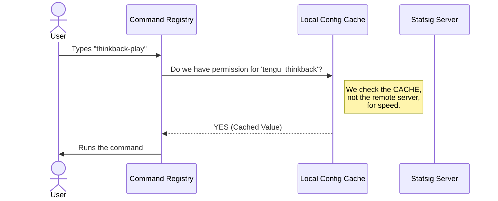

# Chapter 2: Feature Gating (Statsig)

In the previous chapter, [Local Command Registration](01_local_command_registration.md), we created a "menu item" for our command. We told the CLI that `thinkback-play` exists.

However, just because an item is on the menu doesn't mean everyone can order it. Maybe the kitchen is only testing it, or it's reserved for VIP members.

## The Motivation: Keycard Access

Imagine a high-tech office building. There is a specific room labeled "Thinkback Control Room."
- The **Room** is the code that runs the command.
- The **Door** is the barrier preventing unauthorized access.

If you walk up to the door and turn the handle, it won't open. You need to tap your **ID Badge**. A central security system checks your badge and decides: *Does this person have the specific permission to enter?*

In our software, this concept is called **Feature Gating**.

> **Goal:** We want the `thinkback-play` command to exist in the code, but the CLI should refuse to run it unless the user has the specific `tengu_thinkback` permission enabled in their configuration.

## Key Concepts

To implement this security system, we rely on a tool called **Statsig**. Here are the pieces of the puzzle:

1.  **The Gate Name (`tengu_thinkback`)**: This is the unique ID of the permission. It's like the specific frequency on the keycard.
2.  **The Checker (`checkStatsigFeatureGate...`)**: This is the card reader on the door. It asks the security system "Yes or No?"
3.  **The `isEnabled` Property**: This is the lock mechanism. If the Checker says "No," this property remains false, and the command effectively doesn't exist for that user.

## How It Works

We implement this check inside the registration object we built in the previous chapter (`index.ts`). We simply add a rule to the `isEnabled` property.

### Step 1: Import the Security System
First, we need to bring in the tool that knows how to read permissions.

```typescript
// From index.ts
import { 
  checkStatsigFeatureGate_CACHED_MAY_BE_STALE 
} from '../../services/analytics/growthbook.js'
```
* **Explanation:** We are importing a specific helper function. Don't worry about the long name for now; think of it as the "Card Reader."

### Step 2: Install the Lock
Now, inside our command definition, we hook up the lock.

```typescript
// From index.ts
const thinkbackPlay = {
  // ... name and type defined previously
  
  // The Lock Mechanism:
  isEnabled: () =>
    checkStatsigFeatureGate_CACHED_MAY_BE_STALE('tengu_thinkback'),

  // ... load function defined previously
}
```
* **Explanation:** When the CLI looks at this command, it runs `isEnabled`.
* The code checks the specific ID `'tengu_thinkback'`.
* If it returns `true`, the command works. If `false`, the CLI acts like the command doesn't exist.

## What Happens Under the Hood?

Let's trace what happens when you press Enter in your terminal. We want this check to be incredibly fast so the user doesn't feel a lag.



### Why use "Cached" values?
You might have noticed the function name is quite long: `checkStatsigFeatureGate_CACHED_MAY_BE_STALE`.

If we asked the remote Statsig server for permission every single time you typed a command, your CLI would be slow. It would have to connect to the internet, wait for a response, and then run.

Instead, the application downloads the permissions **once** (usually when the app starts or periodically in the background) and saves them locally.
- **Cached:** It reads from a local file/memory.
- **May Be Stale:** It might be a few minutes old, but that is acceptable for a CLI command to ensure it feels snappy.

## Deep Dive: The Implementation

Let's look at the implementation details in `index.ts` again to see how this fits into the bigger picture.

```typescript
// From index.ts
const thinkbackPlay = {
  type: 'local',
  name: 'thinkback-play',
  
  // 1. The Gate Check
  isEnabled: () =>
    checkStatsigFeatureGate_CACHED_MAY_BE_STALE('tengu_thinkback'),

  // 2. Visibility
  isHidden: true, 
  
  // 3. The Implementation (See Next Chapter)
  load: () => import('./thinkback-play.js'),
} satisfies Command
```

### Combining Concepts
*   **`isEnabled`**: Controls if the command **works**.
*   **`isHidden`**: Controls if the command **appears** in the `--help` list.

In this specific case, `thinkback-play` is actually hidden (`isHidden: true`) *regardless* of the feature gate. This is because it is an internal command meant to be run by other tools, not necessarily typed manually by humans. However, the `isEnabled` check ensures that even if a script tries to run it, the security check must pass.

## Conclusion

In this chapter, we learned how to secure our commands using **Feature Gating**.

**We learned:**
1.  **Feature Gating** acts like a keycard system to control access.
2.  We use the `isEnabled` property in our command registration.
3.  We rely on **Cached** checks to keep the CLI fast, accepting that data might be slightly "stale."

Now that the security system has approved our access, we are allowed to enter the room! But the room is currently empty. We need to bring in the furniture and the machinery (the code). To keep things efficient, we only bring them in exactly when we need them.

Let's learn how to do that efficiently in the next chapter.

[Next Chapter: Lazy Loading](03_lazy_loading.md)

---

Generated by [Code IQ](https://github.com/adityasoni99/Code-IQ)