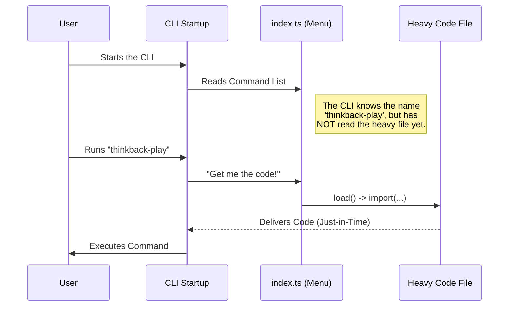

# Chapter 3: Lazy Loading

In the previous chapter, [Feature Gating (Statsig)](02_feature_gating__statsig_.md), we implemented a security system. We ensured that only authorized users (those with the `tengu_thinkback` permission) could access our command.

Now we have a different problem: **Performance**.

## The Motivation: The Overcrowded Factory

Imagine a car factory.
- To build a car, you need thousands of parts: engines, tires, windshields, seats, etc.
- If you piled **every single part** for **every type of car** onto the factory floor first thing in the morning, there would be no room to walk! The factory would be cluttered, slow, and inefficient.

This is exactly what happens to software if we aren't careful.

> **The Problem:** If our CLI has 50 different commands, and we load the code for *all* of them when the program starts, the user has to wait several seconds just to see the blinking cursor.

> **The Goal:** We want a "Just-in-Time" delivery system. We want the CLI to load the heavy code for `thinkback-play` **only** at the exact moment the user tries to run it.

## Key Concepts

To solve this, we use a technique called **Lazy Loading**.

### Static vs. Dynamic Imports
In TypeScript/JavaScript, there are two ways to bring in code from other files.

1.  **Static Import (Top of file):**
    *   This is the standard `import ... from ...`.
    *   **Behavior:** "Load this immediately, before the program even starts running."
2.  **Dynamic Import (Inside code):**
    *   This is the function `import(...)`.
    *   **Behavior:** "Load this file right now, while the program is already running."

For our CLI to be fast, we want to avoid option #1 for our command logic.

## How It Works

We implement Lazy Loading inside our registration object in `index.ts`.

### Step 1: avoiding the Top-Level Import
Normally, you might be tempted to do this:

```typescript
// ❌ BAD for performance
// This loads the heavy code immediately!
import { call } from './thinkback-play.js' 

const thinkbackPlay = {
  name: 'thinkback-play',
  run: call // The code is already here, occupying memory
}
```

### Step 2: Using the `load` Property
Instead, we use a special property in our command object called `load`. We give it a function that returns a **Dynamic Import**.

```typescript
// ✅ GOOD for performance
// No heavy imports at the top!

const thinkbackPlay = {
  name: 'thinkback-play',
  // Only runs when the CLI specifically calls this function
  load: () => import('./thinkback-play.js'), 
}
```

*   **Explanation:** The arrow function `() => ...` acts like a pause button. The code inside it (`import(...)`) **does not run** until someone actually presses that button (executes the function).

## What Happens Under the Hood?

Let's visualize the timeline. Notice how the heavy file is ignored until the very end.



1.  **Startup:** The application starts instantly because it's only reading text metadata (names, descriptions).
2.  **Waiting:** The application sits idle, using very little memory.
3.  **Action:** When the user commands it, the application reaches out to the disk, grabs the file, and runs it.

## Deep Dive: The Code

Let's look at `index.ts` again. We've looked at `type`, `name`, and `isEnabled`. Now let's focus on the `load` property.

```typescript
// From index.ts
const thinkbackPlay = {
  // ... other properties (type, name, isEnabled)
  
  // The Lazy Loader:
  load: () => import('./thinkback-play.js'),

} satisfies Command
```

### Why `satisfies Command`?
You might see `satisfies Command` at the end of the object. This is a TypeScript feature.
It ensures that our object has all the required parts (like `name` and `load`). If we forgot to write the `load` function, TypeScript would give us a red error line here.

### The Implementation File
When the `import()` finishes, it looks for the file `./thinkback-play.js`.

```typescript
// From thinkback-play.ts

// The CLI expects this specific function name "call"
export async function call(): Promise<LocalCommandResult> {
  
  // Heavy logic starts here...
  const v2Data = loadInstalledPluginsV2()
  
  return { type: 'success' } // simplified
}
```

*   **Explanation:** The `import()` statement imports the *entire* file. The CLI framework is smart enough to look inside that imported file, find the exported function named `call`, and execute it.

## Conclusion

In this chapter, we learned how to keep our application fast using **Lazy Loading**.

**We learned:**
1.  **Lazy Loading** is like "Just-in-Time" delivery for code.
2.  **Static Imports** happen at startup (slow), while **Dynamic Imports** happen on demand (fast startup).
3.  We use `load: () => import(...)` to delay loading until necessary.

Now our command is:
1.  Registered (Chapter 1)
2.  Secured (Chapter 2)
3.  Efficiently Loaded (Chapter 3)

However, once the code loads, it needs to know *what* to play. It needs to know about the environment it is running in. Does the user have specific plugins installed? Where are the files located?

To handle this, we need **Context-Aware Configuration**.

[Next Chapter: Context-Aware Configuration](04_context_aware_configuration.md)

---

Generated by [Code IQ](https://github.com/adityasoni99/Code-IQ)