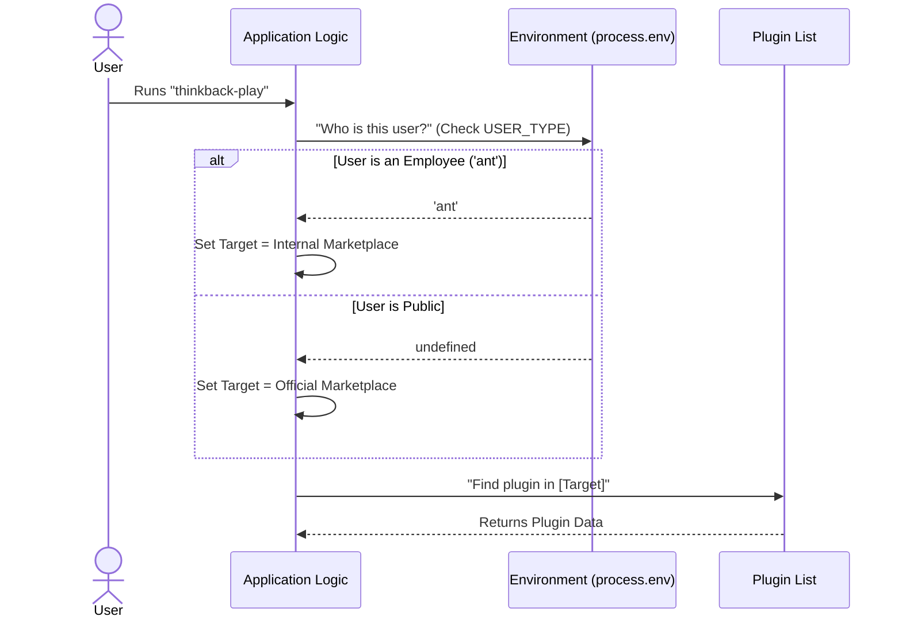

# Chapter 4: Context-Aware Configuration

In the previous chapter, [Lazy Loading](03_lazy_loading.md), we learned how to load our heavy code only when strictly necessary.

Now, our code is loaded and running. But there is a catch: The code is run by different types of users. Some are public users, and some are internal employees (often called "Ants" in this codebase). Depending on who they are, the data they need to access is stored in a different location.

## The Motivation: The Corporate Cafeteria

Imagine you are in line at a corporate cafeteria. You place an order for a burger.

1.  **The Interaction:** You tap your badge at the register.
2.  **The Check:** The scanner reads your badge context.
    *   **Scenario A (Visitor):** The scanner sees "Visitor." It charges the standard price from the **Public Menu**.
    *   **Scenario B (Employee):** The scanner sees "Employee." It automatically switches to the **Internal Menu** and applies a discount.

The "Burger" is the same, but the **source** (Public Menu vs. Internal Menu) changes based on who you are.

> **Goal:** We need our code to find the installed `thinkback` plugin.
> *   If the user is an **Employee ('ant')**, we look in the `Internal Marketplace`.
> *   If the user is **Public**, we look in the `Official Marketplace`.

## Key Concepts

To build this "Scanner," we use **Context-Aware Configuration**.

### 1. The Environment Variable (`process.env`)
Your computer has a set of invisible sticky notes attached to every program it runs. These are called **Environment Variables**.
In this project, we look for a specific sticky note called `USER_TYPE`.
*   If it says `ant`, the user is an employee.
*   If it's empty or says anything else, they are a public user.

### 2. The Switch
We write a small function that acts as the traffic cop. It looks at the variable and points the code in the right direction.

## How It Works

We implement this logic inside `thinkback-play.ts`. We define two different names for our "Marketplaces."

### Step 1: Define the Options
First, we establish the two possible sources.

```typescript
// From thinkback-play.ts
import { OFFICIAL_MARKETPLACE_NAME } from '../../utils/plugins/officialMarketplace.js'

// The private, internal source
const INTERNAL_MARKETPLACE_NAME = 'claude-code-marketplace'
```
*   **Explanation:** These are just strings (names). One is for the public, one is for employees.

### Step 2: The Context Check
Now, we write a helper function to determine the ID. This is our "Badge Scanner."

```typescript
// From thinkback-play.ts
function getPluginId(): string {
  // Check the "ID Badge" (Environment Variable)
  const marketplaceName =
    process.env.USER_TYPE === 'ant'
      ? INTERNAL_MARKETPLACE_NAME // Employee? Use Internal.
      : OFFICIAL_MARKETPLACE_NAME // Everyone else? Use Official.

  // Return the full ID, e.g., "thinkback@claude-code-marketplace"
  return `thinkback@${marketplaceName}`
}
```
*   **Explanation:**
    *   `process.env.USER_TYPE`: This reads the system configuration.
    *   `? ... : ...`: This is a shorthand "If / Else". If 'ant', do the first thing; otherwise, do the second.
    *   The function returns the correct identifier string tailored to the specific user.

## What Happens Under the Hood?

Let's visualize how the application makes this decision at runtime.



1.  **Query:** The app asks the environment for context.
2.  **Decision:** It constructs the specific search term (the Plugin ID).
3.  **Lookup:** It searches the database using *only* that specific ID.

## Deep Dive: The Implementation

Now that we have our `getPluginId` helper, let's see how it's used in the main logic of `thinkback-play.ts`.

### Using the Context
The `call()` function (which we learned about in previous chapters) uses this ID to find data.

```typescript
// From thinkback-play.ts
export async function call(): Promise<LocalCommandResult> {
  // 1. Load the big list of all installed plugins
  const v2Data = loadInstalledPluginsV2()
  
  // 2. Determine WHO we are looking for based on context
  const pluginId = getPluginId() 

  // 3. Find the specific entry
  const installations = v2Data.plugins[pluginId]
  
  // ... continue to check if it exists
```

*   **Explanation:**
    *   `loadInstalledPluginsV2()`: This loads a huge JSON object containing everything the user has installed.
    *   `getPluginId()`: This runs our context logic from Step 2.
    *   `v2Data.plugins[pluginId]`: We use the result to look up the specific configuration we need.

### Why do we do this?
If we didn't have this check, an employee might have the plugin installed from the internal store, but the code would be looking for the public version. The code would say "Plugin not found!" even though it is right there.

By making the configuration **Context-Aware**, the code adapts to the user's reality without the user having to configure anything manually.

## Conclusion

In this chapter, we learned about **Context-Aware Configuration**.

**We learned:**
1.  **Environment Variables** act like ID badges that tell the code who is running it.
2.  We use conditional logic to switch between an **Internal Marketplace** and an **Official Marketplace**.
3.  This ensures the application looks for the correct resources for that specific user.

Now that the application knows *who* the user is and *which* plugin ID to look for, it has successfully found the plugin entry in the configuration.

But a configuration entry is just text. We need to find the actual images and animation files on the hard drive to play the animation.

Let's learn how to locate those physical files in the next chapter.

[Next Chapter: Plugin Asset Discovery](05_plugin_asset_discovery.md)

---

Generated by [Code IQ](https://github.com/adityasoni99/Code-IQ)