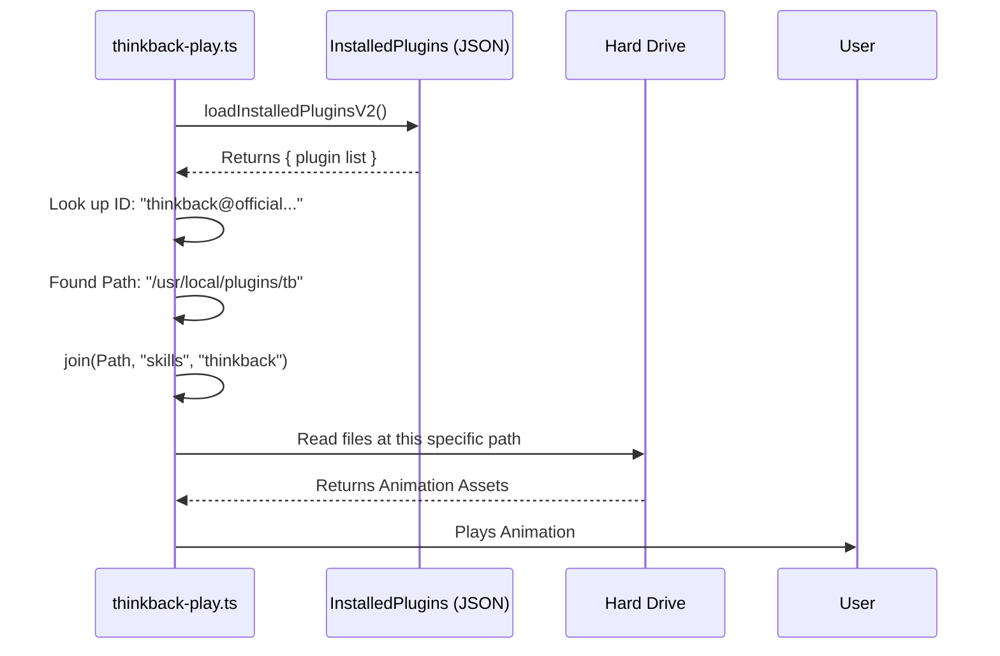

# Chapter 5: Plugin Asset Discovery

Welcome to the final chapter of our tutorial series!

In the previous chapter, [Context-Aware Configuration](04_context_aware_configuration.md), we learned how to identify exactly *which* version of a plugin the user needs (e.g., `thinkback@official-marketplace` vs. `thinkback@claude-code-marketplace`).

Now we have the ID, but we have a physical problem: **Where are the files?**

## The Motivation: The Library Card Catalog

Imagine walking into a massive library to find a specific book. You have the title (the ID), but you don't know where it is.
- Is it on the 1st floor or the 3rd?
- Is it in Aisle 5 or Aisle 99?

If you just wandered around randomly looking for it, you'd never find it. Instead, you go to the **Card Catalog**. You look up the ID, and the card tells you exactly: *"Row 4, Shelf B."*

In our software:
- The **Book** is the animation code (the assets).
- The **Library** is the user's hard drive.
- The **Card Catalog** is our **Plugin Asset Discovery** system.

> **Goal:** We need to find the folder on the user's computer where the `thinkback` images and scripts are stored so we can play the animation.

## Key Concepts

To solve this, we rely on a central registry. We don't guess paths like `C:\Program Files\...`. We ask the registry for the location.

### 1. The Registry (`loadInstalledPluginsV2`)
This function acts as the database. It scans a specific configuration file on the computer that lists every single plugin the user has ever installed.

### 2. The Asset Path (`installPath`)
This is the specific folder path returned by the registry. It points to the root folder of that specific plugin version.

### 3. Path Joining
Once we find the root folder (e.g., `/User/plugins/thinkback-v1`), we need to dig deeper to find the specific "skill" folder. We use a helper called `join` to glue these folder names together safely.

## How It Works

Let's look at how we locate these files in `thinkback-play.ts`.

### Step 1: Open the "Card Catalog"
First, we load the entire list of installed plugins.

```typescript
// From thinkback-play.ts
import { loadInstalledPluginsV2 } from '../../utils/plugins/installedPluginsManager.js'

// ... inside call() function
const v2Data = loadInstalledPluginsV2()
```
*   **Explanation:** `v2Data` now holds a massive object containing details about every plugin on the system. It's our map.

### Step 2: Look up the ID
We use the ID we generated in Chapter 4 (Context-Aware Configuration) to find our specific entry.

```typescript
// pluginId comes from our previous chapter logic
const installations = v2Data.plugins[pluginId]
```
*   **Explanation:** We look inside the `plugins` list using our key.
*   **Result:** This returns an array (a list) of installations. Usually, there is just one active installation.

### Step 3: Check for Existence
Before we try to read files, we must ensure the plugin is actually there.

```typescript
if (!installations || installations.length === 0) {
  return {
    type: 'text',
    value: 'Thinkback plugin not installed.',
  }
}
```
*   **Explanation:** If the list is empty or undefined, it means the user hasn't installed the plugin yet. We return a helpful error message instead of crashing.

### Step 4: Get the Address
Now we grab the first installation from the list and extract the physical path.

```typescript
const firstInstall = installations[0]

// This string is the physical path on the hard drive
// e.g., "/Users/alice/.claude/plugins/thinkback-1.0.0"
const rootPath = firstInstall.installPath 
```
*   **Explanation:** `installPath` is the "Row 4, Shelf B" from our library analogy. It is the exact location on the disk.

### Step 5: Construct the Full Path
Finally, we build the full path to the specific asset we want (the `skills` folder).

```typescript
import { join } from 'path' // Node.js helper

// Combines: rootPath + "skills" + "thinkback"
const skillDir = join(rootPath, 'skills', 'thinkback')
```
*   **Explanation:** We use `join` because different computers use different slashes (Windows uses `\`, Mac/Linux uses `/`). `join` handles this automatically for us.

## What Happens Under the Hood?

Here is the flow of information when the code runs:



1.  **Load:** The app reads the registry file.
2.  **Search:** It finds the object matching our ID.
3.  **Resolve:** It combines the base path with the subfolders.
4.  **Execute:** It hands this valid path to the animation engine.

## Deep Dive: The Code Implementation

Let's look at the final assembly of these concepts in the `call` function.

```typescript
// From thinkback-play.ts
export async function call(): Promise<LocalCommandResult> {
  const v2Data = loadInstalledPluginsV2()
  
  // 1. Get the ID (from Chapter 4)
  const pluginId = getPluginId()
  
  // 2. Look it up
  const installations = v2Data.plugins[pluginId]

  // 3. Validate it exists
  if (!installations || !installations[0]?.installPath) {
     return { type: 'text', value: 'Installation path not found.' }
  }

  // 4. Construct the path
  const skillDir = join(installations[0].installPath, 'skills', 'thinkback')

  // 5. Play!
  const result = await playAnimation(skillDir)
  return { type: 'text', value: result.message }
}
```

### Why is this abstraction important?
If we hardcoded the path, say `C:/MyPlugins/thinkback`, this code would break for:
1.  **Mac/Linux Users:** They don't have a `C:` drive.
2.  **Custom Installs:** A user might install plugins on an external hard drive.
3.  **Version Updates:** If the folder was named `thinkback-v1` and we updated to `thinkback-v2`, the hardcoded path would fail.

By using **Plugin Asset Discovery**, our code is flexible. It asks "Where is it *today*?" and gets the correct answer every time.

## Conclusion

Congratulations! You have completed the **thinkback-play** tutorial series.

We have built a robust, professional-grade command system:
1.  **[Local Command Registration](01_local_command_registration.md)**: We created the menu item.
2.  **[Feature Gating](02_feature_gating__statsig_.md)**: We secured it with a keycard system.
3.  **[Lazy Loading](03_lazy_loading.md)**: We optimized it to load only when needed.
4.  **[Context-Aware Configuration](04_context_aware_configuration.md)**: We made it smart enough to know *who* is asking.
5.  **Plugin Asset Discovery**: We gave it a map to find its own files on the disk.

You now understand how modern CLI tools manage plugins and commands efficiently and securely!

---

Generated by [Code IQ](https://github.com/adityasoni99/Code-IQ)