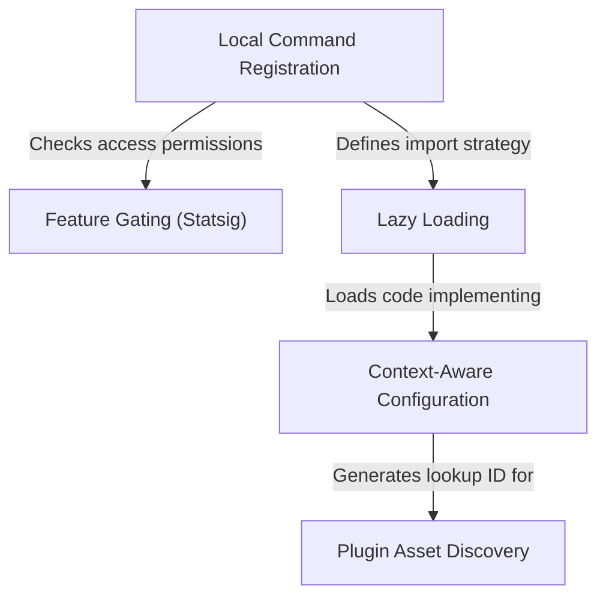

# Tutorial: thinkback-play

This project manages a **CLI command** (`thinkback-play`) designed to play a specific *animation* for the user. It employs a modular architecture that checks **remote feature gates** for access permissions and uses **context-aware logic** to dynamically locate the correct **plugin assets** on the user's machine, ensuring the feature is loaded efficiently only when needed.

## Chapters

1. [Local Command Registration](01_local_command_registration.md)
2. [Feature Gating (Statsig)](02_feature_gating__statsig_.md)
3. [Lazy Loading](03_lazy_loading.md)
4. [Context-Aware Configuration](04_context_aware_configuration.md)
5. [Plugin Asset Discovery](05_plugin_asset_discovery.md)

---

Generated by [Code IQ](https://github.com/adityasoni99/Code-IQ)