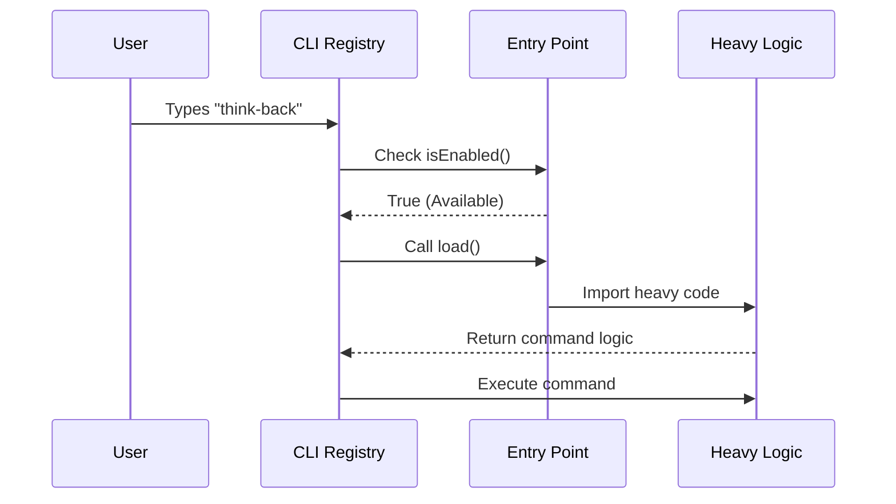

# Chapter 1: Lazy Command Entry Point

Welcome to the **thinkback** project! In this tutorial series, we will build a "Year in Review" feature for a developer CLI tool.

We start at the very beginning: **The Entry Point**.

## Motivation: The Restaurant Menu

Imagine you are at a restaurant. When you sit down, the waiter hands you a menu. The menu lists the names of the dishes and a short description of what they are.

Crucially, **the kitchen does not cook every single dish on the menu the moment you sit down.** That would be a waste of food and would take forever! Instead, the kitchen waits until you actually *order* a specific dish before they start cooking it.

This is exactly the problem the **Lazy Command Entry Point** solves for software:

1.  **The Problem:** If our CLI tool loads the heavy code for every possible command when it starts up, it will be slow and sluggish.
2.  **The Solution:** We create a lightweight "Menu Item" (the Entry Point) that describes the command but delays loading the heavy code until the user actually types the command.

## Key Concepts

To build this, we need three simple ingredients:

1.  **Identity:** What is the command called? (e.g., `think-back`)
2.  **Visibility:** Is this command allowed to be seen? (Like a "Sold Out" sticker on a menu).
3.  **Lazy Loading:** The mechanism to fetch the real code only when requested.

## How to Use: Defining the Entry Point

Let's solve our use case: We want to add a command called `think-back`.

We define a simple JavaScript object. This object doesn't contain the logic for calculating your year in review; it just points to it.

### Step 1: Identity
First, we give it a name and description so the help menu knows about it.

```typescript
const thinkback = {
  type: 'local-jsx', // Hints that this command has a UI
  name: 'think-back', // What the user types
  description: 'Your 2025 Claude Code Year in Review',
};
```
*This is just a label. It costs almost zero computer memory to load this.*

### Step 2: Lazy Loading
Now, we add the "kitchen order" instruction. We use a function that returns an `import`. This tells the computer: *"Go find the file `thinkback.js` ONLY when this function is run."*

```typescript
// Inside the thinkback object...
load: () => import('./thinkback.js'),
```
*If the user never runs `think-back`, the file `./thinkback.js` is never touched!*

## Under the Hood: What happens when you type?

Before we look at the final code, let's visualize the flow.

1.  **User** types `think-back`.
2.  **CLI Registry** looks at the "Menu" (our Entry Point).
3.  It checks if the command is **Enabled**.
4.  If yes, it triggers the **Load** function.
5.  Only then is the **Heavy Logic** imported and executed.



## Implementation Deep Dive

Now let's look at the actual code in `index.ts`. This combines identity, visibility, and lazy loading into one neat package.

### Feature Flags (Visibility)
We don't want everyone to see this command while we are still testing it. We use a "feature flag."

```typescript
import { checkStatsigFeatureGate_CACHED_MAY_BE_STALE } from '../../services/analytics/growthbook.js'

// ... inside the object
isEnabled: () =>
    checkStatsigFeatureGate_CACHED_MAY_BE_STALE('tengu_thinkback'),
```
*`isEnabled` acts like a bouncer. It checks a remote service (Statsig) to see if the feature `tengu_thinkback` is turned on for this user.*

### The Complete Object
Here is the full file. It implements the `Command` interface so TypeScript knows it's a valid menu item.

```typescript
// --- File: index.ts ---
import type { Command } from '../../commands.js'

const thinkback = {
  type: 'local-jsx',
  name: 'think-back',
  description: 'Your 2025 Claude Code Year in Review',
  // ... (isEnabled and load defined below)
} satisfies Command
```

The logic parts are simple functions:

```typescript
// Continued from above object...
  isEnabled: () =>
    checkStatsigFeatureGate_CACHED_MAY_BE_STALE('tengu_thinkback'),

  // The "Lazy" part:
  load: () => import('./thinkback.js'),
```

Finally, we export it so the main application can add it to the list.

```typescript
export default thinkback
```

## Summary

In this chapter, we learned how to create a **Lazy Command Entry Point**.
1.  We defined the **Identity** (name/description).
2.  We protected it with **Visibility** (feature flags).
3.  We used **Lazy Loading** (`import()`) to keep the application fast.

Now that we have successfully "ordered the dish," we need to cook it! When `import('./thinkback.js')` runs, it loads the user interface.

In the next chapter, we will learn how that user interface is built.

[Next Chapter: Ink-based UI Orchestration](02_ink_based_ui_orchestration.md)

---

Generated by [Code IQ](https://github.com/adityasoni99/Code-IQ)