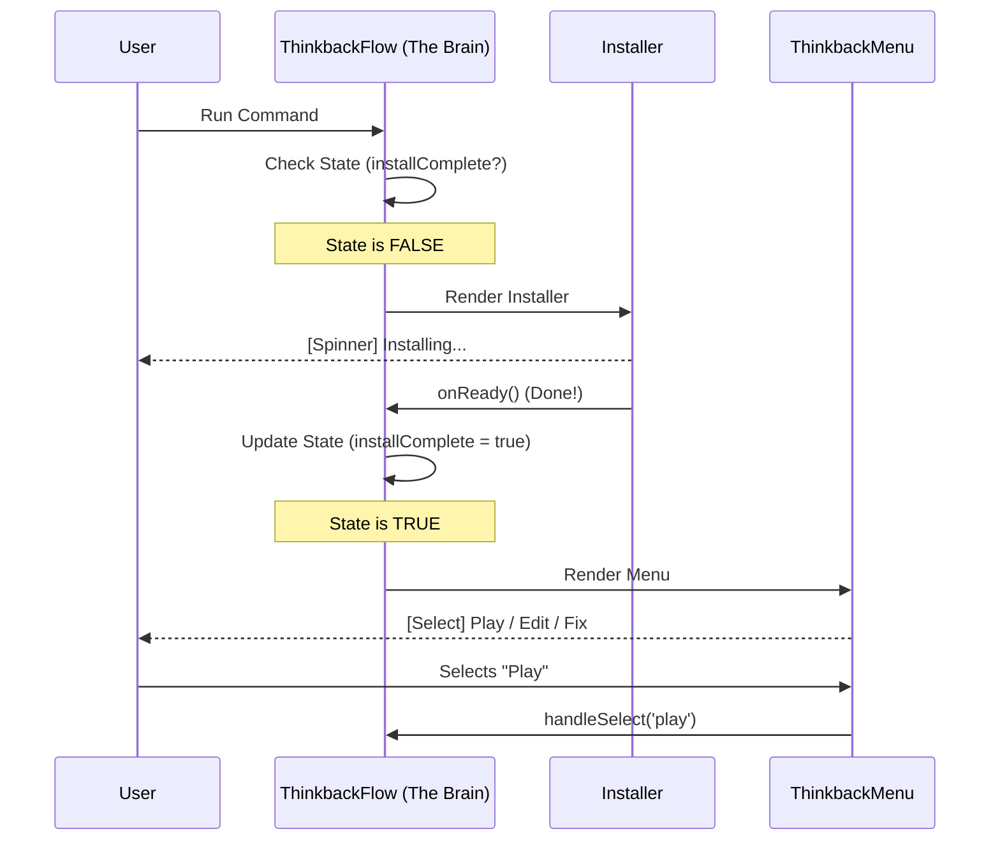

# Chapter 2: Ink-based UI Orchestration

Welcome back! In [Chapter 1: Lazy Command Entry Point](01_lazy_command_entry_point.md), we learned how to create a "Menu Item" that lazily loads our code.

Now that the user has clicked that menu item (by typing `think-back`), the application needs to wake up and show something.

In this chapter, we explore **Ink-based UI Orchestration**. We will learn how to build a rich, interactive "Dashboard" inside the terminal using React.

## Motivation: The Machine Dashboard

Think of a complex machine, like a nuclear reactor or a high-speed train.
*   **The Internals:** There are thousands of gears, pipes, and circuits (complex code).
*   **The Dashboard:** The operator sees simple lights, gauges, and buttons.

If the dashboard is broken, it doesn't matter how good the engine is—the operator can't use it.

**The Problem:** Standard terminal scripts usually just print text line-by-line. They are static.
**The Solution:** We use a library called **Ink**. It allows us to use **React** to build terminal dashboards. We can have loading spinners that vanish when done, and menus you can navigate with arrow keys.

## Key Concepts

To orchestrate our UI, we need three layers:

1.  **The Canvas (`call`):** The function that clears a space in the terminal to draw our UI.
2.  **The Brain (`ThinkbackFlow`):** A parent component that decides *what* to show (Is it loading? Is it broken? Is it ready?).
3.  **The Face (`ThinkbackMenu`):** The actual buttons and options the user interacts with.

## How to Use: Building the Dashboard

Let's walk through how we construct this in `thinkback.tsx`.

### 1. The Canvas (`call`)

This is the bridge between the raw terminal and React. When the lazy loader imports our file, it calls this function.

```typescript
// The entry point for the UI
export async function call(onDone) {
  // Renders the React component into the terminal
  return <ThinkbackFlow onDone={onDone} />;
}
```
*This simply tells the computer: "Start the React engine and mount the `ThinkbackFlow` component."*

### 2. The Brain (`ThinkbackFlow`)

This component manages the **State** of our application. It acts like a traffic controller.

It tracks two main things:
1.  Is the plugin installed?
2.  Do we have an animation ready to play?

```typescript
function ThinkbackFlow({ onDone }) {
  // State: Are we done installing dependencies?
  const [installComplete, setInstallComplete] = useState(false);
  
  // State: Do we have a generated video file?
  const [hasGenerated, setHasGenerated] = useState(null);

  // ... logic to check these states ...
```

Based on these states, `ThinkbackFlow` decides what to render.

**Scenario A: Still Installing**
If the installation isn't done, show the Installer (which has a loading spinner).

```typescript
  if (!installComplete) {
    return <ThinkbackInstaller 
      onReady={handleReady} 
      onError={handleError} 
    />;
  }
```

**Scenario B: Loading Data**
If we are installed but haven't checked for files yet, show a spinner.

```typescript
  if (hasGenerated === null) {
    return (
      <Box>
        <Spinner />
        <Text>Loading thinkback skill…</Text>
      </Box>
    );
  }
```

**Scenario C: Ready for Action**
If everything is ready, show the interactive menu.

```typescript
  return (
    <ThinkbackMenu 
      onDone={onDone} 
      onAction={handleAction} 
      hasGenerated={hasGenerated} 
    />
  );
}
```

### 3. The Face (`ThinkbackMenu`)

This is what the user actually sees and uses. It uses a `Select` component (a list you can scroll through).

The menu options change dynamically. If you have never used the tool, it says "Let's go!". If you have, it offers "Play", "Edit", etc.

```typescript
function ThinkbackMenu({ onAction, hasGenerated }) {
  // Define options based on history
  const options = hasGenerated
    ? [ { label: 'Play animation', value: 'play' }, ... ]
    : [ { label: "Let's go!", value: 'regenerate' } ];

  // Render the interactive list
  return <Select options={options} onChange={handleSelect} />;
}
```

## Under the Hood: The Render Cycle

How does the terminal update without printing a million new lines? Ink takes over the standard output and repaints only the parts of the screen that changed, just like a web browser.

Here is the flow of our UI Orchestration:



## Implementation Deep Dive

Let's look at a specific logic piece in `thinkback.tsx` regarding how the Menu handles user choices.

The `ThinkbackMenu` component doesn't actually *do* the work (like regenerating video). It just tells the parent what the user wants. This is called **Generative Action Dispatch**.

```typescript
// Inside ThinkbackMenu...
function handleSelect(value) {
  if (value === "play") {
    // If Play, run the animation immediately
    playAnimation(skillDir);
  } else {
    // Otherwise, tell the parent (The Brain) to run an action
    onAction(value);
  }
}
```

The "Brain" (`ThinkbackFlow`) then translates that simple string (e.g., `'edit'`) into a complex prompt for the AI.

```typescript
// Inside ThinkbackFlow...
function handleAction(action) {
  const prompts = {
    edit: 'Use the Skill tool to... mode=edit...',
    fix: 'Use the Skill tool to... mode=fix...',
  };
  
  // Send the specific AI prompt back to the system
  onDone(prompts[action], { display: "user" });
}
```

## Summary

In this chapter, we learned about **Ink-based UI Orchestration**.

1.  We used **React components** (`ThinkbackFlow`) to manage the state of the terminal UI.
2.  We created a **Dashboard** that switches between loading screens and interactive menus.
3.  We separated the **Logic** (The Brain) from the **Visuals** (The Face).

The user has now selected "Play" from our beautiful menu. But how do we actually show a movie inside a text-based terminal?

In the next chapter, we will build the engine that plays the movie.

[Next Chapter: Animation Runtime Engine](03_animation_runtime_engine.md)

---

Generated by [Code IQ](https://github.com/adityasoni99/Code-IQ)