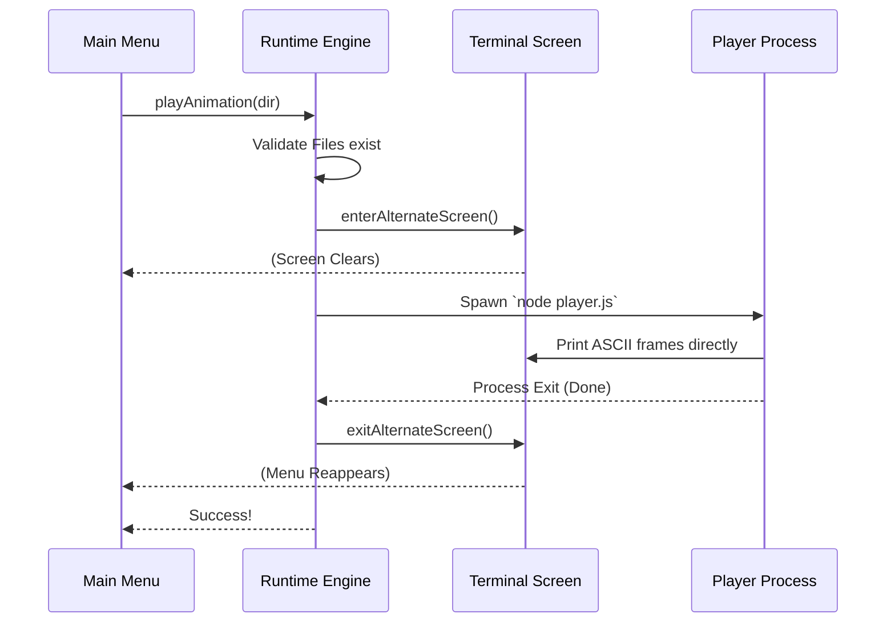

# Chapter 3: Animation Runtime Engine

Welcome back! In [Chapter 2: Ink-based UI Orchestration](02_ink_based_ui_orchestration.md), we built a beautiful dashboard menu. We left off at the moment the user selected **"Play animation"**.

Now, we need to actually show the movie. In this chapter, we will build the **Animation Runtime Engine**.

## Motivation: The Cinema Projectionist

Imagine you want to watch a movie at a cinema. You don't just project the movie onto the dirty wall of the lobby while people are buying popcorn. You need a specific process:

1.  **Check the Reel:** Make sure the movie file actually exists.
2.  **Dim the Lights:** The theater gets dark (the screen clears) so you only focus on the movie.
3.  **Play the Movie:** The projector runs the film.
4.  **Lights Up:** When the movie ends, the lights come back on, and you return to the lobby.

The **Animation Runtime Engine** (`playAnimation`) performs exactly these steps for our terminal-based "Year in Review."

## Key Concepts

To build this engine, we need three distinct tools:

1.  **Validation:** checking if the `data` and the `player` script exist before starting.
2.  **Alternate Screen:** A special mode in terminals that hides your command history to show a full-screen application (like `vim` or `nano`).
3.  **Subprocess:** We run the animation in a separate "child" process so it doesn't interfere with our main menu logic.

## How to Use: The Engine Interface

We define a single asynchronous function. It takes one argument: the directory where our "film reels" (the animation files) are stored.

```typescript
// The inputs: where do the files live?
const skillDir = '/path/to/animation/files';

// Run the engine
const result = await playAnimation(skillDir);

if (result.success) {
  console.log("Show's over!");
}
```

This function handles everything. It takes over the screen, plays the animation, and returns control when finished.

## Implementation Deep Dive

Let's build `playAnimation` step-by-step in `thinkback.tsx`.

### Step 1: The Ticket Check (Validation)

Before we dim the lights, we must ensure we have the files. We check for `year_in_review.js` (the data) and `player.js` (the logic).

```typescript
// Define paths
const dataPath = join(skillDir, 'year_in_review.js');
const playerPath = join(skillDir, 'player.js');

// Check if data exists
try {
  await readFile(dataPath);
} catch (e) {
  if (isENOENT(e)) {
    return { success: false, message: 'No animation found.' };
  }
}
```
*We use `readFile` inside a try/catch block. If it fails with `ENOENT` (Error NO ENTry), the file is missing.*

### Step 2: Dimming the Lights (Alternate Screen)

We don't want the animation to print over your previous commands. We use `Ink` to switch to the **Alternate Screen**.

```typescript
import instances from '../../ink/instances.js';

// Get the current terminal instance
const inkInstance = instances.get(process.stdout);

// "Dim the lights" - switch to a blank screen
inkInstance.enterAlternateScreen();
```
*Now the user sees a blank black screen, ready for the show.*

### Step 3: The Projector (Spawn Subprocess)

Now we run the `player.js` script. We use `execa` to spawn a new Node.js process.

Crucially, we use `stdio: 'inherit'`. This tells the child process: *"Here is the microphone. Speak directly to the user's terminal."*

```typescript
try {
  // Run the player script in the skill directory
  await execa('node', [playerPath], {
    stdio: 'inherit', // Let the child write to screen
    cwd: skillDir,
    reject: false     // Don't crash if the animation errors
  });
} catch {
  // Handle interruptions (like Ctrl+C)
}
```

### Step 4: Lights Up (Cleanup)

Whether the movie finished perfectly or the projector broke, we **must** bring the lights back up. We use a `finally` block to ensure we exit the alternate screen.

```typescript
// This runs no matter what happens above
finally {
  // "Lights up" - return to normal terminal
  inkInstance.exitAlternateScreen();
}
```
*If we forgot this, the user would be stuck on a blank screen forever!*

### Step 5: The Souvenir (Browser Fallback)

As a bonus, after the terminal animation ends, we open an HTML version in the browser so the user can save it.

```typescript
const htmlPath = join(skillDir, 'year_in_review.html');

if (await pathExists(htmlPath)) {
  // Open file based on OS (Mac uses 'open', Windows 'start')
  const openCmd = platform === 'macos' ? 'open' : 'xdg-open'; 
  void execFileNoThrow(openCmd, [htmlPath]);
}
```

## Under the Hood: The Sequence

Here is what happens in the system when you press "Play":



## Summary

In this chapter, we built the **Animation Runtime Engine**.

1.  We learned to **Validate** files before execution to prevent crashes.
2.  We used the **Alternate Screen** to create an immersive, cinema-like experience in the terminal.
3.  We learned how to **Spawn Child Processes** that inherit the terminal output stream.

This completes the "Happy Path" where everything works and the user just wants to watch their video.

But what if the user says: *"I don't like this video, I want to change it"*? We need a way to translate user clicks into AI instructions.

In the next chapter, we will learn how to handle those requests.

[Next Chapter: Generative Action Dispatch](04_generative_action_dispatch.md)

---

Generated by [Code IQ](https://github.com/adityasoni99/Code-IQ)