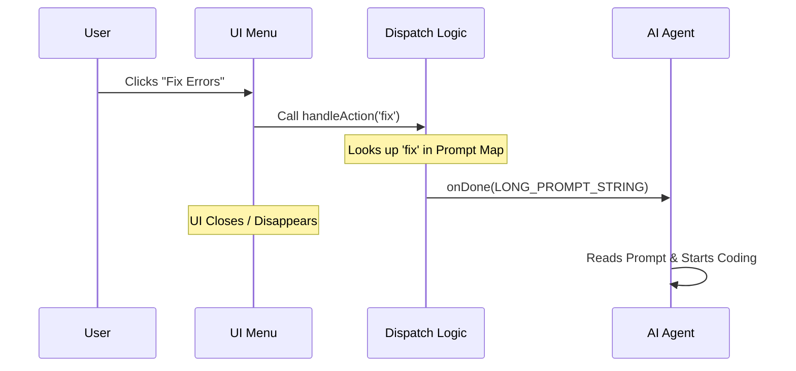

# Chapter 4: Generative Action Dispatch

Welcome back! In [Chapter 3: Animation Runtime Engine](03_animation_runtime_engine.md), we built the cinema projector that plays our "Year in Review" movie.

But what if the movie isn't quite right? Maybe the data is wrong, or you want to change the visual style.

In this chapter, we explore **Generative Action Dispatch**. We will learn how to turn a simple button click (like "Fix") into a complex set of instructions for the AI.

## Motivation: The Work Order System

Imagine you live in an apartment building. If your sink is leaking, you don't fix it yourself, and the building manager at the front desk doesn't fix it either.

1.  **You (The User)** tell the manager: "My sink is broken."
2.  **The Manager (The UI)** writes a detailed **Work Order**: *"Unit 404, Sink leaking, please send a plumber with a wrench."*
3.  **The Specialist (The AI)** receives the ticket and performs the actual repair.

The **Generative Action Dispatch** is that "Work Order" system. The UI cannot rewrite the code itself—it's just a menu. Instead, it dispatches a detailed prompt to the AI, telling *it* to modify the code.

## Key Concepts

To build this system, we need three components:

1.  **The Trigger:** The simple user action (e.g., clicking "Edit").
2.  **The Prompt Map:** A dictionary that translates "Edit" into a detailed paragraph of instructions.
3.  **The Handoff (`onDone`):** The mechanism that closes the UI and hands the microphone back to the AI.

## How to Use: The Dispatcher

In our code, the dispatch logic happens inside our main logic component (`ThinkbackFlow`).

We define a function called `handleAction`. It takes a short code word (the **Trigger**) and looks up the detailed instruction (the **Prompt**).

```typescript
function handleAction(action) {
  // 1. Define the Work Orders
  const prompts = {
    edit: 'Use the Skill tool to... mode=edit...',
    fix: 'Use the Skill tool to... mode=fix...',
  };
  
  // 2. Hand off to the AI
  onDone(prompts[action], { display: "user" });
}
```

*   **Input:** The user selects `'edit'` from the menu.
*   **Output:** The system effectively types a long paragraph into the chat on behalf of the user, guiding the AI to the next step.

## Under the Hood: The Sequence

It is important to understand that when an action is dispatched, **the UI closes**. The graphical menu disappears, and the text-based chat returns so the AI can do its work.



## Implementation Deep Dive

Let's look at how this is implemented in `thinkback.tsx`.

### Step 1: Defining the "Work Orders" (Prompts)

First, we define constant strings for our prompts. These are carefully crafted to ensure the AI knows exactly what tool to use and what mode to set.

```typescript
const EDIT_PROMPT = 'Use the Skill tool to invoke the "thinkback" skill with mode=edit...';

const FIX_PROMPT = 'Use the Skill tool to invoke the "thinkback" skill with mode=fix...';

const REGENERATE_PROMPT = 'Use the Skill tool to invoke the "thinkback" skill with mode=regenerate...';
```
*Notice how specific these are. We don't just say "Fix it." We say "Use the Skill tool... with mode=fix".*

### Step 2: The Dispatch Logic

Inside `ThinkbackFlow`, we implement the handler. This connects the simple action to the complex prompt.

```typescript
// Inside ThinkbackFlow...
const handleAction = (action) => {
  const prompts = {
    edit: EDIT_PROMPT,
    fix: FIX_PROMPT,
    regenerate: REGENERATE_PROMPT,
  };

  // The Magic Handoff
  onDone(prompts[action], { 
    display: "user", // Pretend the user typed this
    shouldQuery: true // Force the AI to respond
  });
};
```

**Why `display: "user"`?**
This tells the system to print the prompt in the chat window as if the *user* had typed it. This provides context to the user about what is happening.

### Step 3: Triggering from the UI

Finally, inside our `ThinkbackMenu` (from Chapter 2), we hook up the buttons to call this function.

```typescript
// Inside ThinkbackMenu...
function handleSelect(value) {
  if (value === 'play') {
    // ... play logic ...
  } else {
    // Dispatch the Generative Action!
    onAction(value);
  }
}
```

## Summary

In this chapter, we learned about **Generative Action Dispatch**.

1.  We created a **Prompt Map** (Work Orders) to translate simple clicks into complex AI instructions.
2.  We used the **Handoff** mechanism (`onDone`) to close the UI and give control back to the AI.
3.  We used `display: "user"` to make the interaction feel natural in the chat history.

Now the AI has received the command: *"Use the Skill tool to invoke thinkback..."*.

But wait—does the user even *have* the "Skill tool" installed? Does the AI know how to use it? We need to ensure the environment is set up correctly before the AI tries to work.

In the next chapter, we will build the safety checks for this process.

[Next Chapter: Plugin Installation State Machine](05_plugin_installation_state_machine.md)

---

Generated by [Code IQ](https://github.com/adityasoni99/Code-IQ)