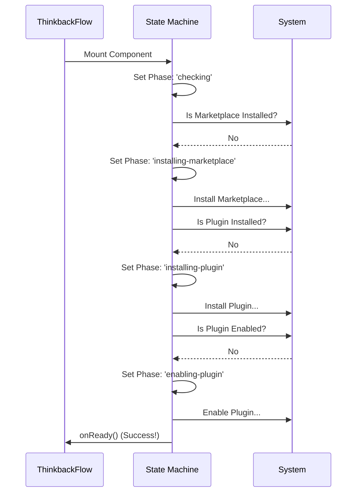

# Chapter 5: Plugin Installation State Machine

Welcome back! In [Chapter 4: Generative Action Dispatch](04_generative_action_dispatch.md), we learned how to send complex instructions to the AI to "fix" or "edit" our animation.

However, there is a catch. Those instructions rely on a specific tool (the `thinkback` skill) being present on the user's machine. **What if the user has never installed it?**

In this chapter, we build the **Plugin Installation State Machine**. This is the automated wizard that ensures all necessary software is installed before the user tries to run it.

## Motivation: The Construction Crew

Imagine you want to move into a new house. You cannot just move your furniture (the "User Data") onto an empty lot. You need a construction process:

1.  **Foundation:** You need land and a foundation (The Marketplace).
2.  **Framing:** You need to build the house structure (Install the Plugin).
3.  **Utilities:** You need to turn on the electricity (Enable the Plugin).
4.  **Move In:** Only then can you live there (Run the App).

If you try to move in before the house is built, everything fails.

**The Problem:** Users might run our command `think-back` without having the underlying plugin installed.
**The Solution:** We create a component (`ThinkbackInstaller`) that acts as the "Construction Manager." It automatically checks each step and performs the work if something is missing.

## Key Concepts

To build this robust installer, we use a **State Machine**. This is a fancy term for a system that can only be in one specific "phase" at a time.

1.  **The Phases:** A list of valid steps (e.g., `checking`, `installing-marketplace`, `installing-plugin`, `ready`).
2.  **The Check-and-Act Loop:** A logic flow that checks if step 1 is done. If not, do it. Then move to step 2.
3.  **Visual Feedback:** Because installing takes time, we need to show the user exactly what is happening (e.g., "Installing marketplace...").

## How to Use: The Gatekeeper

We don't use the Installer manually. Instead, we use it as a **Gatekeeper** inside our main application flow.

In `ThinkbackFlow` (from [Chapter 2: Ink-based UI Orchestration](02_ink_based_ui_orchestration.md)), we check if the installation is complete. If not, we block the rest of the app and show the Installer.

```typescript
// Inside ThinkbackFlow
if (!installComplete) {
  return (
    <ThinkbackInstaller 
      onReady={() => setInstallComplete(true)} 
      onError={handleError} 
    />
  );
}

// ... Rest of the application (Menu, etc.)
```
*   **Input:** The user runs the command. `installComplete` starts as `false`.
*   **Output:** The user sees a loading spinner. When `onReady` is called, the Installer disappears, and the main menu appears.

## Internal Implementation: The Sequence

Before looking at the code, let's visualize the "Construction Manager's" checklist. This runs automatically when the component mounts.



## Implementation Deep Dive

Let's build `ThinkbackInstaller` in `thinkback.tsx`.

### Step 1: Defining the States

First, we define exactly what "phases" are possible. This prevents our code from getting confused (e.g., trying to enable a plugin that isn't installed).

```typescript
type InstallState = 
  | { phase: 'checking' }
  | { phase: 'installing-marketplace' }
  | { phase: 'installing-plugin' }
  | { phase: 'enabling-plugin' }
  | { phase: 'ready' }
  | { phase: 'error'; message: string };
```
*TypeScript helps us here. We can't accidentally type `phase: 'building-house'` because it's not in the list.*

### Step 2: The Check-and-Act Loop

We use a React `useEffect` hook to run our logic immediately when the component appears. This is the brain of the state machine.

We check requirements in a strict order: **Marketplace -> Plugin -> Enabled**.

```typescript
// Inside useEffect...
const marketplaceInstalled = await checkMarketplace();

if (!marketplaceInstalled) {
  setState({ phase: 'installing-marketplace' });
  await addMarketplaceSource({ repo: '...' });
}
```
*If the marketplace is missing, we pause here, update the UI state, and install it.*

### Step 3: Installing the Plugin

Once the marketplace exists, we check for the specific plugin (`thinkback`).

```typescript
// Continuing the logic...
const pluginInstalled = isPluginInstalled(getPluginId());

if (!pluginInstalled) {
  setState({ phase: 'installing-plugin' });
  
  // This downloads the code needed for the next chapters
  await installSelectedPlugins([getPluginId()]); 
}
```
*Now we are framing the house.*

### Step 4: Enabling the Plugin

Finally, a plugin might be installed but "Disabled" in the settings. We must ensure it's active.

```typescript
// Continuing the logic...
const { disabled } = await loadAllPlugins();
const isDisabled = disabled.some(p => p.name === 'thinkback');

if (isDisabled) {
  setState({ phase: 'enabling-plugin' });
  await enablePluginOp(getPluginId());
}

// If we made it here, we are done!
onReady();
```
*We turned on the electricity. The house is ready.*

### Step 5: Rendering the UI

While all that complex logic is happening in the background, the user needs to know what is going on. We render a simple UI based on the current `phase`.

```typescript
// Determine the text based on the state
const message = state.phase === 'installing-marketplace'
  ? 'Installing marketplace…'
  : state.phase === 'installing-plugin'
    ? 'Installing thinkback plugin…'
    : 'Checking installation…';

// Render the spinner
return (
  <Box>
    <Spinner />
    <Text>{message}</Text>
  </Box>
);
```

## Summary

In this chapter, we built the **Plugin Installation State Machine**.

1.  We defined a strict set of **Phases** to manage the complexity of installation.
2.  We created an **Automated Checklist** that verifies the Marketplace, Plugin, and Enabled status in order.
3.  We provided **Visual Feedback** so the user isn't staring at a frozen screen.

Now the foundation is laid, the frame is up, and the lights are on. The environment is perfectly set up.

But wait—how does the application know *exactly* where the files for this plugin are located on the user's computer? A generic path won't work.

In the final chapter, we will learn how to dynamically locate our resources.

[Next Chapter: Skill Environment Resolution](06_skill_environment_resolution.md)

---

Generated by [Code IQ](https://github.com/adityasoni99/Code-IQ)