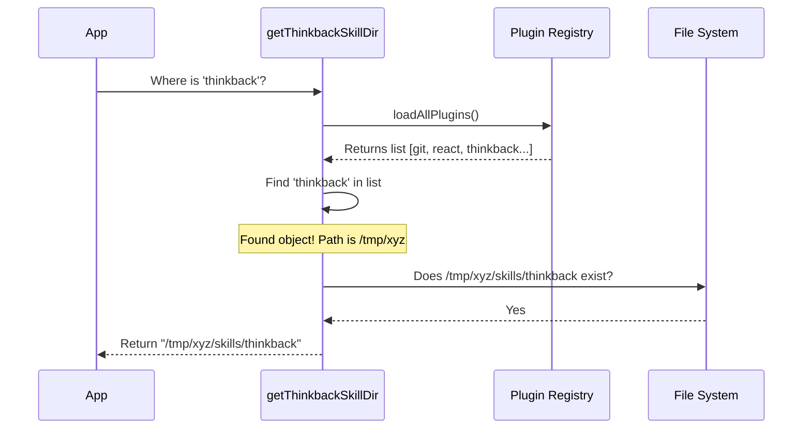

# Chapter 6: Skill Environment Resolution

Welcome to the final chapter of our tutorial series!

In [Chapter 5: Plugin Installation State Machine](05_plugin_installation_state_machine.md), we ensured that the `thinkback` plugin is installed and enabled on the user's computer.

However, we have one final problem. **Where exactly is it installed?**

In this chapter, we explore **Skill Environment Resolution**. We will write a function that acts like a GPS, locating the exact folder path of our plugin so we can access our animation files.

## Motivation: The Secret Warehouse

Imagine you are trying to find a specific book in a massive, chaotic warehouse.
*   **The Problem:** You cannot simply say, "The book is on Shelf 5." On your computer, it might be on Shelf 5. On your friend's computer, it might be on Shelf 99. On a Windows machine, the shelves look completely different!
*   **Hardcoding Fails:** If we write `const path = "/Users/me/plugins/thinkback"`, the code will crash on everyone else's computer.

**The Solution:** We need a dynamic "locator" function. We ask the system, *"Where did you put the thinkback plugin?"* and it returns the correct address for that specific computer.

## Key Concepts

To resolve the environment, we need three steps:

1.  **The Registry (`loadAllPlugins`):** This is the master list of every plugin installed on the system.
2.  **The Search (`find`):** We need to look through that list to find the one that matches our name (`thinkback`).
3.  **The Path Construction (`join`):** Once we find the plugin, we need to point to the specific sub-folder where our "skills" live.

## How to Use: The Locator

We wrap all this complexity into a single asynchronous function: `getThinkbackSkillDir()`.

When we call this, we don't care *how* it finds the folder, only that it *does*.

```typescript
// Ask the GPS for the location
const skillDir = await getThinkbackSkillDir();

if (skillDir) {
  console.log("Found the secret base at:", skillDir);
  // Output: /Users/alice/.claude/plugins/thinkback-123/skills/thinkback
} else {
  console.log("Plugin not found!");
}
```

*   **Input:** None (it queries the system).
*   **Output:** A string containing the absolute file path, or `null` if not found.

## Under the Hood: The Hunt

Let's visualize what happens when we ask for the directory. The function doesn't know the path initially; it has to ask the **Plugin Registry**.



## Implementation Deep Dive

Let's write the `getThinkbackSkillDir` function found in `thinkback.tsx`. We will break it down into two simple parts.

### Step 1: Query and Filter
First, we get the list of enabled plugins and search for ours. We check two things: the name (`thinkback`) or the source URL (in case the name varies).

```typescript
async function getThinkbackSkillDir(): Promise<string | null> {
  // 1. Get the master list of active plugins
  const { enabled } = await loadAllPlugins();

  // 2. Find the one that matches our ID
  const plugin = enabled.find(p => 
    p.name === 'thinkback' || 
    (p.source && p.source.includes('thinkback'))
  );
```
*If `plugin` is undefined here, it means the user hasn't installed it yet.*

### Step 2: Construct and Verify
If we found the plugin object, it contains a `.path` property (e.g., `/user/.cache/plugins/...`). We need to append `skills/thinkback` to it.

Crucially, we verify the file exists on the disk before returning it.

```typescript
  if (!plugin) {
    return null;
  }

  // 3. Construct the full path to the specific sub-folder
  const skillDir = join(plugin.path, 'skills', 'thinkback');

  // 4. Verify it actually exists on disk
  if (await pathExists(skillDir)) {
    return skillDir;
  }

  return null;
}
```
*We use `join` from the Node.js path library so this works on both Windows (`\`) and Mac/Linux (`/`).*

### Integrating with the App

Now recall [Chapter 3: Animation Runtime Engine](03_animation_runtime_engine.md). The `playAnimation` function required a `skillDir`. This is where that value comes from!

And recall [Chapter 5: Plugin Installation State Machine](05_plugin_installation_state_machine.md). The installer ensures that when we call `loadAllPlugins`, our plugin is actually in the list.

## Project Summary

Congratulations! You have completed the **thinkback** tutorial series.

Let's review what we built:

1.  **Lazy Entry Point:** We created a lightweight menu item that loads fast.
2.  **UI Orchestration:** We built a dashboard using React and Ink.
3.  **Animation Engine:** We hijacked the terminal screen to play a movie.
4.  **Generative Dispatch:** We taught the UI how to write prompts for the AI.
5.  **Installation State Machine:** We built a robot to install dependencies automatically.
6.  **Environment Resolution:** We learned how to locate our files dynamically.

You now have a fully functional "Year in Review" feature that is robust, user-friendly, and integrated seamlessly into the CLI environment.

**End of Tutorial Series.**

---

Generated by [Code IQ](https://github.com/adityasoni99/Code-IQ)