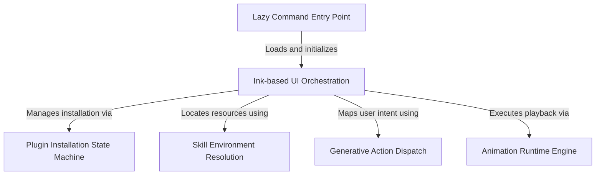

# Tutorial: thinkback

This project implements a **Year in Review** experience for Claude Code users, generating a personalized *ASCII animation* of their coding activity. It manages the full lifecycle from **lazy loading** the command and installing necessary **plugins** to orchestrating an interactive terminal UI that allows users to *play*, *edit*, or *fix* their generative content.

## Chapters

1. [Lazy Command Entry Point](01_lazy_command_entry_point.md)
2. [Ink-based UI Orchestration](02_ink_based_ui_orchestration.md)
3. [Animation Runtime Engine](03_animation_runtime_engine.md)
4. [Generative Action Dispatch](04_generative_action_dispatch.md)
5. [Plugin Installation State Machine](05_plugin_installation_state_machine.md)
6. [Skill Environment Resolution](06_skill_environment_resolution.md)

---

Generated by [Code IQ](https://github.com/adityasoni99/Code-IQ)