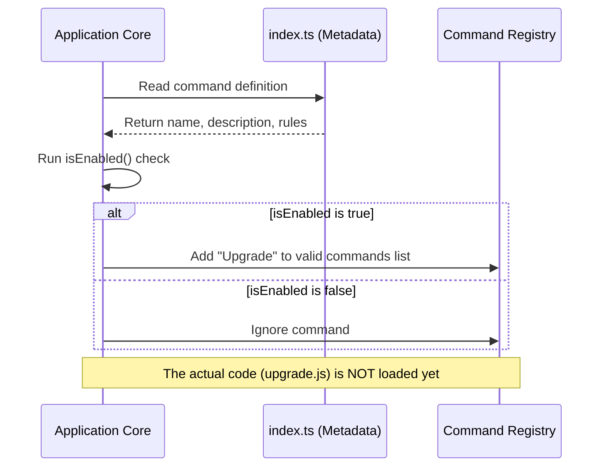

# Chapter 1: Command Registration & Metadata

Welcome to the **Upgrade** project tutorial! In this series, we will build a feature that allows users to upgrade their subscription.

Before we write the logic to process a payment or change a user's status, we need to introduce this new capability to the system. We call this **Command Registration**.

## The Motivation: The Restaurant Menu

Imagine walking into a restaurant. You sit down and look at a **menu**. The menu lists the names of dishes, a short description, and perhaps whether they are spicy or vegetarian.

Crucially, the menu **is not the food**. The chef doesn't cook every single meal in the kitchen the moment the restaurant opens. The kitchen waits until you actually *order* the food to cook it.

In our software:
1.  **The Menu Entry (`index.ts`)**: This is the "Metadata." It tells the system "I exist, my name is Upgrade, and here is who is allowed to order me."
2.  **The Meal (`upgrade.js`)**: This is the "Logic." It is the heavy code that actually performs the upgrade.

**Why do we do this?**
If we loaded every single feature's code when the application started, the app would be very slow (like a chef cooking 100 dishes for one customer). By separating the **Metadata** from the logic, our app starts fast and stays organized.

---

## Use Case: Adding the "Upgrade" Button

Our goal is to tell the application that a new command called `upgrade` exists. We want it to be visible only to users who are not already on the "enterprise" plan.

Here is how we construct the "Menu Entry" in a file called `index.ts`.

### Step 1: Naming the Command

First, we define the basic identity of our command.

```typescript
const upgrade = {
  type: 'local-jsx',
  name: 'upgrade',
  description: 'Upgrade to Max for higher rate limits',
  // ... more properties later
}
```
**Explanation:**
*   `name`: The unique ID of the command.
*   `description`: What the user sees in the help menu or UI.
*   `type`: Defines how this command runs (we will cover `'local-jsx'` in [LocalJSX Command Execution](03_localjsx_command_execution.md)).

### Step 2: Defining Availability

We don't want to show an "Upgrade" button to someone who is already on the highest plan. We use metadata to define these rules.

```typescript
// Inside the upgrade object
availability: ['claude-ai'],
isEnabled: () =>
  !isEnvTruthy(process.env.DISABLE_UPGRADE_COMMAND) &&
  getSubscriptionType() !== 'enterprise',
```
**Explanation:**
*   `availability`: Where this command can be used (e.g., only in the 'claude-ai' environment).
*   `isEnabled`: A function that returns `true` or `false`. If it returns `false`, the command stays hidden from the menu.

### Step 3: The "Kitchen" Link (Lazy Loading)

Finally, we tell the system where to find the actual code (the meal) if the user decides to run this command.

```typescript
// Inside the upgrade object
load: () => import('./upgrade.js'),
} satisfies Command
```
**Explanation:**
*   `load`: This is a special function. It uses `import()` to find the heavy logic file (`upgrade.js`).
*   It only runs when the user clicks the button. This concept is explored further in [Lazy Module Loading](05_lazy_module_loading.md).

---

## Under the Hood: Internal Implementation

What happens when you start the application? The system acts like a host setting up the tables. It reads the metadata but doesn't cook the food yet.

### Registration Sequence

Here is a simplified view of the startup process:



### Deep Dive: The `index.ts` File

Let's look at the complete code snippet for `index.ts` to see how it comes together.

```typescript
import type { Command } from '../../commands.js'
import { getSubscriptionType } from '../../utils/auth.js'
import { isEnvTruthy } from '../../utils/envUtils.js'

// The Command Object
const upgrade = {
  type: 'local-jsx',
  name: 'upgrade',
  // ... properties ...
  load: () => import('./upgrade.js'),
} satisfies Command

export default upgrade
```

**Key Takeaways:**
1.  **`satisfies Command`**: This is a TypeScript feature. It ensures our "Menu Entry" follows the strict format the system expects. If we forget the `name`, TypeScript will yell at us here.
2.  **`export default`**: We export this lightweight object so the main application can find it easily during startup.

This file acts as a **Guard**. It checks `getSubscriptionType()` (see [Subscription State Verification](04_subscription_state_verification.md)) before allowing the command to be registered. This prevents the user from even seeing options that aren't valid for them.

---

## Conclusion

In this chapter, we learned how to introduce a new feature to the system using **Command Registration & Metadata**. We created a lightweight entry in `index.ts` that acts like a menu item: it describes the command and sets the rules for who can see it, but it leaves the heavy lifting for later.

Now that our command is registered and visible in the "menu," what happens when a user actually selects it?

In the next chapter, we will look at how the system handles the user interaction in the **[Hybrid Browser-CLI Workflow](02_hybrid_browser_cli_workflow.md)**.

---

Generated by [Code IQ](https://github.com/adityasoni99/Code-IQ)