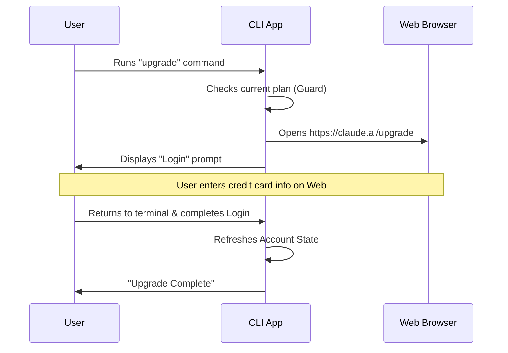

# Chapter 2: Hybrid Browser-CLI Workflow

Welcome back! In the previous chapter, **[Command Registration & Metadata](01_command_registration___metadata.md)**, we added the "Upgrade" item to our application's menu. We defined *who* can see it and *where* it lives.

Now, we need to define what happens when the user actually clicks that button. This introduces a tricky problem: **How do you accept a credit card payment inside a text-based terminal?**

The answer is: **You don't.**

This chapter introduces the **Hybrid Browser-CLI Workflow**, a pattern that bridges the gap between the text-based terminal and the rich visual interface of a web browser.

---

## The Motivation: The "Clerk and the Cashier"

Think of the CLI (Command Line Interface) like a store clerk who helps you find items on the shelf. The clerk is very fast and efficient. However, the clerk does not carry a credit card machine.

When you want to buy something (Upgrade):
1.  **The Handoff:** The clerk (CLI) points you to the cashier counter (The Web Browser).
2.  ** The Pause:** The clerk waits patiently while you walk over there.
3.  **The Return:** You pay the cashier, get a receipt, and return to the clerk. The clerk checks your receipt (Re-authentication) and hands you the goods.

In our code, we need to manage this exact flow.

---

## Step 1: The Safety Check (The Guard)

Before we send the user to the browser, we need to make sure they actually *need* to go. Sending a user to pay for something they already own is a bad user experience.

We open `upgrade.tsx` and start with a check.

```typescript
// Inside upgrade.tsx logic
if (isClaudeAISubscriber()) {
  // Check if user is already on the Max plan
  if (isMax20x) {
    // Stop the process immediately
    setTimeout(onDone, 0, 'You are already on the highest plan.');
    return null;
  }
}
```

**Explanation:**
*   We check the user's current subscription status.
*   If they are already "Max 20x" (the highest tier), we print a message and exit (`return null`).
*   This saves the user a trip to the web browser.

---

## Step 2: Opening the Portal

If the user *does* need to upgrade, we need to open the "door" to the web. We use a utility called `openBrowser`.

```typescript
const url = 'https://claude.ai/upgrade/max';

// This acts like a remote control for the user's OS
await openBrowser(url);
```

**Explanation:**
*   `openBrowser`: This is a helper function that detects the user's operating system (Windows, Mac, or Linux) and launches their default web browser (Chrome, Safari, etc.) pointing to the specific payment URL.
*   **The Gap:** At this exact moment, the user's attention shifts from the black terminal window to the white web browser window.

---

## Step 3: The Wait (Transitioning State)

This is the most critical part of the Hybrid Workflow. The CLI cannot "see" what is happening in the browser. It doesn't know if the user paid successfully or just closed the tab.

To solve this, we don't just exit. We transition the CLI into a **Login State**.

```typescript
return (
  <Login
    startingMessage={'Starting new login... Exit with Ctrl-C to cancel.'}
    onDone={(success) => {
      // Logic when user returns
      context.onChangeAPIKey(); 
      onDone(success ? 'Login successful' : 'Login interrupted');
    }}
  />
);
```

**Explanation:**
*   **`<Login />`**: Instead of finishing the command, we return a *React Component*. (We will explain how the CLI renders React in **[LocalJSX Command Execution](03_localjsx_command_execution.md)**).
*   **Why Login?** Because after you upgrade on the web, your local CLI session is outdated. It still thinks you are on the "Free" plan.
*   **`onChangeAPIKey()`**: This refreshes the session token, ensuring the CLI now sees the new "Enterprise" status.

---

## Under the Hood: The Sequence

Let's visualize how the control passes between the User, the CLI, and the Web.



### Handling Failures

What if the browser refuses to open? Perhaps the user is on a server without a screen (headless mode). We must handle this gracefully.

```typescript
} catch (error) {
  // If automation fails, give manual instructions
  logError(error as Error);
  setTimeout(
    onDone, 
    0, 
    'Failed to open browser. Please visit https://claude.ai/upgrade/max'
  );
}
```

**Explanation:**
*   We wrap the `openBrowser` call in a `try/catch` block.
*   If it fails, we print the URL to the screen so the user can copy-paste it manually.

---

## Why this Architecture?

You might ask: *Why not just wait for a "Payment Success" signal from the server?*

1.  **Complexity:** Setting up a real-time WebSocket or polling mechanism to listen for a payment event is complex.
2.  **Security:** The CLI runs locally on a user's machine. Minimizing open connections is safer.
3.  **Reliability:** By forcing a re-login (The `<Login />` component), we verify the state in the most robust way possible. It ensures we aren't guessing if the payment worked; we are fetching the fresh account status directly.

---

## Conclusion

In this chapter, we learned how to implement a **Hybrid Browser-CLI Workflow**. We built a bridge that allows our terminal application to leverage the secure payment processing of a web browser.

We learned to:
1.  **Guard** against unnecessary actions.
2.  **Handoff** control to the browser.
3.  **Wait** and refresh state using a Login component.

But wait—in Step 3, we returned a piece of code that looked like HTML (`<Login />`) inside a function called `call`. How does a text-based terminal understand and render visual components?

We will answer that in the next chapter: **[LocalJSX Command Execution](03_localjsx_command_execution.md)**.

---

Generated by [Code IQ](https://github.com/adityasoni99/Code-IQ)