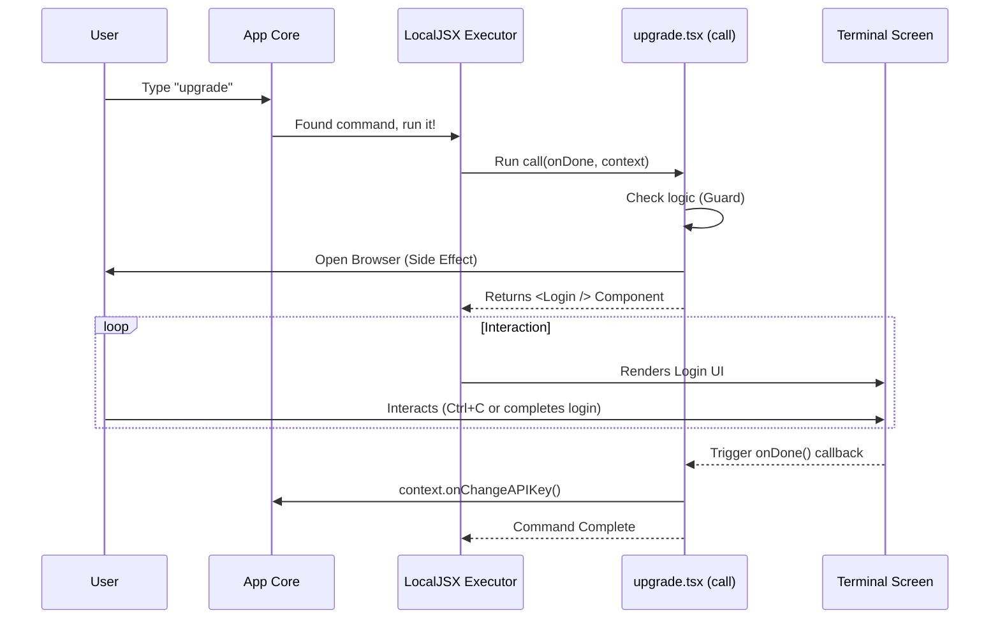

# Chapter 3: LocalJSX Command Execution

Welcome back! In **[Hybrid Browser-CLI Workflow](02_hybrid_browser_cli_workflow.md)**, we built a workflow that jumps between the terminal and the web browser. At the very end of that chapter, we saw something strange: our code returned a component that looked like HTML (`<Login />`), but it was running inside a black-and-white terminal.

How is that possible?

This chapter introduces **LocalJSX Command Execution**, the "engine" that powers our interactive commands.

---

## The Motivation: Scripts vs. Apps

In traditional programming, a command line script is often linear. It runs line A, then line B, then line C, and then quits. It's like **sending a letter**: you drop it in the box and hope it gets there.

But modern CLI tools need to be interactive. They need to update the screen, show spinners, accept input, and react to changes.

**LocalJSX** solves this by treating the terminal like a web page. It uses a version of React (the popular web library) to manage the terminal screen. This allows us to:
1.  **Render UI:** Show interactive components like login forms.
2.  **Manage State:** Remember if the user has finished paying or is still waiting.
3.  **Handle Lifecycle:** Run code before the UI appears, and clean up after it leaves.

---

## The Core Concept: The `call` Function

Every LocalJSX command (like our `upgrade` command) must have a specific entry point called the `call` function. Think of this function as the **Director** of a movie. It decides what happens, when it happens, and what the audience (the user) sees.

### The Structure

Here is the basic skeleton of the `call` function found in `upgrade.tsx`:

```typescript
// upgrade.tsx
import * as React from 'react';

export async function call(onDone, context) {
  // 1. Logic & Checks
  // 2. Side Effects (like opening browser)
  // 3. Render UI
}
```

**Explanation:**
*   **`async`**: The function can pause and wait for things (like opening a browser).
*   **`onDone`**: A special button we press when the command is finished to tell the system "We are done here."
*   **`context`**: A toolbox containing helpful utilities to talk to the main application.

---

## Step 1: Preconditions and Side Effects

Before we show any UI, the `call` function usually performs invisible work. In our `upgrade` command, this happens in two stages.

### Stage A: The Guard (Logic)

First, we check if the command should run at all.

```typescript
// Inside call()
if (isClaudeAISubscriber() && isMax20x) {
  // If already upgraded, tell the system we are done
  setTimeout(onDone, 0, 'You are already on the highest plan.');
  
  // Return null means "Don't show any UI"
  return null; 
}
```

**What happens here?**
*   If the user is already on the Max plan, we call `onDone` immediately with a message.
*   We return `null`. This tells LocalJSX: "Don't render any components. Just exit."

### Stage B: The Action (Side Effect)

If the user *does* need to upgrade, we perform the action.

```typescript
const url = 'https://claude.ai/upgrade/max';

// Perform the side effect
await openBrowser(url);
```

**Key Concept:** This happens *before* any UI is drawn to the terminal screen. The terminal is technically still blank or showing the previous command output while the browser opens.

---

## Step 2: Rendering the UI (The Return)

This is where LocalJSX shines. Instead of just `console.log("Please log in")`, we return a **Component**.

```typescript
return (
  <Login 
    startingMessage="Starting new login..." 
    onDone={(success) => {
      // Logic to run when the Login component finishes
      context.onChangeAPIKey(); 
      onDone(success ? 'Success' : 'Failed');
    }} 
  />
);
```

**Beginner Breakdown:**
1.  **`<Login />`**: This is a React component designed for the terminal. It handles asking for the email, showing the spinner, and verifying the token.
2.  **`return`**: By returning this component, the `call` function hands control over to the rendering engine. The engine keeps the app running until the `<Login />` component says it's finished.
3.  **`context.onChangeAPIKey()`**: This uses the `context` toolbox to tell the main app, "Hey, the user just logged in again, please refresh their profile!"

---

## Under the Hood: How it Works

How does a text-based terminal understand React components? We use a library called **Ink** internally, but we wrap it in our `LocalJSX` system.

Here is the flow of data when you type `upgrade`:



### The "Virtual DOM" in the Console

Just like React in a browser creates a "Virtual DOM" to manage HTML elements, LocalJSX creates a Virtual DOM for text.

*   **Browser React:** `<div style="color: red">Error</div>`
*   **LocalJSX:** `<Text color="red">Error</Text>`

The Executor takes these components and translates them into the special text codes that make text colored or bold in your terminal.

---

## Putting it Together

Let's look at the implementation in `upgrade.tsx` again, but stripped down to its skeleton to see the flow.

```typescript
// upgrade.tsx - Simplified
import * as React from 'react';
import { Login } from '../login/login.js';

export async function call(onDone, context) {
  try {
    // 1. The Guard
    if (userIsAlreadyUpgraded) {
       onDone('Already upgraded');
       return null;
    }

    // 2. The Side Effect
    await openBrowser('https://claude.ai/upgrade');

    // 3. The Interactive UI
    return (
      <Login 
        onDone={(success) => {
           context.onChangeAPIKey(); // Update app state
           onDone('Finished');       // Exit command
        }} 
      />
    );
    
  } catch (error) {
    // 4. Error Handling
    onDone('Something went wrong');
    return null;
  }
}
```

**Why is this better than a script?**
If we wrote a simple script, we couldn't easily insert the `<Login />` component. That component is complex—it listens for keypresses and handles network requests. By using **LocalJSX**, the `upgrade` command gets to reuse that complex logic simply by "rendering" it.

---

## Conclusion

In this chapter, we explored **LocalJSX Command Execution**. We learned that the `call` function is the director of the command. It manages the lifecycle in three steps:
1.  **Guards:** Checks if the command should run.
2.  **Side Effects:** Performs actions like opening browsers.
3.  **Rendering:** Returns interactive UI components to the terminal.

This architecture turns our CLI from a simple script runner into a rich, interactive application.

However, in our "Guard" step, we briefly mentioned checking if the user is a subscriber. How do we actually know that? Where does that data come from?

In the next chapter, we will learn how the system ensures we have the correct user data before we even attempt these checks in **[Subscription State Verification](04_subscription_state_verification.md)**.

---

Generated by [Code IQ](https://github.com/adityasoni99/Code-IQ)