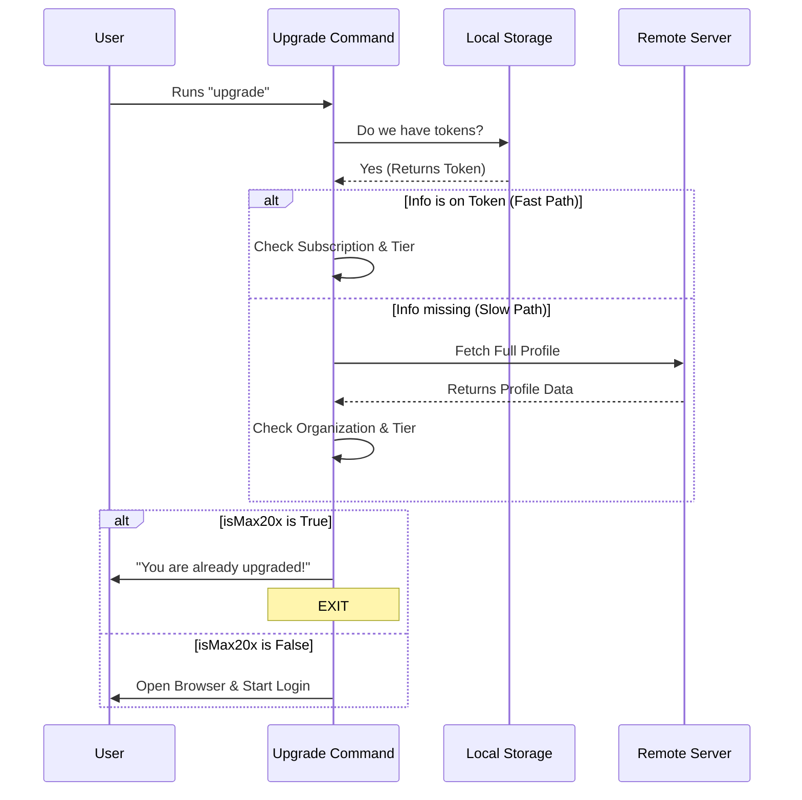

# Chapter 4: Subscription State Verification

Welcome back! In the previous chapter, **[LocalJSX Command Execution](03_localjsx_command_execution.md)**, we built the engine that renders interactive UI components like our Login screen in the terminal.

However, we have a missing piece. We built the "Upgrade" button and the "Payment" flow, but we haven't asked a crucial question: **Does this user actually need to upgrade?**

This chapter covers **Subscription State Verification**, the logic that acts as a gatekeeper to ensure we don't annoy users with unnecessary prompts.

---

## The Motivation: The VIP Club

Imagine you are running a VIP club.
*   **The Action:** A guest walks up and asks to buy a VIP pass.
*   **The Bad Approach:** You immediately take their credit card, process a charge, and print a new ticket—only to realize they were *already* a VIP member. The guest is annoyed, and you have to issue a refund.
*   **The Good Approach (Verification):** Before you do anything, you look at the wristband they are already wearing. If it says "VIP," you smile and say, "Go right in, you're already all set!"

In our application, opening a web browser and asking for payment is disruptive. We want to check the user's "digital wristband" (their Auth Tokens) first. If they are already on the "Max 20x" plan, we stop them at the door with a friendly message.

---

## Concept 1: The "Digital Wristband" (OAuth Tokens)

When a user logs in, they receive **OAuth Tokens**. You can think of these as their ID card. This card doesn't just say *who* they are; it often contains small notes about *what* they are allowed to do.

We need to look for two specific "notes" (flags) on this ID card:
1.  **`subscriptionType`**: What plan are they on? (e.g., "free", "pro", "max").
2.  **`rateLimitTier`**: How much power do they have? (e.g., "default_claude_max_20x").

If a user has **both** `type: max` and `tier: 20x`, they are already at the highest level.

---

## Use Case: Implementing the Gatekeeper

Let's look at how we implement this check inside our command. We are working inside `upgrade.tsx`.

### Step 1: Retrieving the ID Card

First, we need to grab the current session tokens.

```typescript
import { getClaudeAIOAuthTokens } from '../../utils/auth.js';

// Get the user's current session data
const tokens = getClaudeAIOAuthTokens();

// We only check if tokens actually exist
if (!tokens) {
  // If no tokens, they aren't logged in at all
  return null; 
}
```

**Explanation:**
*   `getClaudeAIOAuthTokens()`: This looks into the local storage (like checking the user's pocket) to see if they have a saved session.

### Step 2: Reading the Flags (Plan A)

Sometimes, the information is written directly on the token we have locally. This is the fastest check.

```typescript
let isMax20x = false;

// Check if the flags exist on the local token
if (tokens.subscriptionType && tokens.rateLimitTier) {
  // Verify the values match our highest plan
  isMax20x = 
    tokens.subscriptionType === 'max' && 
    tokens.rateLimitTier === 'default_claude_max_20x';
}
```

**Explanation:**
*   We check if the token has the info we need.
*   If `subscriptionType` is "max" AND `rateLimitTier` is "default_claude_max_20x", we set our variable `isMax20x` to `true`.

### Step 3: The Deep Check (Plan B)

Sometimes, the local token is minimal and doesn't list the tier. In this case, we have to call the server to ask for the full profile.

```typescript
// If local check failed, but we have an access token...
else if (tokens.accessToken) {
  // Fetch full profile from the server
  const profile = await getOauthProfileFromOauthToken(tokens.accessToken);
  
  // Check the flags on the remote profile
  isMax20x = 
    profile?.organization?.organization_type === 'claude_max' && 
    profile?.organization?.rate_limit_tier === 'default_claude_max_20x';
}
```

**Explanation:**
*   `getOauthProfileFromOauthToken`: This makes a network request (calls the head office) to get the user's latest status.
*   We check the same criteria on the returned `profile` object.

### Step 4: Closing the Gate

Finally, if `isMax20x` is true, we stop the upgrade process.

```typescript
if (isMax20x) {
  // 1. Tell the user why we are stopping
  const msg = 'You are already on the highest Max subscription plan.';
  
  // 2. Schedule the exit
  setTimeout(onDone, 0, msg);
  
  // 3. Stop rendering
  return null;
}
```

**Explanation:**
*   We use `onDone` (from our **LocalJSX** chapter) to exit the command cleanly.
*   We return `null` so no UI (like the Login screen) is drawn.

---

## Under the Hood: The Verification Flow

Let's visualize the decision-making process.



### Why two checks?

You might wonder why we have "Plan A" and "Plan B."
*   **Speed:** Reading local tokens (Plan A) takes 0.001 seconds.
*   **Accuracy:** calling the server (Plan B) takes 0.5 seconds but is guaranteed to be up-to-date.
*   **Strategy:** We try to be fast first. If the data is missing, we sacrifice speed for accuracy.

---

## Code Deep Dive

Let's look at the actual implementation in `upgrade.tsx` to see how it handles the data structure differences.

### Handling Data Mismatches

The local token and the remote profile use slightly different names for the same thing (e.g., `subscriptionType` vs `organization_type`). The code handles this translation.

**Local Token Check:**
```typescript
// Inside upgrade.tsx
if (tokens.subscriptionType === 'max' && 
    tokens.rateLimitTier === 'default_claude_max_20x') {
      isMax20x = true;
}
```

**Remote Profile Check:**
```typescript
// Inside upgrade.tsx
if (profile?.organization?.organization_type === 'claude_max' && 
    profile?.organization?.rate_limit_tier === 'default_claude_max_20x') {
      isMax20x = true;
}
```

**Beginner Note:** Notice the use of `?.` (Optional Chaining). `profile?.organization?.type` means: "Does profile exist? If yes, does organization exist? If yes, give me the type." This prevents the app from crashing if the data is incomplete.

---

## Conclusion

In this chapter, we learned about **Subscription State Verification**. We created a smart logic layer that checks a user's status before allowing an action.

We learned:
1.  **OAuth Tokens** act as the user's ID card.
2.  We check specific flags (`rateLimitTier`) to determine VIP status.
3.  We use a **Hybrid Check** (Local first, Remote second) to balance speed and accuracy.

Now our command is smart. It registers itself in the menu, it runs interactively, and it verifies the user. But wait—this verification logic requires importing authentication utilities. If we have hundreds of commands, will importing all these utilities slow down the app startup?

In the next chapter, we will solve performance issues using **[Lazy Module Loading](05_lazy_module_loading.md)**.

---

Generated by [Code IQ](https://github.com/adityasoni99/Code-IQ)