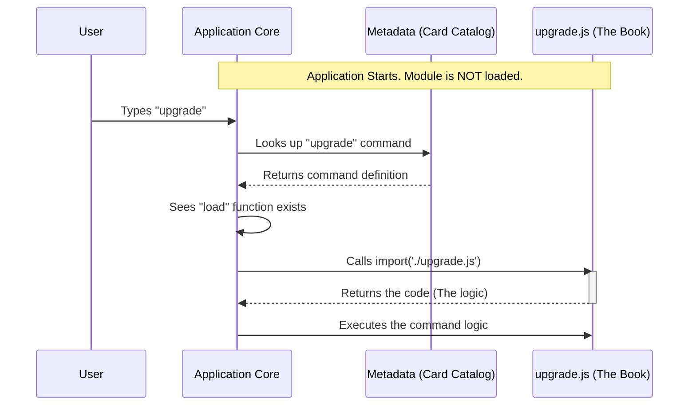

# Chapter 5: Lazy Module Loading

Welcome to the final chapter of this tutorial series!

In the previous chapter, **[Subscription State Verification](04_subscription_state_verification.md)**, we wrote complex logic to check a user's subscription status. We imported authentication utilities, network request libraries, and environment helpers to make that verification secure and accurate.

But here is the catch: **We added a lot of code.**

If our application has 50 different commands, and each one imports 5 or 6 heavy libraries, the application would take several seconds just to start up.

This chapter introduces **Lazy Module Loading**, a performance pattern that keeps our application lightning-fast.

---

## The Motivation: The Library Stacks

To understand why we need this, let's imagine a **Public Library**.

**Scenario A: The "Eager" Approach (Bad)**
Imagine if, the moment you walked into the library, the librarian piled **every single book in the building** onto your desk.
*   **Result:** You are buried under books. You can't find what you need. It takes an hour just to clear space to sit down.
*   **In Software:** This is "Static Importing." The app loads the code for *every* feature at startup, eating up memory and slowing down the launch.

**Scenario B: The "Lazy" Approach (Good)**
You walk in and look at the **Card Catalog** (The Metadata). It lists the names of books and where they are located. When you find the book you want, you hand a slip to the librarian. The librarian goes into the "Stacks" (the storage area), retrieves **only that one book**, and brings it to you.
*   **Result:** Your desk is clean. You get exactly what you need, right when you need it.
*   **In Software:** This is "Lazy Loading." We only load the heavy code for a command when the user actually types that command.

---

## Use Case: The `load` Function

We implement this pattern in the command definition file (`index.ts`). We want to define the command's existence (the Card Catalog) without loading its logic (the Book).

Here is the implementation we've seen in previous chapters:

```typescript
// index.ts
const upgrade = {
  name: 'upgrade',
  // ... other metadata ...
  
  // The Lazy Load Magic
  load: () => import('./upgrade.js'),
  
} satisfies Command
```

**Explanation:**
1.  **`load`**: This is a specific property our system looks for.
2.  **`() => ...`**: This is an arrow function. It wraps the action so it doesn't happen immediately. It waits to be called.
3.  **`import('./upgrade.js')`**: This is a **Dynamic Import**. Unlike a standard import at the top of a file, this line tells Node.js: "Go find and load this file *right now*, but not a moment sooner."

---

## Concept: Dynamic vs. Static Imports

Let's look at the difference in code.

### The Old Way (Static)

If we wrote `index.ts` like this, the app would be slow:

```typescript
// ❌ BAD: This loads the logic immediately when the app starts
import { call } from './upgrade.js'; 

const upgrade = {
  name: 'upgrade',
  run: call // The code is already loaded and ready
};
```
*   **Problem:** Even if the user never types `upgrade`, we have paid the cost to load `upgrade.js`.

### The New Way (Dynamic / Lazy)

This is how we actually do it:

```typescript
// ✅ GOOD: No imports at the top!

const upgrade = {
  name: 'upgrade',
  // Only load when the framework specifically asks for it
  load: () => import('./upgrade.js') 
};
```
*   **Benefit:** The file `upgrade.js` is ignored during startup. The application boots up instantly.

---

## Under the Hood: The Execution Flow

What happens when a user types `upgrade` into the CLI? The system acts like the librarian fetching the book.

### The Sequence



### Internal Implementation Details

The framework code that runs your command looks something like this (simplified):

```typescript
// Framework logic (Pseudo-code)
async function runCommand(commandName, args) {
  // 1. Find the command in the registry
  const cmd = registry.find(commandName);

  // 2. The Lazy Load Step
  // We await the result because fetching a file takes a few milliseconds
  const module = await cmd.load();

  // 3. Execute
  // We assume the module exports a 'call' function
  await module.call(args);
}
```

**Key Takeaways:**
1.  **`await`**: Loading a file dynamically is an asynchronous operation. The computer has to go to the hard drive, read the file, and parse the JavaScript. We must wait for it.
2.  **Memory Efficiency:** If the user runs the app but only uses the `help` command, the heavy `upgrade.js` file is never loaded into the computer's RAM.

---

## When to Use Lazy Loading

You should use this pattern for **almost every command** in a CLI application.

*   **Use Lazy Loading when:** The code contains heavy logic, imports other large libraries, or is used infrequently (like `upgrade` or `settings`).
*   **Use Static Loading when:** The code is a tiny utility needed by *every* part of the app (like a `colors` helper or basic `constants`).

---

## Conclusion

In this chapter, we learned about **Lazy Module Loading**.

We discovered that:
1.  **Static Imports** are like carrying every book in the library on your back.
2.  **Dynamic Imports** (`import()`) allow us to fetch code only when needed.
3.  We implement this in the `load` function of our command definition.

This architecture ensures that the **Upgrade** project remains snappy and responsive, no matter how many features we add in the future.

### Tutorial Complete!

Congratulations! You have completed the **Upgrade** project tutorial. You have learned how to:
1.  Register a command using Metadata ([Chapter 1](01_command_registration___metadata.md)).
2.  Bridge the CLI and Browser worlds ([Chapter 2](02_hybrid_browser_cli_workflow.md)).
3.  Render interactive UI in the terminal ([Chapter 3](03_localjsx_command_execution.md)).
4.  Verify user data securely ([Chapter 4](04_subscription_state_verification.md)).
5.  Optimize performance with Lazy Loading (Chapter 5).

You are now ready to build scalable, interactive, and high-performance CLI tools. Happy coding!

---

Generated by [Code IQ](https://github.com/adityasoni99/Code-IQ)