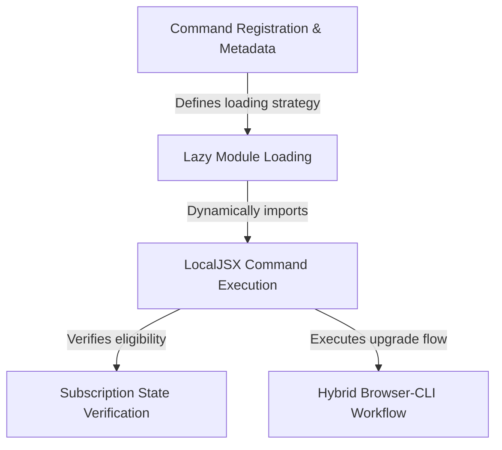

# Tutorial: upgrade

This project implements a **CLI command** that enables users to upgrade their service plan directly from the terminal. It uses a *lazy-loading* mechanism to keep startup fast and performs **verification checks** to ensure only eligible users run the process. The core workflow facilitates a **hybrid interaction** by opening a web browser for the transaction and managing re-authentication in the console.

## Chapters

1. [Command Registration & Metadata](01_command_registration___metadata.md)
2. [Hybrid Browser-CLI Workflow](02_hybrid_browser_cli_workflow.md)
3. [LocalJSX Command Execution](03_localjsx_command_execution.md)
4. [Subscription State Verification](04_subscription_state_verification.md)
5. [Lazy Module Loading](05_lazy_module_loading.md)

---

Generated by [Code IQ](https://github.com/adityasoni99/Code-IQ)