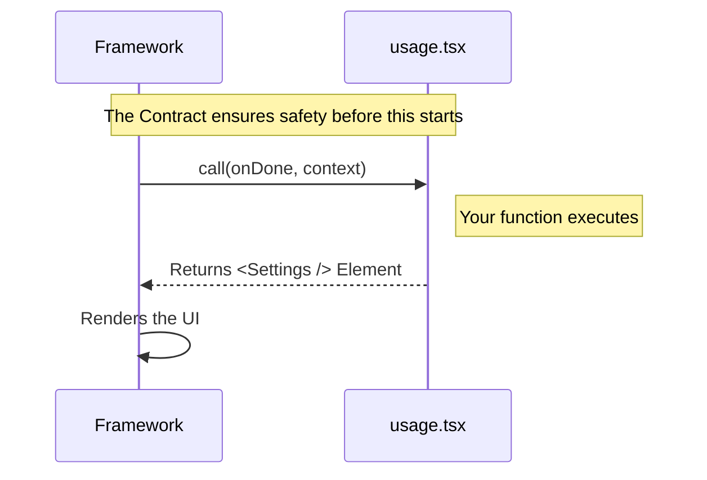

# Chapter 1: Type-Driven Contract

Welcome to the **Usage** project tutorial! In this series, we are going to build a command that displays usage limits (like a plan overview) within an application.

In this first chapter, we are tackling the most important foundational concept: **The Type-Driven Contract**.

## The Motivation: Why do we need this?

Imagine you are building a new feature, like a "Usage Settings" panel. You want to plug this feature into a large, existing application framework.

The framework needs to run your code, but it doesn't know *what* you wrote.
*   What arguments does your function accept?
*   What will your function return?
*   What happens if you forget to handle a specific piece of data?

If we just guess, the app might crash when a user clicks the button. We need a way to guarantee that your new code fits perfectly into the framework.

**The Use Case:** We want to ensure that our `call` function (which launches the settings) receives exactly the tools it needs (like `onDone`) and returns exactly what the framework expects (a UI element).

## The Concept: Plugs and Sockets

Think of the framework as a wall with an **electrical socket**. Think of your code as a **lamp plug**.

*   **The Socket:** This is the `LocalJSXCommandCall` type defined by the framework. It has a specific shape (three holes, specific voltage).
*   **The Plug:** This is your code in `usage.tsx`.

If your plug has two prongs but the socket requires three, they won't fit. You can't even plug it in.

In programming terms:
*   **The Contract:** The TypeScript interface (`LocalJSXCommandCall`) defines the rules.
*   **The Enforcer:** The TypeScript compiler acts like a building inspector. It stops you *before* you even run the app if your "plug" is shaped wrong.

## How to use it

To fulfill this contract, we explicitly tell TypeScript that our function acts as a `LocalJSXCommandCall`.

### Step 1: Import the Contract
First, we need to bring in the "blueprint" (the type) so we know what we are building.

```tsx
// usage.tsx
import * as React from 'react';

// We import the specific type definition here
import type { LocalJSXCommandCall } from '../../types/command.js';
```

### Step 2: Implement the Contract
Now we write our function. Notice the `: LocalJSXCommandCall` part. This is where we sign the contract.

```tsx
// usage.tsx - continued
import { Settings } from '../../components/Settings/Settings.js';

// We apply the type to our constant 'call'
export const call: LocalJSXCommandCall = async (onDone, context) => {
  // If we don't return a React element here, TypeScript yells at us!
  return <Settings onClose={onDone} context={context} defaultTab="Usage" />;
};
```

**What just happened?**
1.  **Input:** The framework provides `onDone` (a function to close the panel) and `context` (data about the app). Because of the contract, we get auto-completion for these!
2.  **Output:** We return `<Settings ... />`. This is a React Element. If we tried to return a number or text, the "building inspector" (compiler) would show a red error line.

## Under the Hood: Internal Implementation

What actually happens when the application tries to run your command?

Because we adhered to the Type-Driven Contract, the framework can trust our code blindly. It knows exactly which inputs to provide and what output to wait for.

Here is the flow of execution:



### Deep Dive: The Type Definitions

Let's look at the "Socket" definition. While you don't need to memorize this, it helps to see what the contract actually looks like.

We also use a contract for the command registration in `index.ts`. This file tells the system *about* your command.

```typescript
// index.ts
import type { Command } from '../../commands.js'

// This object must satisfy the 'Command' shape
export default {
  type: 'local-jsx',
  name: 'usage',
  // ... other properties
} satisfies Command
```

The `satisfies Command` keyword acts similarly to the colon syntax (`: Type`). It checks that the object we are exporting matches the `Command` interface.

By using these types:
1.  **`LocalJSXCommandCall`**: Ensures the *function logic* is correct (in `usage.tsx`).
2.  **`Command`**: Ensures the *configuration* is correct (in `index.ts`).

We will discuss how `index.ts` is actually used in the [Command Registration](02_command_registration.md) chapter.

## Conclusion

In this chapter, we learned that a **Type-Driven Contract** is like a safety standard for our code. By marking our `call` function with `LocalJSXCommandCall`, we ensure that our "plug" fits the framework's "socket" perfectly. This prevents bugs and makes coding easier because our tools know exactly what data is available.

Now that our code is "safe" and follows the rules, we need to tell the framework that it exists.

[Next Chapter: Command Registration](02_command_registration.md)

---

Generated by [Code IQ](https://github.com/adityasoni99/Code-IQ)