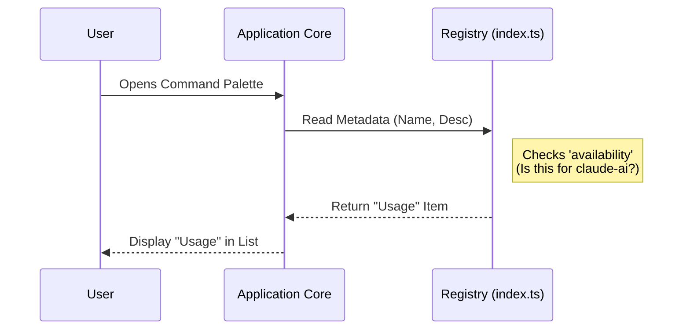

# Chapter 2: Command Registration

Welcome back! In the previous chapter, [Type-Driven Contract](01_type_driven_contract.md), we built the actual logic for our usage panel—the "plug" that fits into the system.

However, if you ran the application right now, you wouldn't see your new feature anywhere. You wrote the code, but you haven't told the application that it exists!

In this chapter, we will solve this by creating a **Command Registration**.

## The Motivation: Why do we need this?

Imagine you own a restaurant. You have a chef in the kitchen who knows exactly how to cook a specific dish (this is the code we wrote in Chapter 1).

But how do customers know they can order it? You need to put it on the **Menu**.

**The Use Case:** We want our "Usage" feature to appear in the application's command list (the menu) so users can find it by name. We also want to describe what it does and limit it so it only appears for specific users (like `claude-ai`).

## The Concept: The Menu Item

**Command Registration** acts as the manifesto or "ID Card" for your feature. It tells the system *about* the command without running the command itself.

It defines three main things:
1.  **Identity:** What is it called? (`name`)
2.  **Context:** What does it do? (`description`)
3.  **Rules:** Who can see it? (`availability`)

Think of the registration file as the text on a restaurant menu. It lists "Cheeseburger" and "A delicious beef patty," but it is **not** the burger itself. It's just the promise of a burger.

## How to use it

We create the registration in a file called `index.ts`. This is the entry point that the framework looks for.

### Step 1: Naming the Command
We define a plain JavaScript object. The most important part is giving it a unique name.

```typescript
// index.ts
export default {
  // The internal type of command (we use local-jsx for React UIs)
  type: 'local-jsx',

  // The unique ID users might type to find this
  name: 'usage',
  
  // A human-readable hint about what this does
  description: 'Show plan usage limits',
// ... continued below
```

**Explanation:**
*   `name`: This is the command ID. If a user searches for "usage", this entry pops up.
*   `description`: This helps the user decide if this is the command they want.

### Step 2: Setting Availability
Sometimes, a menu item is only available during "Lunch" or for "VIPs". We can restrict our command using the `availability` array.

```typescript
// index.ts - continued
  // ... previous code

  // Only show this command if the current provider is 'claude-ai'
  availability: ['claude-ai'],

// ... continued below
```

**Explanation:**
*   If the user is using a different AI provider (like OpenAI), this command will be hidden from the menu entirely. It prevents users from trying to run code that isn't supported for their context.

### Step 3: The "Kitchen" Connection
Finally, we need to point to the actual code (the chef). However, we don't want to wake the chef up until an order is placed.

```typescript
// index.ts - continued
  
  // Notice we use a function () => ...
  load: () => import('./usage.js'),

} satisfies Command // Remember the contract from Chapter 1?
```

**Explanation:**
*   `load`: This tells the app *where* to find the logic we wrote in Chapter 1.
*   **Note:** We use a special technique here called `import()`. We will explain exactly why and how this works in the next chapter, [Lazy Loading / Dynamic Import](03_lazy_loading___dynamic_import.md).

## Under the Hood: Internal Implementation

What happens when the application starts up?

The application scans for these `index.ts` files to build its "Menu". It reads the name and description *immediately*, but it intentionally ignores the actual logic code (the `usage.tsx` file) until later.

Here is the flow of how the Menu is built:



### Deep Dive: The Registration Object

Let's look at the complete code block for `index.ts`.

Because we are using TypeScript, we use the `satisfies Command` syntax we briefly saw in [Chapter 1](01_type_driven_contract.md). This ensures we don't forget the `name` or spell `availability` incorrectly.

```typescript
// index.ts
import type { Command } from '../../commands.js'

export default {
  type: 'local-jsx',
  name: 'usage',
  description: 'Show plan usage limits',
  availability: ['claude-ai'],
  load: () => import('./usage.js'),
} satisfies Command
```

**Why is this separate from the logic?**
If we put the "Menu" (registration) and the "Kitchen" (logic) in the same file, the application would have to load *every single feature's code* just to show the list of available commands. That would make the app very slow!

By splitting them, the app can read this lightweight `index.ts` file in milliseconds.

## Conclusion

In this chapter, we learned that **Command Registration** is like creating a menu item. We defined:
1.  **Who we are** (`name`).
2.  **What we do** (`description`).
3.  **When we appear** (`availability`).

We have successfully listed our command on the menu! However, you might have noticed the line `load: () => import('./usage.js')`. This is a very special way of connecting the menu to the kitchen.

To understand why we didn't just use a normal `import`, let's move on to the next concept.

[Next Chapter: Lazy Loading / Dynamic Import](03_lazy_loading___dynamic_import.md)

---

Generated by [Code IQ](https://github.com/adityasoni99/Code-IQ)