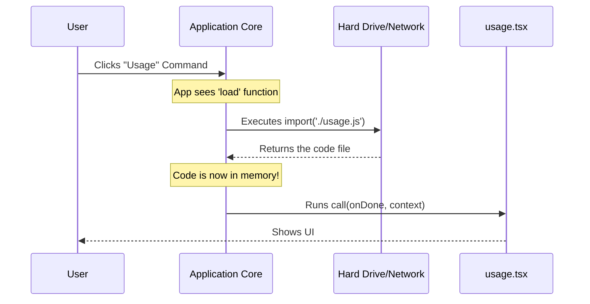

# Chapter 3: Lazy Loading / Dynamic Import

Welcome back! In the previous chapter, [Command Registration](02_command_registration.md), we created a "menu item" for our command in `index.ts`.

You might have noticed a specific line in that file that looked a bit unique:
`load: () => import('./usage.js')`

Why didn't we just write `import ... from ...` at the top of the file like we usually do? In this chapter, we will explain exactly why, and introduce the concept of **Lazy Loading**.

## The Motivation: Why do we need this?

Imagine you are building a massive application with **500 different commands**.

If you load the code for *all* 500 commands the moment the application starts, two bad things happen:
1.  **Slow Startup:** The user has to wait for 500 files to be read and processed before they can do anything.
2.  **Wasted Memory:** The computer's memory (RAM) is filled with code for commands the user might never use.

**The Use Case:** We want our application to start instantly. We want to ensure that the heavy code for our "Usage" command is only loaded **if and when** the user actually asks to see it.

## The Concept: The Library Archive

Think of your application's memory like the **Front Desk** of a library.

*   **Static Import (The Old Way):** This is like keeping every single book the library owns on the front desk. The desk is cluttered, there is no room to work, and the librarian is overwhelmed.
*   **Lazy Loading (The New Way):** This is like an **Archive Service**. The front desk is clean. All the books are stored in a basement vault.

When a patron (the user) asks for a specific book ("Usage"), the librarian runs to the basement, grabs that specific book, and brings it to the desk. This keeps the front desk fast and efficient.

In programming terms:
*   **Static Import:** Loads code immediately.
*   **Dynamic Import:** Loads code on demand.

## How to use it

We implement this in our `index.ts` file using a JavaScript feature called `import()`.

### Step 1: Avoiding Static Imports
Normally, you might write this at the top of a file:

```typescript
// DON'T DO THIS in index.ts
import { call } from './usage.js'; 

// This forces the app to load usage.js immediately!
```

We want to avoid this. Do not import your command logic at the top of the registration file.

### Step 2: using the Dynamic Import
Instead, we use the `load` property in our registration object.

```typescript
// index.ts
export default {
  name: 'usage',
  // ... other properties
  
  // The magic happens here:
  load: () => import('./usage.js'),
} satisfies Command
```

**What is happening here?**
1.  **`() => ...`**: This is an Arrow Function. It wraps the action. It says: "Don't do this yet. Only do this when I call you."
2.  **`import(...)`**: This is a function that goes to the "hard drive" (the basement) and fetches the file.

Because we wrapped it in a function, the file is **not** loaded when the application starts. It sits there, waiting.

## Under the Hood: Internal Implementation

What happens when the user actually clicks the "Usage" command?

The framework sees that you provided a `load` function. It executes that function, waits for the file to arrive, and then runs your code.

Here is the sequence of events:



### Deep Dive: Handling the Promise

When we use `import()`, JavaScript returns a **Promise**. A Promise is like a delivery receipt that says, "I don't have the file yet, but I promise to give it to you in a few milliseconds."

The framework handles this "waiting" period for us. Here is a simplified look at how the framework uses your `load` function:

```typescript
// Framework Internal Logic (Simplified)

async function runCommand(command) {
  // 1. Trigger the lazy load
  // We use 'await' to pause until the file is fully loaded
  const module = await command.load();

  // 2. Now we have the file! 
  // We can access the 'call' function we wrote in Chapter 1
  return module.call(onDone, context);
}
```

**Explanation:**
1.  The framework calls `command.load()`.
2.  It uses `await` to wait for the dynamic import to finish fetching the file.
3.  Once loaded, it accesses `module.call`. This is the exact function we wrote in [Type-Driven Contract](01_type_driven_contract.md).

## Conclusion

In this chapter, we learned that **Lazy Loading** is a strategy to keep our application fast and lightweight. By using `load: () => import(...)`, we ensure that our code stays in the "basement" until the user specifically asks for it.

So, we have defined the contract (Chapter 1), registered the command (Chapter 2), and optimized how it loads (Chapter 3). Now, the code is loaded and running... but how do we actually display buttons, text, and layout to the user?

We need to understand how the system handles the React elements we return.

[Next Chapter: JSX Command Handler](04_jsx_command_handler.md)

---

Generated by [Code IQ](https://github.com/adityasoni99/Code-IQ)