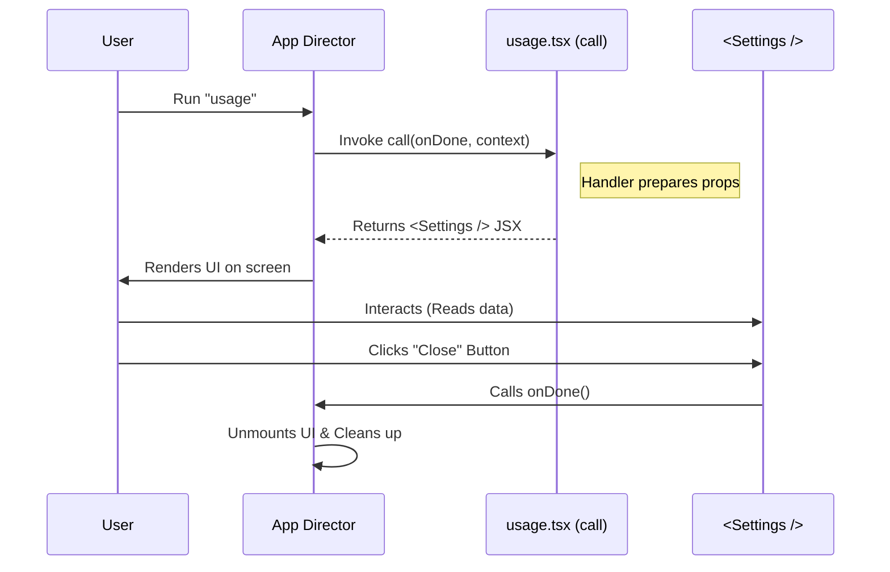

# Chapter 4: JSX Command Handler

Welcome back! In [Chapter 3: Lazy Loading / Dynamic Import](03_lazy_loading___dynamic_import.md), we optimized our application so it fetches the code only when needed.

Now that the application has successfully loaded our code from the "archive," it says: "Okay, I have the file. What do I do now?"

In this chapter, we will explore the **JSX Command Handler**. This is the logic that actually puts pixels on the screen.

## The Motivation: Why do we need this?

Most command-line tools just output text. You type `date`, and it prints `Mon Jan 1`.

But we want to build a rich Graphical User Interface (GUI). We want buttons, tabs, and layout. We can't just `return "Hello World"`; we need to return a visual component. Furthermore, this component needs to know *when* to appear and *when* to disappear.

**The Use Case:** When the user runs the "Usage" command, we need to:
1.  Receive data about the current app state (`context`).
2.  Render a React component (the UI).
3.  Wait for the user to finish reading.
4.  Close the UI cleanly when the user is done (`onDone`).

## The Concept: The Stage Play

To understand the Command Handler, imagine a **Stage Play**.

1.  **The Director (The System):** Yells "Action!" This is the system invoking your command.
2.  **The Script (The Handler):** This is the `call` function. It tells the actor what to do immediately after "Action!" is called.
3.  **The Props & Co-stars (Context):** The Director hands you items you need (like user ID, theme colors) via the `context`.
4.  **The Exit (onDone):** You cannot leave the stage until the scene is over. The `onDone` callback is your cue to bow and exit.

If you don't use `onDone`, the curtain never falls, and the app gets stuck!

## How to use it

The "Handler" is simply the function named `call` inside our file `usage.tsx`. Let's break down its lifecycle parts.

### Step 1: Receiving the Context
When the handler starts, the system passes it a `context` object. This contains environment data.

```tsx
// usage.tsx
export const call: LocalJSXCommandCall = async (onDone, context) => {
  
  // Example: We can access data from the system here
  console.log("Current User ID:", context.userId);
  
  // ... continue to render
};
```

**Explanation:**
*   `context`: Think of this as a backpack full of tools the main app gives you. It might contain the current user's name, the active color theme, or API keys.

### Step 2: Rendering the UI (JSX)
Unlike a standard function that calculates a number, this handler returns a **React Element** (JSX).

```tsx
// usage.tsx
  // ... inside the call function

  // We return a Component. This is what the user SEES.
  return (
    <Settings 
      context={context} 
      defaultTab="Usage" 
      // ... more props
    />
  );
```

**Explanation:**
*   **JSX:** This looks like HTML, but it's JavaScript. It describes the UI.
*   **Return Value:** By returning this, we tell the system: "Please draw this `<Settings>` panel on the screen for me."

### Step 3: The Exit Strategy (onDone)
This is the most critical part of the interaction. The UI is interactive; it stays open while the user clicks around. We need a way to close it.

```tsx
// usage.tsx
export const call: LocalJSXCommandCall = async (onDone, context) => {
  
  // We pass 'onDone' down to our component as a prop named 'onClose'
  return <Settings onClose={onDone} context={context} defaultTab="Usage" />;
};
```

**Explanation:**
*   `onDone`: This is a function provided by the system. Calling it means "I am finished."
*   **Delegation:** We don't call `onDone()` immediately. We pass it to the `<Settings />` component. The *component* will call it when the user clicks a specific "Close" button inside the UI.

## Under the Hood: Internal Implementation

What happens when the Director yells "Action!"?

The system creates a container (a "Stage") for your component. It watches that container. When `onDone` is finally triggered, the system dismantles the stage and frees up memory.

Here is the lifecycle of a command execution:



### Deep Dive: The Execution Wrapper

Inside the framework, there is code that wraps your handler to manage this lifecycle. It looks something like this (simplified):

```typescript
// Framework Internal Code (Simplified)

async function executeCommand(commandModule, appData) {
  return new Promise((resolve) => {
    
    // 1. Define the Exit Strategy
    const onDone = () => {
      removeUIFromScreen(); // Clear the screen
      resolve(); // Tell the app the command is finished
    };

    // 2. Run the Handler (Your code!)
    const uiElement = commandModule.call(onDone, appData);

    // 3. Render the result
    renderOnScreen(uiElement);
  });
}
```

**Explanation:**
1.  **`Promise`**: The system pauses other background tasks while your command is active.
2.  **`onDone` definition**: The system creates the `onDone` function before it even calls you. This function handles the cleanup (removing the window).
3.  **`renderOnScreen`**: Takes the JSX you returned and actually attaches it to the application's DOM (Document Object Model).

## Conclusion

In this chapter, we learned that the **JSX Command Handler** is the script that controls the interaction.
1.  It accepts `context` to understand the environment.
2.  It returns **JSX** to define the visual interface.
3.  It uses `onDone` to control when the interaction ends.

We have now covered the **Contract** (safety), the **Registration** (discovery), the **Loading** (performance), and the **Handler** (execution).

However, in our code, we returned a component called `<Settings />`. We haven't looked at that component yet. How does the component know how to arrange the buttons or style the text?

[Next Chapter: View Delegation / UI Configuration](05_view_delegation___ui_configuration.md)

---

Generated by [Code IQ](https://github.com/adityasoni99/Code-IQ)