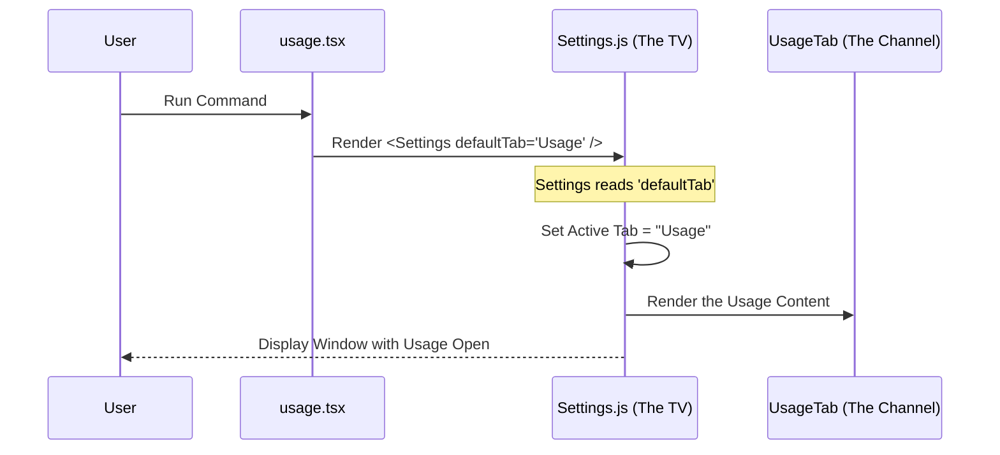

# Chapter 5: View Delegation / UI Configuration

Welcome to the final chapter of this specific tutorial series!

In the previous chapter, [JSX Command Handler](04_jsx_command_handler.md), we learned how to launch a React component when a command is run. We returned a specific line of code:

`return <Settings ... />`

But wait—we are building a **Usage** command. Why are we returning a **Settings** component? Why didn't we write `<UsagePanel />` or build HTML buttons from scratch?

In this chapter, we will explore **View Delegation** and **UI Configuration**. This is the secret to building new features rapidly without reinventing the wheel.

## The Motivation: Why do we need this?

Building a high-quality User Interface (UI) is hard.
*   You need a window frame with a "Close" button.
*   You need a navigation sidebar.
*   You need to handle light mode and dark mode.
*   You need to make sure the fonts match the rest of the app.

If every new command had to build these from scratch, your code would be huge, and every screen would look slightly different.

**The Use Case:** We want our "Usage" screen to look *exactly* like the main application settings. We want it to exist inside the standard settings window, but we want to "fast forward" the user directly to the usage information.

## The Concept: The Universal Remote

Think of the `Settings` component as a **Smart TV**.

*   **Building from scratch:** This is like building your own TV with soldering irons and glass just to watch the news. It takes forever and might explode.
*   **View Delegation:** This is like buying a pre-made Samsung TV. It already works. You just turn it on.
*   **UI Configuration:** This is like a **Universal Remote** with a macro button.

When the user runs our command, we act like that remote. We turn the TV on (render `<Settings />`), but we send a special signal (configuration) that says:

> "Don't start on the Home screen. Switch immediately to the **Usage** channel."

We **delegate** (hand off) the hard work of drawing the window to the `Settings` component, and we simply **configure** it to show what we want.

## How to use it

Let's look at our code in `usage.tsx` one last time.

```tsx
// usage.tsx
import { Settings } from '../../components/Settings/Settings.js';

export const call: LocalJSXCommandCall = async (onDone, context) => {
  // We reuse the generic 'Settings' component
  return (
    <Settings 
      onClose={onDone} 
      context={context} 
      defaultTab="Usage" // <--- THE MAGIC CONFIGURATION
    />
  );
};
```

### The Configuration Prop: `defaultTab`
This is the most important part of this chapter.

The `Settings` component is designed to be generic. It usually opens to a "General" or "Profile" tab. By passing `defaultTab="Usage"`, we override its default behavior.

1.  **Input:** The string `"Usage"`.
2.  **Action:** The component receives this prop.
3.  **Result:** It automatically highlights the "Usage" tab in the sidebar and renders the usage graphs in the main area.

If we changed this to `defaultTab="Billing"`, the exact same command would open the Billing screen instead. We control the view via configuration, not by rewriting code.

## Under the Hood: Internal Implementation

How does the `Settings` component know what to do?

When React renders a component, it passes these "props" (properties) down. The `Settings` component has internal logic to read `defaultTab` and set its initial state.

Here is the flow of data:



### Deep Dive: Inside the Shared Component

While we don't need to edit `Settings.js`, it helps to understand how it handles our request. Imagine the `Settings` component looks something like this internally:

```tsx
// Settings.js (Simplified Example)
export const Settings = (props) => {
  // 1. Initialize state using the configuration prop
  const [currentTab, setCurrentTab] = useState(props.defaultTab || 'General');

  // 2. Render the shared layout (Sidebar + Content)
  return (
    <div className="window-frame">
      <Sidebar active={currentTab} onClick={setCurrentTab} />
      
      {/* 3. Conditionally render the content */}
      {currentTab === 'Usage' && <UsageContent />}
      {currentTab === 'General' && <GeneralContent />}
    </div>
  );
};
```

**Explanation:**
1.  **State Initialization:** The component asks: "Did anyone pass me a `defaultTab`?" If yes (which we did), it starts there.
2.  **Shared Layout:** It draws the `Sidebar` and window frame. We didn't have to write this code in `usage.tsx`!
3.  **Conditional Rendering:** Because `currentTab` is 'Usage', it shows the usage content.

## Conclusion

In this tutorial series, we have built a complete, production-ready feature using a robust architecture.

1.  **[Type-Driven Contract](01_type_driven_contract.md):** We ensured our code was safe and compatible using TypeScript.
2.  **[Command Registration](02_command_registration.md):** We told the system our command exists and who can see it.
3.  **[Lazy Loading](03_lazy_loading___dynamic_import.md):** We ensured our code only loads when requested to keep the app fast.
4.  **[JSX Command Handler](04_jsx_command_handler.md):** We bridged the gap between the command line and the graphical interface.
5.  **View Delegation:** We reused a powerful existing component (`Settings`) and simply configured it (`defaultTab`) to solve our specific problem.

By using **View Delegation**, you saved hours of work. You didn't build a UI; you just told the existing UI where to go. This makes your codebase smaller, cleaner, and easier to maintain.

You are now ready to add your own commands to the system! Happy coding!

---

Generated by [Code IQ](https://github.com/adityasoni99/Code-IQ)