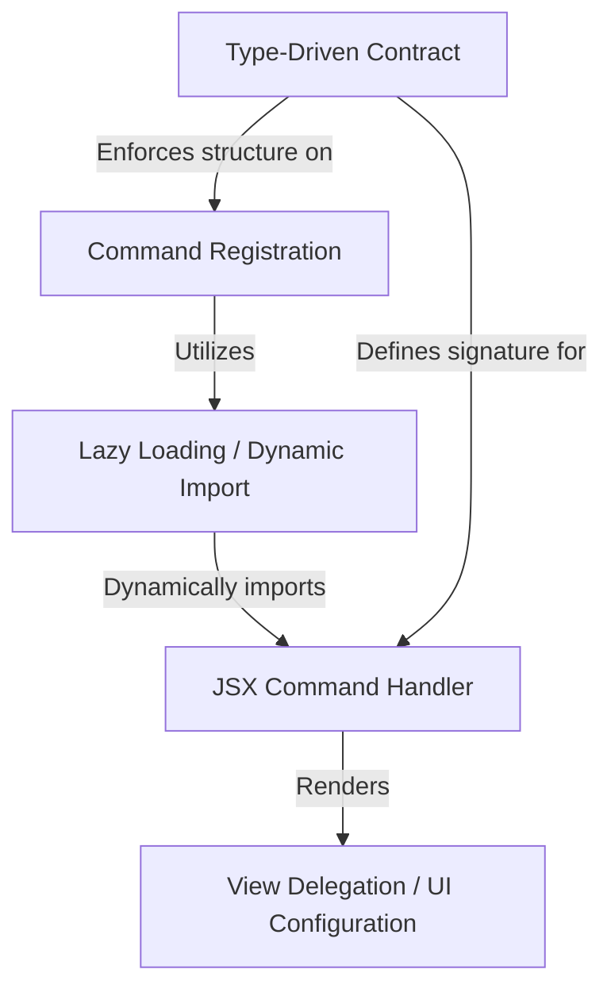

# Tutorial: usage

This project implements a specific **command** named `usage` designed for the *claude-ai* environment. Its purpose is to allow users to quickly check their plan limits by launching a pre-configured **Settings** interface. To ensure the application remains fast, it employs a *lazy loading* technique, meaning the code for the visual interface is only loaded into memory when the user explicitly triggers the command.

## Chapters

1. [Type-Driven Contract](01_type_driven_contract.md)
2. [Command Registration](02_command_registration.md)
3. [Lazy Loading / Dynamic Import](03_lazy_loading___dynamic_import.md)
4. [JSX Command Handler](04_jsx_command_handler.md)
5. [View Delegation / UI Configuration](05_view_delegation___ui_configuration.md)

---

Generated by [Code IQ](https://github.com/adityasoni99/Code-IQ)