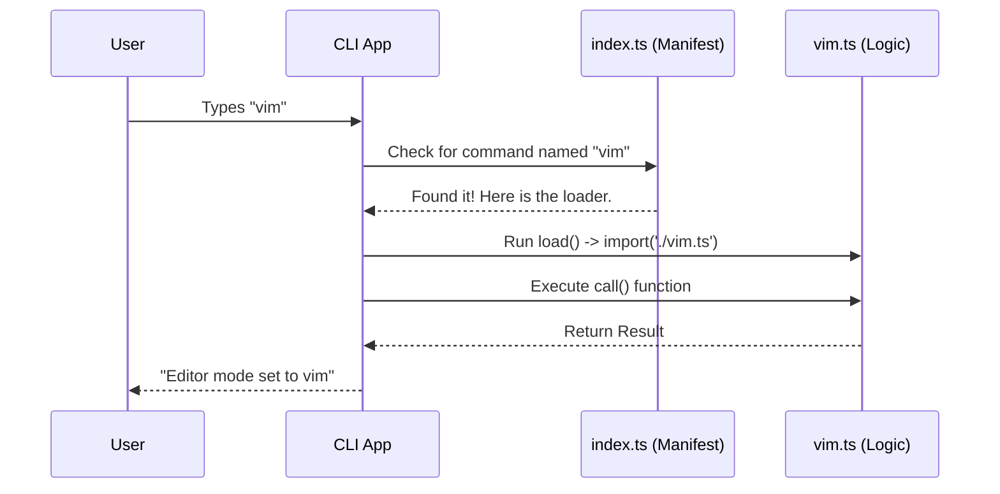

# Chapter 1: Command Definition & Registration

Welcome to the first chapter of our tutorial! We are going to build a `vim` command for a CLI (Command Line Interface) tool.

## The Motivation

Imagine you have written a cool piece of code that changes how text is edited. But right now, it's just a file sitting on your computer. If a user types `vim` in the terminal, the computer says "Command not found."

**The Problem:** How do we tell the main application that our new command exists, what it is called, and where to find the code to run it?

**The Use Case:** We want to create a command named `vim`. When a user runs it, it should toggle the editor mode (like switching between a standard notepad and the Vim editor).

## The Concept: The Restaurant Menu

The best way to understand **Command Definition & Registration** is to think of a restaurant.

1.  **The Menu (`index.ts`):** When you sit down, you look at a menu. It lists the names of dishes (e.g., "Spaghetti") and a description ("Pasta with tomato sauce"). It **does not** contain the chef or the stove. It just tells you what is available.
2.  **The Kitchen (`vim.ts`):** This is where the actual cooking happens. This file contains the logic and ingredients.

In our project, we separate these two concerns. We create a "manifest" file (the menu) that points to the "implementation" file (the kitchen).

## How to Register a Command

Let's look at the "Menu" file first. In this project, every command has an `index.ts` file that acts as its registration card.

### Step 1: Naming the Command

First, we define the basic identity of our command.

```typescript
// File: index.ts
import type { Command } from '../../commands.js'

const command = {
  name: 'vim',
  description: 'Toggle between Vim and Normal editing modes',
  supportsNonInteractive: false,
  type: 'local',
  // ... more code coming
}
```
**Explanation:**
*   `name`: This is what the user types in the terminal.
*   `description`: This is what appears when the user asks for help (e.g., `help vim`).
*   `type`: Defines where this runs (locally on your machine).

### Step 2: The "Lazy" Connection

Now, we need to connect the menu to the kitchen. We don't want to load the heavy cooking logic until the user actually orders the dish.

```typescript
// File: index.ts (continued)
const command = {
  // ... previous properties
  
  // This function is only called when the user runs the command!
  load: () => import('./vim.js'),
} satisfies Command

export default command
```

**Explanation:**
*   `load`: This is a function that dynamically imports the logic file.
*   `import('./vim.js')`: This points to the file where the code actually lives.
*   This concept is critical for performance. It ensures we don't slow down the CLI by loading code for commands the user isn't using yet. We will explore this deeper in [Dynamic Command Loading](02_dynamic_command_loading.md).

## Internal Implementation: Under the Hood

What actually happens when you type `vim` and hit Enter?

### The Flow

1.  The CLI app looks at its registry (the `index.ts` files).
2.  It finds a command with `name: 'vim'`.
3.  It executes the `load()` function we defined above.
4.  The `vim.ts` file is loaded into memory.
5.  The CLI executes the `call` function inside `vim.ts`.

### Visualizing the Process



### The "Kitchen" Code (`vim.ts`)

Now let's peek inside the implementation file to see how it handles the request. This file exports a `call` function.

#### Accessing Configuration
First, the command needs to know the current state.

```typescript
// File: vim.ts
import { getGlobalConfig, saveGlobalConfig } from '../../utils/config.js'

export const call: LocalCommandCall = async () => {
  // Get current settings
  const config = getGlobalConfig()
  let currentMode = config.editorMode || 'normal'
  
  // ... logic continues
```

**Explanation:**
*   `call`: This is the standard function name the CLI looks for.
*   `getGlobalConfig`: We fetch the current user settings. To learn more about how settings are stored, see [Global Configuration Management](04_global_configuration_management.md).

#### Changing the State
Next, we calculate the new mode (toggle between 'vim' and 'normal') and save it.

```typescript
// File: vim.ts (Logic)
  // Logic to swap modes
  const newMode = currentMode === 'normal' ? 'vim' : 'normal'

  // Save the new preference
  saveGlobalConfig(current => ({
    ...current,
    editorMode: newMode,
  }))
```

**Explanation:**
*   We use basic logic to switch `normal` to `vim` and vice versa.
*   We immediately save this change so it persists for the next command. This specific logic is detailed in [Editor Mode Logic](03_editor_mode_logic.md).

#### Telemetry and Output
Finally, we log that the user did something and return a message.

```typescript
// File: vim.ts (Ending)
  // Log usage data
  logEvent('tengu_editor_mode_changed', {
    mode: newMode,
    source: 'command',
  })

  return {
    type: 'text',
    value: `Editor mode set to ${newMode}.`
  }
}
```

**Explanation:**
*   `logEvent`: We track that this feature was used. This is covered in [Event Analytics & Telemetry](05_event_analytics___telemetry.md).
*   `return`: We send a text response back to the user.

## Conclusion

In this chapter, you learned how to **register a command**. We created a "Menu" (`index.ts`) that describes the command and tells the CLI where to find the "Kitchen" (`vim.ts`) where the code actually runs.

This separation keeps our application fast and organized. But how does the application find all these `index.ts` files automatically without us manually listing them in a central file?

To find out, proceed to the next chapter: [Dynamic Command Loading](02_dynamic_command_loading.md).

---

Generated by [Code IQ](https://github.com/adityasoni99/Code-IQ)