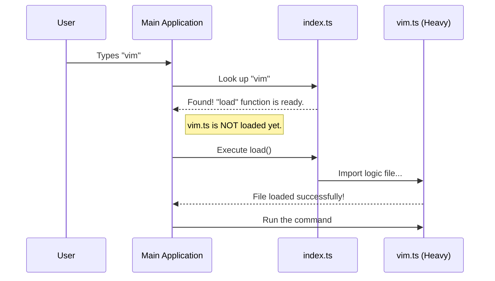

# Chapter 2: Dynamic Command Loading

Welcome back! In the previous chapter, [Command Definition & Registration](01_command_definition___registration.md), we created the "Menu" (`index.ts`) for our `vim` command. We told the application that a command named `vim` exists.

Now, we need to talk about **speed**.

## The Motivation

Imagine you are building a Command Line Interface (CLI) that has 500 different commands.

**The Problem:** If the application reads the code for all 500 commands every time you start it, the startup would be incredibly slow. It would feel sluggish just to print the help menu.

**The Use Case:** When a user simply wants to check the version of the app, we shouldn't force their computer to load the heavy logic required for the `vim` editor. We want to load the `vim` code **only** when the user actually types `vim`.

## The Concept: The Library Archive

To understand **Dynamic Command Loading**, think of a large library.

1.  **The Front Desk (`index.ts`):** The librarian sits here with a catalog. The catalog is light and easy to read. It tells you where books are, but it doesn't contain the actual text of the books.
2.  **The Archives (`vim.ts`):** This is the basement where the heavy books are stored.

**Dynamic Loading** works like this:
*   The librarian does **not** bring every single book from the archives to the desk when the library opens (Application Start).
*   Instead, the librarian waits until you ask for a specific book. Only then do they go down to the archives to retrieve it.

## How to Implement Dynamic Loading

We achieve this in our project using a feature called **Dynamic Imports**.

Let's look at our `index.ts` file again. The magic happens in the `load` property.

```typescript
// File: index.ts
import type { Command } from '../../commands.js'

const command = {
  name: 'vim',
  // ... (other properties like description)
  
  // The Magic: This function imports the code ON DEMAND
  load: () => import('./vim.js'),
} satisfies Command
```

**Explanation:**
*   `load`: This is a function that returns a "Promise" (a commitment to do something).
*   `() => ...`: This is an arrow function. Crucially, the code inside isn't run immediately. It sits there waiting to be called.
*   `import('./vim.js')`: This tells the language, "Go find the file `vim.js` and load it into memory now."

If we had written `import ... from './vim.js'` at the very top of the file, the code would load immediately. By putting it inside a function, we make it **lazy**.

## Internal Implementation: Under the Hood

How does the main application handle this? It acts as the coordinator. It reads the lightweight definition first, and only pulls the trigger on the heavy code if necessary.

### The Flow

1.  **Startup:** The App reads `index.ts`. It knows `vim` exists, but hasn't read the `vim.ts` code yet. Memory usage is low.
2.  **User Action:** User types `vim`.
3.  **Trigger:** The App sees that `vim` matches the input. It calls the `load()` function we defined.
4.  **Loading:** The `vim.ts` file is read from the disk and compiled.
5.  **Execution:** The App runs the command.

### Visualizing the Process



### Code Walkthrough (Framework Side)

While you don't need to write this part (it's part of the core framework), understanding it helps clarify why we write our command the way we do.

Imagine the CLI has a function that handles running commands. It might look something like this:

```typescript
// Framework Code (Simplified)
async function runCommand(commandName: string) {
  // 1. Find the definition in the registry
  const cmdDef = registry.find(c => c.name === commandName)

  if (cmdDef) {
    // 2. The Heavy Lifting: Load the file NOW
    // This is where our load() function gets called
    const module = await cmdDef.load()

    // 3. Run the logic inside the loaded file
    await module.call()
  }
}
```

**Explanation:**
1.  **Find:** The app finds the lightweight object from `index.ts`.
2.  **await cmdDef.load():** This pauses the app for a tiny millisecond to fetch the `vim.ts` file.
3.  **module.call():** Now that the file is loaded, it executes the logic we will write in the next chapter.

## Why This Matters for `vim`

Our `vim` command might eventually need to load user preferences or check telemetry settings.
*   **Without Dynamic Loading:** The app would check these preferences every time the user runs *any* command, even `help`.
*   **With Dynamic Loading:** We only check these preferences when the user specifically wants to toggle the editor mode.

This architecture sets the stage for checking configurations efficiently, which we will discuss in [Global Configuration Management](04_global_configuration_management.md), and sending usage data, discussed in [Event Analytics & Telemetry](05_event_analytics___telemetry.md).

## Conclusion

In this chapter, you learned:
1.  **The Problem:** Loading all code at startup is slow.
2.  **The Solution:** Use **Dynamic Command Loading** to act like a library archive—fetch only what is requested.
3.  **The Code:** How to use the `load: () => import(...)` pattern in your `index.ts`.

Now that we have successfully loaded our heavy code file (`vim.ts`), it's time to write the actual logic inside it. How do we actually swap the editor mode?

Proceed to the next chapter to find out: [Editor Mode Logic](03_editor_mode_logic.md).

---

Generated by [Code IQ](https://github.com/adityasoni99/Code-IQ)