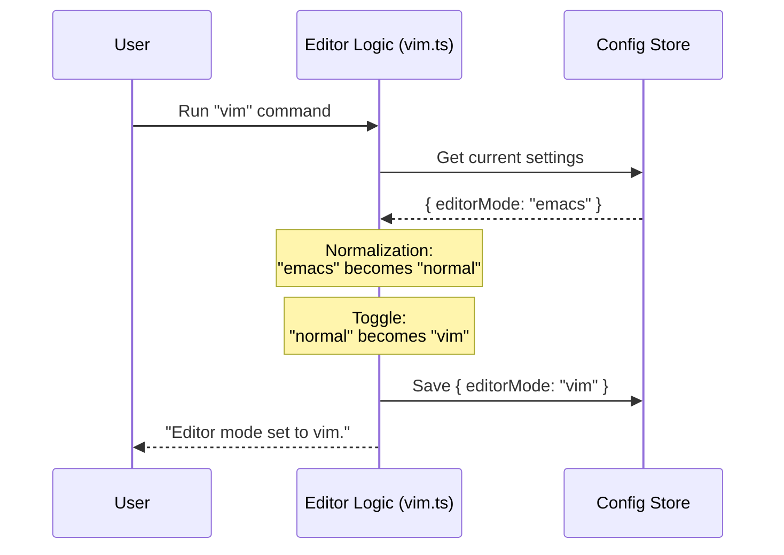

# Chapter 3: Editor Mode Logic

Welcome back! In the previous chapter, [Dynamic Command Loading](02_dynamic_command_loading.md), we set up our command so that the heavy code is only loaded when the user asks for it.

Now that the file is loaded, we need to write the actual "brain" of the command. This chapter covers the logic that decides how the editor behaves.

## The Motivation

Imagine a modern sports car. It has a button to switch between "Drive" (for comfortable, normal driving) and "Sport" (for high-performance driving).
*   The car is the same.
*   The driver is the same.
*   But the **rules** of how the car responds to the gas pedal change completely based on the selected mode.

**The Problem:** Our CLI tool handles text input. By default, it works like a standard notepad ("Normal"). But power users want it to behave like the famous Vim editor ("Vim"). We need a way to switch between these two sets of rules.

**The Use Case:** A user types `vim` in the terminal.
1.  If they are in `normal` mode, switch them to `vim`.
2.  If they are in `vim` mode, switch them to `normal`.
3.  **Crucially:** If they have an old, unsupported setting (like `emacs`), reset them to `normal` safely.

## The Concept: State Logic & Normalization

To handle this, we need to implement **Editor Mode Logic**. This involves three specific steps:

1.  **Retrieval:** Checking what the car is currently doing (Are we in Sport mode?).
2.  **Normalization:** Cleaning up bad data. If the car thinks it is in "Submarine Mode" (which doesn't exist), we must treat it as "Normal" mode to prevent a crash.
3.  **Toggling:** Flipping the switch to the opposite state.

## Implementing the Logic

Let's write the code inside `vim.ts`. We will break this down into small, manageable pieces.

### Step 1: Retrieval and Normalization

First, we need to find out the current state. We also need to handle "legacy" data. Suppose an older version of our app supported an `emacs` mode, but we removed it. We need to ensure we don't break if a user still has that setting.

```typescript
// Inside vim.ts
const config = getGlobalConfig()

// 1. Get current mode (default to 'normal' if undefined)
let currentMode = config.editorMode || 'normal'

// 2. Normalize: Treat 'emacs' as 'normal' (Backward Compatibility)
if (currentMode === 'emacs') {
  currentMode = 'normal'
}
```

**Explanation:**
*   `getGlobalConfig()`: Fetches the user's settings. (We will build this in [Global Configuration Management](04_global_configuration_management.md)).
*   `|| 'normal'`: This is a safety net. If no mode is set, assume 'normal'.
*   The `if` statement ensures that if we encounter the obsolete 'emacs' mode, we treat it just like 'normal' mode.

### Step 2: The Toggle Logic

Now that we have a clean `currentMode`, we decide what the *new* mode should be.

```typescript
// 3. Logic to swap modes
const newMode = currentMode === 'normal' ? 'vim' : 'normal'
```

**Explanation:**
*   This uses a "ternary operator" (a shortcut for if/else).
*   It asks: "Is the current mode 'normal'?"
    *   **Yes?** Set `newMode` to `'vim'`.
    *   **No?** Set `newMode` to `'normal'`.
*   This effectively acts as a light switch.

### Step 3: Saving the State

Changing a variable in memory isn't enough; we need to save it so the app remembers next time.

```typescript
// 4. Save the new preference
saveGlobalConfig(current => ({
  ...current, // Keep other settings (like theme, colors)
  editorMode: newMode, // Update only the editor mode
}))
```

**Explanation:**
*   `saveGlobalConfig`: This function updates the permanent configuration file.
*   `...current`: This is the "spread" operator. It ensures we don't accidentally delete other settings the user might have.

### Step 4: Providing Feedback

Finally, we need to tell the user what happened.

```typescript
// 5. Return a text response to the CLI
return {
  type: 'text',
  value: `Editor mode set to ${newMode}. ${
    newMode === 'vim'
      ? 'Use Escape key to toggle between INSERT and NORMAL modes.'
      : 'Using standard (readline) keyboard bindings.'
  }`,
}
```

**Explanation:**
*   The function returns an object telling the CLI to print text.
*   We add a helpful tip: if they switched to `vim`, we remind them how to use the Escape key.

## Internal Implementation: Under the Hood

What happens internally when this logic runs? Let's visualize the data flow.

### The Sequence

1.  **User** runs the command.
2.  **Logic** reads the config file.
3.  **Logic** "sanitizes" the data (turns 'emacs' into 'normal').
4.  **Logic** calculates the opposite mode.
5.  **Logic** writes back to the config file and informs the user.



### Full Context

Here is how the pieces fit together in the actual `vim.ts` file. Note that we also include a line for `logEvent`.

```typescript
// File: vim.ts
export const call: LocalCommandCall = async () => {
  // ... (Retrieval and Toggle Logic we wrote above) ...

  const newMode = currentMode === 'normal' ? 'vim' : 'normal'
  
  // ... (Save Logic) ...

  // Analytics: Record that the user changed modes
  logEvent('tengu_editor_mode_changed', {
    mode: newMode,
    source: 'command',
  })

  // ... (Return Logic) ...
}
```

**Explanation:**
*   `logEvent`: It is helpful to know how many users actually use the Vim mode. We track this data using telemetry. We will learn exactly how this works in [Event Analytics & Telemetry](05_event_analytics___telemetry.md).

## Conclusion

In this chapter, we built the "brain" of our command. You learned:

1.  **State Retrieval:** How to check the current status of the application.
2.  **Normalization:** The importance of handling legacy or dirty data (converting 'emacs' to 'normal').
3.  **Toggling:** Simple logic to switch between two states.

However, we treated `getGlobalConfig` and `saveGlobalConfig` as magic functions. How does the application actually store these settings? Does it use a database? A text file?

To understand how we persist user preferences, proceed to the next chapter: [Global Configuration Management](04_global_configuration_management.md).

---

Generated by [Code IQ](https://github.com/adityasoni99/Code-IQ)