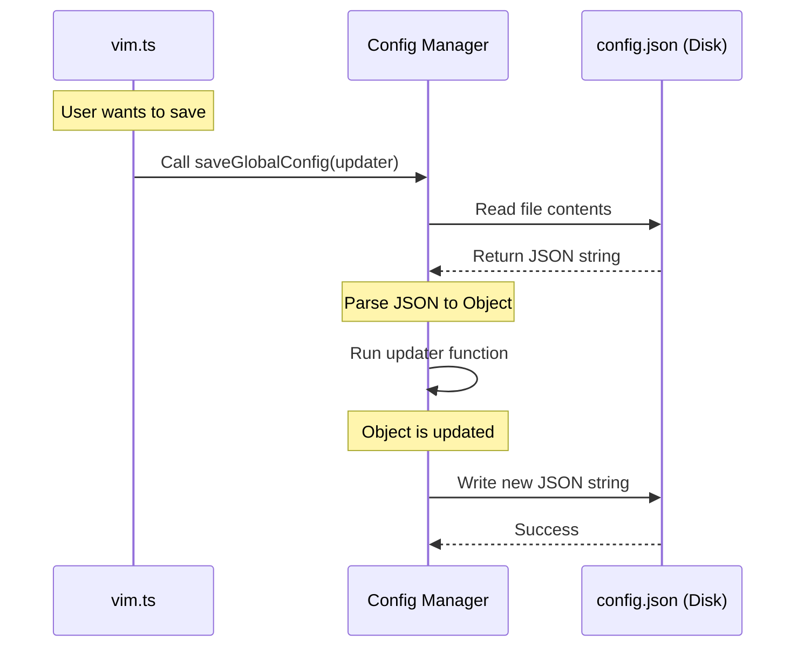

# Chapter 4: Global Configuration Management

Welcome back! In the previous chapter, [Editor Mode Logic](03_editor_mode_logic.md), we wrote the logic to toggle our editor between "Normal" and "Vim" modes.

However, we have a problem. If you change your setting to "Vim" mode, close your terminal, and open it again tomorrow, the application will forget your choice. It resets to "Normal" every time.

**The Problem:** Variables in code only live as long as the program is running. When the program stops, the memory is wiped clean.

**The Solution:** We need **Global Configuration Management**. This allows us to write settings to a permanent file on your computer's hard drive so they survive between sessions.

## The Concept: The "Save Game" File

Think of your application like a video game.
*   **Playing the game:** This is when the code is running in memory. You change settings, earn points, or move characters.
*   **Turning off the console:** The memory is cleared.
*   **The Save File:** This is a small file on the memory card. It records "Level: 5" or "Difficulty: Hard".

In our project, **Global Configuration Management** is the system that reads and writes this "Save File."

## How to Use It

We have provided two simple tools (functions) to handle this for you. You don't need to know *where* the file is stored, just how to ask for it.

### 1. Reading Settings (`getGlobalConfig`)

When your command starts, it needs to know the current situation. Is the user in Vim mode? What is their preferred theme?

We use `getGlobalConfig` to peek at the save file.

```typescript
import { getGlobalConfig } from '../../utils/config.js'

// 1. Read the file instantly
const settings = getGlobalConfig()

// 2. Check a specific value
if (settings.editorMode === 'vim') {
  console.log('Vim mode is active!')
}
```

**Explanation:**
*   **`getGlobalConfig()`**: This opens the configuration file, reads the text, converts it into a JavaScript object, and gives it to you.
*   **`settings.editorMode`**: We can access properties just like any other object.

### 2. Writing Settings (`saveGlobalConfig`)

When the user changes a setting (like toggling the editor mode), we need to update the save file.

We use `saveGlobalConfig` to write changes. This function is a bit special: instead of just giving it a value, we give it a **recipe** for how to update the settings.

```typescript
import { saveGlobalConfig } from '../../utils/config.js'

// Save the new state
saveGlobalConfig(currentSettings => ({
  ...currentSettings,  // 1. Copy ALL existing settings
  editorMode: 'vim',   // 2. Overwrite ONLY the editor mode
}))
```

**Explanation:**
*   **The Function Argument**: Notice we pass a function: `currentSettings => ({ ... })`.
*   **`...currentSettings` (The Spread Operator)**: This is crucial! It means "Take everything that was already in the settings (like theme, username, etc.) and copy it over."
*   **`editorMode: 'vim'`**: This tells the system, "After copying the old stuff, change this specific value to 'vim'."

If we didn't use `...currentSettings`, we would accidentally delete every other setting the user had!

## Implementing the Solution

Now, let's look at how we used this in our `vim` command to solve our specific use case.

### The Use Case: Toggling and Persisting

We want to read the current mode, flip it, and save it forever.

```typescript
// File: vim.ts (Snippet)

// 1. READ: Get the current state
const config = getGlobalConfig()
const currentMode = config.editorMode || 'normal'

// 2. LOGIC: Calculate the new state
const newMode = currentMode === 'normal' ? 'vim' : 'normal'

// 3. WRITE: Save it to the disk
saveGlobalConfig(current => ({
  ...current,
  editorMode: newMode,
}))
```

By adding step 3, we ensure that next time the user runs the CLI—even after restarting their computer—`getGlobalConfig` will see the new value.

## Internal Implementation: Under the Hood

How does this actually work? Is it a database? Magic?

It is actually very simple. The configuration is usually just a text file (specifically, a JSON file) stored in your user folder (e.g., `~/.config/myapp/config.json`).

### The Flow

When you call these functions, the application acts as a librarian managing a record book.



### The Framework Code (Simplified)

Here is a simplified version of what the `saveGlobalConfig` function does internally. It uses the Node.js File System (`fs`) module.

```typescript
// Internal Framework Code (Simplified)
import fs from 'node:fs'

export function saveGlobalConfig(updater) {
  // 1. Read the file from the hard drive
  const fileContent = fs.readFileSync('config.json', 'utf-8')
  
  // 2. Turn text into an object
  const currentConfig = JSON.parse(fileContent)

  // 3. Run the updater function you provided
  const newConfig = updater(currentConfig)

  // 4. Write the new object back to the hard drive
  fs.writeFileSync('config.json', JSON.stringify(newConfig))
}
```

**Explanation:**
1.  **`readFileSync`**: Opens the file on your disk.
2.  **`JSON.parse`**: Computers store files as text strings. This converts that string into code variables we can use.
3.  **`updater(...)`**: This is where your arrow function from earlier runs!
4.  **`writeFileSync`**: Saves the result back to the disk so it is there next time.

## Why This Matters

Without Global Configuration Management:
1.  Users would have to re-configure their tools every single time they open them.
2.  We couldn't remember user preferences.
3.  The "Vim" toggle we built in [Editor Mode Logic](03_editor_mode_logic.md) would be useless after the command finishes running.

## Conclusion

In this chapter, you learned how to give your application a long-term memory.
1.  **`getGlobalConfig`** lets you read the saved state.
2.  **`saveGlobalConfig`** lets you update that state without losing other data.

Now that our command is defined, loaded dynamically, logical, and persistent, we have a fully functioning feature!

But... how do we know if anyone is actually using it? Are users switching to Vim mode and staying there, or are they switching back immediately?

To answer these questions, we need to track usage data. Proceed to the final chapter: [Event Analytics & Telemetry](05_event_analytics___telemetry.md).

---

Generated by [Code IQ](https://github.com/adityasoni99/Code-IQ)