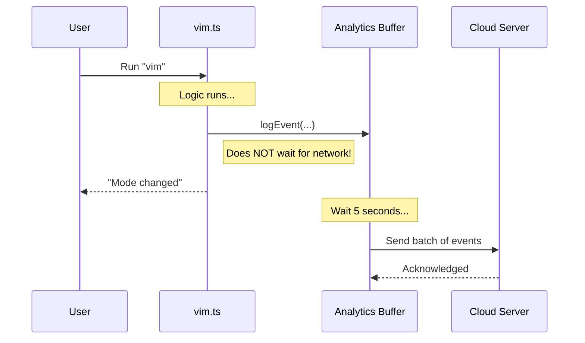

# Chapter 5: Event Analytics & Telemetry

Welcome to the final chapter of our tutorial! 

In the previous chapter, [Global Configuration Management](04_global_configuration_management.md), we gave our application a memory. We enabled it to save the user's preference (Normal vs. Vim mode) so it persists even after the computer is restarted.

Now, we face a different challenge. As developers, we are "flying blind." We built this cool Vim mode, but do we know if anyone is actually using it? Are users trying it once and immediately switching back?

To answer these questions, we need **Event Analytics & Telemetry**.

## The Motivation

Imagine you are an airplane engineer. You design a new landing gear system. Once the plane takes off, you can't see what the pilot does. 

**The Problem:** If you don't know how the pilot flies the plane, you can't improve the design.

**The Solution:** Airplanes have a "Black Box" (Flight Data Recorder). It silently records events like "Altitude: 10,000ft" or "Landing Gear: Down". It doesn't interfere with the flying; it just observes.

**The Use Case:** For our `vim` command, we want to record a "Black Box" entry every time a user toggles the editor mode. We want to know:
1.  **What happened?** (The mode changed).
2.  **What is the new state?** (Vim or Normal).
3.  **Where did it come from?** (The command line).

## The Concept: `logEvent`

In our code, the "Black Box" is a function called `logEvent`. 

It allows us to send a small packet of data to a database. We can look at this database later to see charts and graphs of how our tool is being used.

This system consists of two parts:
1.  **The Event Name:** A specific label for the action (e.g., `tengu_editor_mode_changed`).
2.  **The Metadata:** Extra details about the event (e.g., `{ mode: 'vim' }`).

## Implementing Telemetry

Let's look at how we add this to our `vim.ts` file. We place the "recorder" right after the logic that changes the mode.

### Step 1: The Code

We use the `logEvent` function provided by our analytics service.

```typescript
// File: vim.ts

// ... (Logic that calculated 'newMode') ...

// Record the event in the Black Box
logEvent('tengu_editor_mode_changed', {
  mode: newMode,    // e.g., 'vim' or 'normal'
  source: 'command' // telling us the user typed the command manually
})
```

**Explanation:**
*   **`logEvent`**: This is the function call that triggers the recording.
*   **`'tengu_editor_mode_changed'`**: This is the unique name we give this event. When we look at our data dashboard later, we will search for this name.
*   **`mode: newMode`**: We attach the result. This lets us calculate the percentage of users who prefer Vim vs. Normal.
*   **`source: 'command'`**: This helps us distinguish if the mode changed because the user typed a command, or if it changed automatically via some other script.

### Step 2: Where it fits

Here is the context within the file we built in the previous chapters.

```typescript
// File: vim.ts
export const call: LocalCommandCall = async () => {
  // ... (Get Config) ...
  // ... (Calculate newMode) ...
  // ... (Save Config) ...

  // TELEMETRY: The new part
  logEvent('tengu_editor_mode_changed', {
    mode: newMode,
    source: 'command',
  })

  // ... (Return Output to User) ...
}
```

Notice that we log the event *before* we return the success message to the user.

## Internal Implementation: Under the Hood

You might be wondering: "Does this slow down the app? Does the user have to wait for the data to be sent to the internet?"

The answer is **no**. Telemetry systems are designed to be **non-blocking**.

### The Flow

1.  **Buffer:** When you call `logEvent`, the data isn't sent to the cloud immediately. It is dropped into a local "mailbox" (a buffer array) in the computer's memory.
2.  **Background Process:** The application continues running immediately. The user sees "Editor mode set to vim" instantly.
3.  **Flush:** A background process checks the mailbox every few seconds (or when the app closes) and sends the batched letters to the server.

### Visualizing the Process



### The Framework Code (Simplified)

Here is a simplified view of what `logEvent` looks like inside the system.

```typescript
// Internal Framework Code (Simplified)

const eventQueue = [] // The "Mailbox"

export function logEvent(eventName, metadata) {
  // 1. Create the data packet
  const payload = {
    name: eventName,
    data: metadata,
    timestamp: Date.now()
  }

  // 2. Drop it in the mailbox
  eventQueue.push(payload)

  // 3. Return immediately!
  return
}
```

**Explanation:**
*   **`eventQueue.push`**: This operation is incredibly fast (nanoseconds). It just adds an item to a list.
*   **No `await`**: We do not wait for an HTTP request here. This ensures the CLI remains snappy for the user.

## Why This Matters

By adding these few lines of code, we transform our tool from a "static script" into a "product."

*   If we see 0 events for `vim` mode, we know the feature is undiscovered or unwanted.
*   If we see users switching to `vim` and then immediately back to `normal` (tracked by looking at the timestamps), we know the feature might be confusing or broken.

## Conclusion

In this chapter, you learned:
1.  **The Goal:** To understand user behavior without interrupting them.
2.  **The Tool:** `logEvent` acts as a flight recorder.
3.  **The Mechanism:** Events are buffered and sent in the background to keep the app fast.

### Tutorial Complete!

Congratulations! You have successfully built a complete, production-ready CLI command. Let's recap your journey:

1.  **[Command Definition & Registration](01_command_definition___registration.md):** You created the menu entry (`index.ts`).
2.  **[Dynamic Command Loading](02_dynamic_command_loading.md):** You optimized it to load code only when needed.
3.  **[Editor Mode Logic](03_editor_mode_logic.md):** You wrote the logic to toggle states.
4.  **[Global Configuration Management](04_global_configuration_management.md):** You gave the command long-term memory.
5.  **[Event Analytics & Telemetry](05_event_analytics___telemetry.md):** You added sensors to track usage.

You now have a fully functional `vim` command that is fast, smart, persistent, and measurable. Happy coding!

---

Generated by [Code IQ](https://github.com/adityasoni99/Code-IQ)