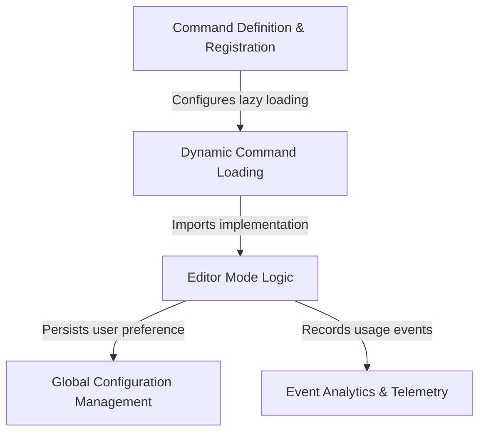

# Tutorial: vim

This project defines a CLI command that allows users to **toggle** between standard text editing and *Vim-style* key bindings. It utilizes a **lazy-loading** mechanism to keep startup fast, only importing the core logic when the command is run, and it automatically *persists* the user's choice to the global configuration while recording telemetry data for analysis.

## Chapters

1. [Command Definition & Registration](01_command_definition___registration.md)
2. [Dynamic Command Loading](02_dynamic_command_loading.md)
3. [Editor Mode Logic](03_editor_mode_logic.md)
4. [Global Configuration Management](04_global_configuration_management.md)
5. [Event Analytics & Telemetry](05_event_analytics___telemetry.md)

---

Generated by [Code IQ](https://github.com/adityasoni99/Code-IQ)