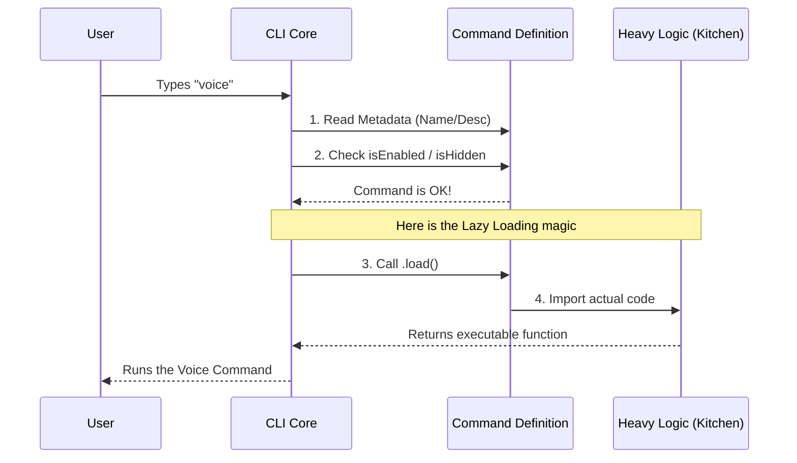

# Chapter 1: Command Definition Pattern

Welcome to the **Voice** project! In this tutorial series, we are going to build a robust Command Line Interface (CLI) feature.

## Why do we need this?

Imagine you are building a Swiss Army Knife. It has a knife, a screwdriver, a saw, and a pair of scissors.

If you tried to open all the tools at once every time you picked it up, it would be heavy, dangerous, and hard to handle. Instead, you keep them folded (hidden) and only pull out the specific tool you need, when you need it.

In software, this is the **Command Definition Pattern**.

We want to add a `voice` command to our CLI. The logic for voice processing is heavy (it needs audio libraries). If we load that heavy logic every time the user just wants to check the `help` menu, our CLI will be slow.

**The Solution:** We create a lightweight "Registration Card" (or Menu Item) that tells the CLI *about* the command without actually loading the heavy code until the user specifically asks for it.

---

## The "Restaurant Menu" Analogy

Think of this pattern like a **Menu in a Restaurant**:

1.  **The Menu (Command Definition):** Lists the name of the dish ("Steak") and a description ("Grilled to perfection"). It is lightweight and easy to read.
2.  **The Kitchen (Implementation):** This is where the cooking happens. It's hot, busy, and resource-intensive.
3.  **The Order:** The kitchen doesn't start cooking (loading the code) until you actually place an order.

In this chapter, we are writing the **Menu**.

---

## Step-by-Step Implementation

We will create a file called `index.ts`. This file acts as the registration card for our command.

### 1. Basic Metadata
First, we define the basics: what is this command called, and what does it do?

```typescript
// index.ts
const voice = {
  type: 'local',
  name: 'voice',
  description: 'Toggle voice mode',
  supportsNonInteractive: false,
  // ... more properties later
}
```

*   **name**: This is what the user types in the terminal (e.g., `> voice`).
*   **description**: This shows up in the help list so the user knows what it does.
*   **supportsNonInteractive**: Some commands can run automatically in scripts. We set this to `false` because voice mode requires a human to speak.

### 2. Visibility and Rules
Next, we determine *who* can order this item. Sometimes, a feature shouldn't be visible to everyone yet.

```typescript
// ... inside the object
  availability: ['claude-ai'],

  isEnabled: () => isVoiceGrowthBookEnabled(),

  get isHidden() {
    return !isVoiceModeEnabled()
  },
```

*   **availability**: Defines which platforms support this command.
*   **isEnabled**: A check to see if this feature is turned on globally.
*   **isHidden**: If the feature is disabled, we hide it from the menu completely.

> **Note:** These checks rely on concepts we will cover in [Feature Availability Gating](05_feature_availability_gating.md). For now, just know these act as the "bouncers" deciding if the command is available.

### 3. The "Lazy Load" (The Magic Part)
Finally, we tell the CLI where to find the "Kitchen" (the actual code), but we wrap it in a function so it doesn't run immediately.

```typescript
  // ... inside the object
  load: () => import('./voice.js'),
} satisfies Command

export default voice
```

*   **load**: This is a function. It uses `import()` to fetch the heavy `./voice.js` file *only* when called.
*   **satisfies Command**: This ensures our object follows the strict rules of a `Command` structure (TypeScript helper).
*   **export default**: We hand this lightweight card to the main application.

---

## What happens under the hood?

Let's visualize the flow. When you run the CLI, it doesn't load the voice libraries immediately. It only reads the definition we just wrote.



### Explanation of the flow:
1.  **Registration:** The CLI starts up. It reads our `index.ts`. It sees "Okay, there is a command named `voice`." It does **not** read `voice.js` yet.
2.  **User Input:** You type `voice`.
3.  **Verification:** The CLI checks `isEnabled`. If it's true, it proceeds.
4.  **Lazy Loading:** The CLI calls the `.load()` function defined in our object.
5.  **Execution:** The system now spends the time/memory to load the heavy `voice.js` file and runs it.

---

## Full Code Recap

Here is the complete file combining all the pieces we discussed. It's clean, simple, and efficient.

```typescript
import type { Command } from '../../commands.js'
import {
  isVoiceGrowthBookEnabled,
  isVoiceModeEnabled,
} from '../../voice/voiceModeEnabled.js'

const voice = {
  type: 'local',
  name: 'voice',
  description: 'Toggle voice mode',
  availability: ['claude-ai'],
  isEnabled: () => isVoiceGrowthBookEnabled(),
  get isHidden() {
    return !isVoiceModeEnabled()
  },
  supportsNonInteractive: false,
  load: () => import('./voice.js'),
} satisfies Command

export default voice
```

## Summary

In this chapter, you learned the **Command Definition Pattern**.
*   We created a lightweight "menu item" for our feature.
*   We separated the **metadata** (name, description) from the **implementation** (the code that runs).
*   We used **lazy loading** to keep our application fast.

Now that our command is defined and registered, we need to handle how the application remembers the user's choices (like which voice they want to use).

See you in the next chapter!

[Next: Settings Persistence & Change Detection](02_settings_persistence___change_detection.md)

---

Generated by [Code IQ](https://github.com/adityasoni99/Code-IQ)