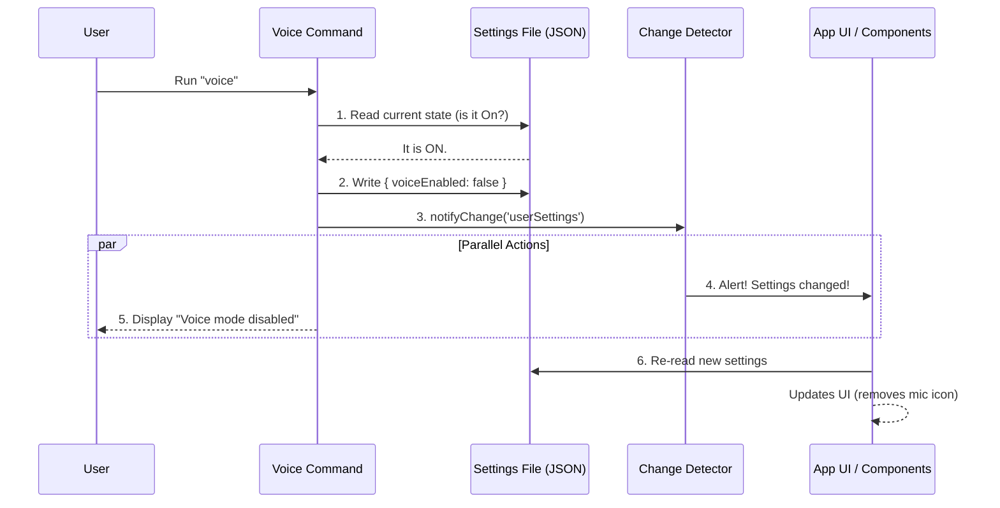

# Chapter 2: Settings Persistence & Change Detection

In the previous [Command Definition Pattern](01_command_definition_pattern.md), we created the "menu item" for our voice command.

Now, we need to make that command actually **do** something. Specifically, we need to remember if the user turned Voice Mode **ON** or **OFF**.

## The Problem: "Goldfish Memory"

By default, computer programs have the memory of a goldfish. If you set a variable like `let voiceOn = true`, the moment you restart the application, that variable is gone. It resets to `false`.

For a feature like "Voice Mode," users expect the application to **remember** their choice.

## The Concept: Smart Home Light Switch

Imagine a smart home light switch. When you flip it, two things happen:

1.  **Persistence (The Database):** It updates a central home database record: `LivingRoomLight: ON`. This ensures that if the power goes out and comes back, the light remembers to stay on.
2.  **Change Detection (The Signal):** It instantly sends a signal to your phone app, the kitchen display, and the lightbulb itself to say, "Hey! The status changed! Update your displays!"

We are going to implement exactly this pattern for our Voice Command.

---

## 1. Reading the Current State

Before we can toggle a switch, we need to know if it is currently up or down.

We use a helper function to read the current configuration snapshot.

```typescript
import { getInitialSettings } from '../../utils/settings/settings.js'

// 1. Get the current snapshot of settings
const currentSettings = getInitialSettings()

// 2. Check if voice is currently enabled
const isCurrentlyEnabled = currentSettings.voiceEnabled === true
```

*   **`getInitialSettings()`**: This reads the JSON file where user preferences are stored.
*   **`isCurrentlyEnabled`**: This gives us a simple `true` or `false`.

---

## 2. Persistence: Writing to Disk

If the user wants to change the setting, we need to write that change to the hard drive immediately. We use `updateSettingsForSource`.

```typescript
import { updateSettingsForSource } from '../../utils/settings/settings.js'

// If we want to turn it OFF:
const result = updateSettingsForSource('userSettings', {
  voiceEnabled: false,
})

// Check for errors (e.g., file permission issues)
if (result.error) {
  console.error("Could not save settings!")
}
```

*   **`'userSettings'`**: This tells the system *which* configuration file to update.
*   **`{ voiceEnabled: false }`**: This is the specific setting we are changing.
*   **`result.error`**: Always check if the save was successful!

---

## 3. Change Detection: Notifying the App

This is the critical step often missed by beginners. Just because you changed the file on the hard drive doesn't mean the rest of the running application knows about it yet!

We need to manually trigger the "Alarm System" to tell the UI to update.

```typescript
import { settingsChangeDetector } from '../../utils/settings/changeDetector.js'

// 1. We just saved the file...
// 2. Now, notify the system that 'userSettings' have changed
settingsChangeDetector.notifyChange('userSettings')
```

*   **`notifyChange`**: This sends an event to any part of the app listening for updates. For example, a status bar icon listening for this event will instantly switch from "Gray" to "Green."

---

## Putting it Together: The Toggle Logic

Here is how we combine these concepts inside our command logic. This snippet handles the case where the user wants to turn Voice Mode **OFF**.

```typescript
// inside voice.ts implementation
if (isCurrentlyEnabled) {
  // 1. Update the persistent file
  updateSettingsForSource('userSettings', { voiceEnabled: false })
  
  // 2. Notify the rest of the app
  settingsChangeDetector.notifyChange('userSettings')
  
  // 3. Give feedback to the user
  return { type: 'text', value: 'Voice mode disabled.' }
}
```

> **Note:** If we are turning Voice Mode **ON**, we usually run several checks (microphone permissions, installation checks) before saving the setting. We will cover those checks in [Environment Pre-flight Validation](03_environment_pre_flight_validation.md).

---

## Under the Hood

What happens internally when this code runs? Let's trace the flow of data.



### Explanation of the Diagram
1.  **Read:** The command checks the file to decide what to do.
2.  **Write:** The command updates the physical JSON file.
3.  **Notify:** The command pokes the `ChangeDetector`.
4.  **React:** The `ChangeDetector` tells the App. The App then re-reads the file to get the latest truth.

---

## Why separate "Write" and "Notify"?

You might ask: *Why doesn't `updateSettingsForSource` automatically notify everyone?*

In complex applications, you might want to update 5 different settings at once. If every update triggered a notification, the app would re-render 5 times, causing lag.

By keeping them separate, we can update multiple settings and then send **one** notification at the end.

## Summary

In this chapter, you learned:
*   **Persistence**: Using `getInitialSettings` and `updateSettingsForSource` to save user preferences to a file so they survive app restarts.
*   **Change Detection**: Using `settingsChangeDetector` to broadcast updates to the rest of the application instantly.

Now that we can save the user's desire to use Voice Mode, we face a new problem: **What if the user turns on Voice Mode, but they don't have a microphone?**

We need to check the environment before we allow the settings to change.

[Next: Environment Pre-flight Validation](03_environment_pre_flight_validation.md)

---

Generated by [Code IQ](https://github.com/adityasoni99/Code-IQ)