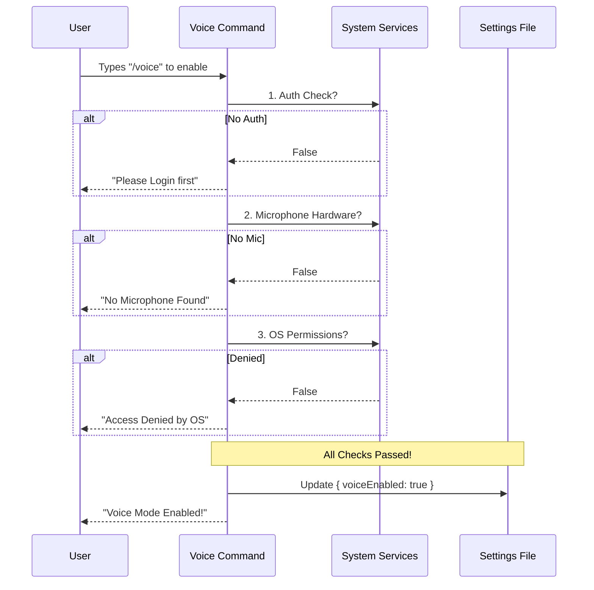

# Chapter 3: Environment Pre-flight Validation

In the previous chapter, [Settings Persistence & Change Detection](02_settings_persistence___change_detection.md), we learned how to save the user's preference (turning Voice Mode ON).

However, we have a problem. What if a user turns Voice Mode ON, but **they don't have a microphone plugged in**? Or what if they are missing the necessary audio software?

If we simply flip the switch to "ON" without checking, the application might crash or throw scary errors later.

## The Pilot's Checklist

We need to implement **Environment Pre-flight Validation**.

Think of your application like an airplane. Before a pilot takes off, they don't just throttle up. They go through a strict checklist:
1.  Is there fuel?
2.  Do the flaps work?
3.  Is the radio on?

If **any** of these checks fail, the plane stays on the ground.

In our CLI, before we allow the user to enable Voice Mode, we must check:
1.  **Authentication:** Are they logged in?
2.  **Hardware:** Is a microphone detected?
3.  **Software:** Are audio drivers/tools (like SoX) installed?
4.  **Permissions:** Did the user grant the OS permission to record?

---

## Step-by-Step Implementation

We are going to modify the logic inside our `voice.ts` command. instead of immediately saving `voiceEnabled: true`, we will run a gauntlet of checks.

### 1. The Auth Check (Is there fuel?)

First, voice mode uses cloud AI models, so we need to ensure the user is allowed to use it.

```typescript
// voice.ts
// 1. Check if the feature is globally enabled
if (!isVoiceModeEnabled()) {
  return { type: 'text', value: 'Voice mode is not available.' }
}

// 2. Check if the user is signed in
if (!isAnthropicAuthEnabled()) {
  return { 
    type: 'text', 
    value: 'Voice mode requires an account. Run /login.' 
  }
}
```
*   **The Logic:** If these return `false`, we return a text message immediately. The code stops here. The settings are **not** updated.

### 2. The Hardware Check (Is the radio working?)

Next, we check if the computer actually has a recording device. Note that we use `await import` here. We don't want to load the microphone library unless we passed the Auth check (Lazy Loading!).

```typescript
// Load the check service dynamically
const { checkRecordingAvailability } = await import('../../services/voice.js')

// Run the hardware check
const recording = await checkRecordingAvailability()

// If no microphone, stop here.
if (!recording.available) {
  return {
    type: 'text',
    value: 'No microphone found in this environment.'
  }
}
```

### 3. The Dependency Check (Do controls work?)

Our system relies on a tool called **SoX** (Sound eXchange) to handle audio streams. If the user hasn't installed it, we need to tell them.

```typescript
const { checkVoiceDependencies } = await import('../../services/voice.js')

const deps = await checkVoiceDependencies()

if (!deps.available) {
  return {
    type: 'text',
    value: 'No audio recording tool found. Please install SoX.'
  }
}
```
*   **User Experience:** Instead of crashing with `Error: command not found`, we give a helpful message guiding the user to install the missing tool.

### 4. The Permission Probe (Clearance for takeoff)

Finally, modern operating systems (macOS, Windows) require users to explicitly grant microphone permission.

```typescript
const { requestMicrophonePermission } = await import('../../services/voice.js')

// This triggers the system popup asking "Allow access to Microphone?"
const hasAccess = await requestMicrophonePermission()

if (!hasAccess) {
  return {
    type: 'text',
    value: 'Microphone access denied. Check System Privacy Settings.'
  }
}
```

### 5. Takeoff! (Save the Settings)

Only if **all** previous checks pass do we finally allow the setting to be changed.

```typescript
// All systems go!
updateSettingsForSource('userSettings', { voiceEnabled: true })

settingsChangeDetector.notifyChange('userSettings')

return { type: 'text', value: 'Voice mode enabled!' }
```

---

## What happens under the hood?

This pattern creates a "Funnel." Many users might try to enter, but only those with a valid environment make it through to the `updateSettings` call.



### Why is this better?

1.  **Prevention:** We prevent the application from entering a "broken state" where voice is on, but fails repeatedly in the background.
2.  **Education:** Each check returns a specific error message. We don't just say "Error." We say "Please install SoX" or "Check Privacy Settings."
3.  **Performance:** Because we check Auth first, we don't waste time checking the microphone hardware if the user isn't even logged in.

## Code Deep Dive

Here is the actual implementation logic from the source code, simplified slightly for clarity. Notice how it combines everything we discussed.

```typescript
// voice.ts (Logic Flow)

// ... imports ...

export const call = async () => {
  // 1. Initial Gatekeeping (Kill-switch & Auth)
  if (!isVoiceModeEnabled()) {
     // ... return error message
  }

  // 2. Hardware Check
  const { checkRecordingAvailability } = await import('../../services/voice.js')
  const recording = await checkRecordingAvailability()
  if (!recording.available) {
    return { type: 'text', value: recording.reason }
  }

  // 3. Software Dependency Check
  const { checkVoiceDependencies } = await import('../../services/voice.js')
  const deps = await checkVoiceDependencies()
  if (!deps.available) {
    return { type: 'text', value: 'Install audio tools...' }
  }

  // 4. OS Permission Check
  // We probe the mic now so the OS dialog appears immediately
  const { requestMicrophonePermission } = await import('../../services/voice.js')
  if (!(await requestMicrophonePermission())) {
    return { type: 'text', value: 'Microphone access is denied...' }
  }

  // 5. Success - Save Settings (From Chapter 2)
  updateSettingsForSource('userSettings', { voiceEnabled: true })
  settingsChangeDetector.notifyChange('userSettings')
  
  return { type: 'text', value: 'Voice mode enabled.' }
}
```

## Summary

In this chapter, you learned **Environment Pre-flight Validation**.

*   We treat enabling a complex feature like a pilot's checklist.
*   We validate **Authentication**, **Hardware**, **Dependencies**, and **Permissions** sequentially.
*   We provide specific feedback for every failure, helping the user fix their environment.

Now that the user has successfully enabled voice mode, the system needs to tell them *how* to use it (e.g., "Hold Space to talk").

[Next: Voice Configuration Feedback](04_voice_configuration_feedback.md)

---

Generated by [Code IQ](https://github.com/adityasoni99/Code-IQ)