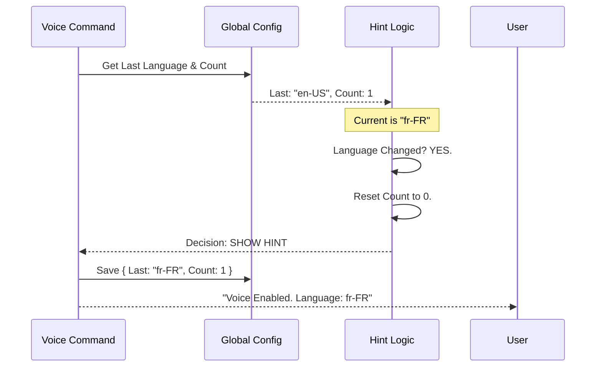

# Chapter 4: Voice Configuration Feedback

In the previous chapter, [Environment Pre-flight Validation](03_environment_pre_flight_validation.md), we ensured the user's computer was ready to record audio (checking microphones, permissions, and tools).

Now, the user has successfully turned Voice Mode **ON**.

But wait—what language is the system listening for? English? Spanish? Japanese?

If the user speaks French but the system is listening for English, the result will be gibberish. We need to tell the user what language is active. However, if we tell them **every single time** they turn it on, it becomes annoying.

This chapter introduces **Voice Configuration Feedback**: a smart logic system that decides *when* to show helpful hints and when to stay silent.

## The Goal: "The Helpful Co-Pilot"

Imagine a car's dashboard:
1.  **New Mode:** When you switch from "Eco" to "Sport" mode, the dashboard flashes a big message: **SPORT MODE ENGAGED**.
2.  **Routine:** If you drive in Sport mode every day, the car stops flashing the big message. It assumes you know what you are doing.
3.  **Change:** If you suddenly switch back to "Eco", it notifies you again.

We want our CLI to behave the same way:
*   **Show Hint:** If the user is new to Voice Mode.
*   **Show Hint:** If the user recently changed their language setting.
*   **Stay Silent:** If the user has seen the hint several times and hasn't changed anything.

---

## Key Concepts

To implement this, we need to track three things in our global configuration (the car's memory):

1.  **Current Language:** What is the user trying to use right now?
2.  **Last Used Language:** What did they use last time?
3.  **Hint Counter:** How many times have we annoyed them with the "You are using English" message?

---

## Step 1: Normalizing the Language

First, we need to know what language is set in the settings. Users might type "en", "en-US", or "english". We use a helper to standardise this into a code the system understands.

```typescript
import { normalizeLanguageForSTT } from '../../hooks/useVoice.js'
import { getInitialSettings } from '../../utils/settings/settings.js'

const settings = getInitialSettings()

// Converts user input into a standard code (e.g., "en-US")
// Also detects if the language is unsupported (fallback)
const stt = normalizeLanguageForSTT(settings.language)
```

*   **`stt.code`**: The clean language code (e.g., 'en-US').
*   **`stt.fellBackFrom`**: If the user chose an invalid language, this tells us what they *tried* to use.

---

## Step 2: The Logic Check

Now we compare the "Current" language against the "History". We decide if we should nag the user.

We define a constant `LANG_HINT_MAX_SHOWS = 2`. This means we show the hint 2 times before stopping.

```typescript
import { getGlobalConfig } from '../../utils/config.js'

const cfg = getGlobalConfig()

// 1. Did the user change language since last time?
const langChanged = cfg.voiceLangHintLastLanguage !== stt.code

// 2. How many times have they seen the hint?
// If they changed language, reset count to 0. Otherwise, use saved count.
const priorCount = langChanged ? 0 : (cfg.voiceLangHintShownCount ?? 0)

// 3. DECISION: Show hint if we haven't hit the limit (2)
const showHint = priorCount < 2
```

### Explanation
*   **`langChanged`**: Detects the "Switch from Eco to Sport" moment.
*   **`priorCount`**: If the language changed, we treat them like a new user (count = 0). If not, we remember the old count.
*   **`showHint`**: This is our final `true` or `false` decision.

---

## Step 3: Updating the Memory

If we decided to show the hint, we must increment the counter so we don't show it forever. We save this back to the global config.

```typescript
import { saveGlobalConfig } from '../../utils/config.js'

if (langChanged || showHint) {
  saveGlobalConfig(prev => ({
    ...prev,
    // Increment the count (unless we are hiding it)
    voiceLangHintShownCount: priorCount + (showHint ? 1 : 0),
    
    // Remember this language for next time
    voiceLangHintLastLanguage: stt.code,
  }))
}
```

*   **`saveGlobalConfig`**: Writes the new state to the disk. Next time the user runs the command, it will remember these numbers.

---

## Step 4: Constructing the Message

Finally, we build the string that gets sent to the user.

```typescript
let langNote = ''

if (stt.fellBackFrom) {
  // ERROR CASE: They picked a bad language
  langNote = ` Note: "${stt.fellBackFrom}" is not supported; using English.`
} else if (showHint) {
  // NORMAL CASE: Just a friendly reminder
  langNote = ` Dictation language: ${stt.code} (/config to change).`
}

// Combine with the main success message
return {
  type: 'text',
  value: `Voice mode enabled. Hold Space to record.${langNote}`,
}
```

---

## Internal Flow

Let's visualize the decision-making process. This happens in milliseconds before the message appears on the screen.



In this diagram, because the user switched from English to French, the system decided to show the hint and updated the database.

---

## Code Deep Dive

Here is how these pieces fit together in the actual `voice.ts` file. We keep the logic clean and linear.

### The Setup
We gather our data points immediately after updating the settings to "Enabled".

```typescript
// voice.ts
const stt = normalizeLanguageForSTT(currentSettings.language)
const cfg = getGlobalConfig()

// Did the language change?
const langChanged = cfg.voiceLangHintLastLanguage !== stt.code

// Calculate previous views based on change status
const priorCount = langChanged ? 0 : (cfg.voiceLangHintShownCount ?? 0)
```

### The Persistence
We update the database *only* if something meaningful happened (a change or a hint being shown).

```typescript
// voice.ts
const showHint = !stt.fellBackFrom && priorCount < LANG_HINT_MAX_SHOWS

if (langChanged || showHint) {
  saveGlobalConfig(prev => ({
    ...prev,
    voiceLangHintShownCount: priorCount + (showHint ? 1 : 0),
    voiceLangHintLastLanguage: stt.code,
  }))
}
```
*   **Why `!stt.fellBackFrom`?** If the language is unsupported, we show a specific warning message instead of the standard hint, so we don't increment the standard hint counter.

### The User Feedback
We append the calculated note to the standard instruction.

```typescript
// voice.ts
let langNote = ''

if (stt.fellBackFrom) {
   langNote = ` Note: "${stt.fellBackFrom}" is unsupported...`
} else if (showHint) {
   langNote = ` Dictation language: ${stt.code} (/config to change).`
}

return {
  type: 'text',
  value: `Voice mode enabled. Hold ${key} to record.${langNote}`,
}
```

## Summary

In this chapter, you learned how to implement **Voice Configuration Feedback**.

*   We moved beyond simple "On/Off" messages to "Context-Aware" messages.
*   We tracked user history (counters and previous states) to avoid being annoying.
*   We handled edge cases where a user selects an unsupported language.

At this point, our Voice Command is fully functional! It handles setup, checks the environment, saves settings, and gives smart feedback.

But there is one final layer of security. Currently, we check if the user is *logged in*, but we also need a way to turn this feature off remotely for *everyone* if there is a major bug.

[Next: Feature Availability Gating](05_feature_availability_gating.md)

---

Generated by [Code IQ](https://github.com/adityasoni99/Code-IQ)