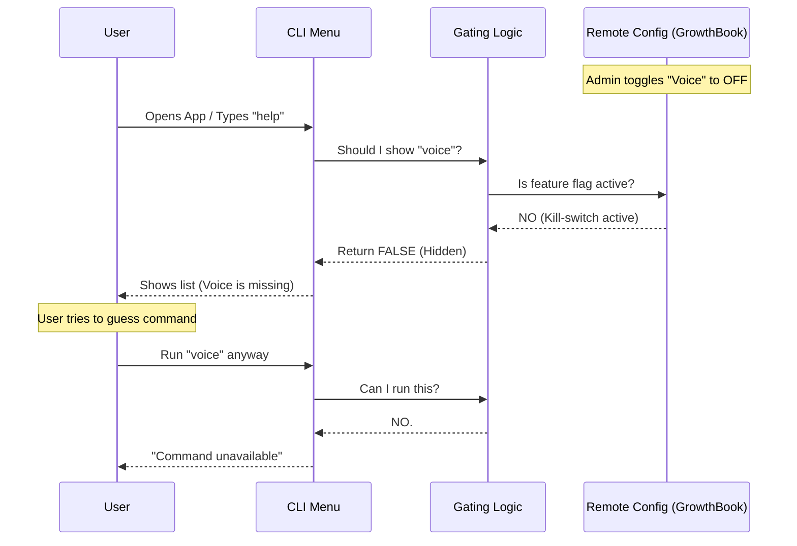

# Chapter 5: Feature Availability Gating

In the previous chapter, [Voice Configuration Feedback](04_voice_configuration_feedback.md), we added helpful hints to guide the user on how to use the voice feature.

We have built a fully functional feature! But now we face a safety and business challenge.

## The Problem: The "Broken Door" Scenario

Imagine we release the Voice feature, but suddenly we discover a critical bug that causes the application to crash for everyone.

If the code is already on the user's computer, how do we stop them from using it? We can't reach into their computer and delete the file. Usually, we would have to release a **new version** of the app, which takes time.

We need a faster way. We need a "Remote Control" to turn the feature off instantly, everywhere in the world, without the user updating their app.

## The Solution: The Bouncer

This pattern is called **Feature Availability Gating**.

Think of your command like a **Nightclub**:
1.  **The Command:** The Club itself.
2.  **The User:** The guest trying to enter.
3.  **The Gate:** A security guard (The Bouncer) at the door.

Even if the club is open (the code exists), the Bouncer checks two things:
1.  **ID Check (Authentication):** Is this user allowed to be here? (Are they logged in?)
2.  **Capacity Rules (Feature Flags):** Did the club owner call and say "Shut it down"? (Remote Kill-switch).

---

## 1. Centralizing the Logic

First, we don't want to write these complex checks inside every single file. We create a central "Rule Book" file.

We call this `voiceModeEnabled.ts`.

```typescript
// voice/voiceModeEnabled.ts

// The remote switch (GrowthBook)
import { isVoiceGrowthBookEnabled } from './growthBook.js'
// The user ID check (Auth)
import { isAnthropicAuthEnabled } from '../utils/auth.js'

export const isVoiceModeEnabled = () => {
  // Rule 1: Is the remote switch ON?
  if (!isVoiceGrowthBookEnabled()) {
    return false
  }
  
  // Rule 2: Is the user logged in?
  if (!isAnthropicAuthEnabled()) {
    return false // Gate closed
  }

  return true // Gate open
}
```

*   **`isVoiceGrowthBookEnabled()`**: Checks a remote server configuration. If we toggle a switch on our server dashboard, this returns `false` instantly for all users.
*   **`isAnthropicAuthEnabled()`**: Checks if the user has signed in.

---

## 2. Hiding the "Menu Item"

Now we go back to our [Command Definition Pattern](01_command_definition_pattern.md) from Chapter 1.

If the Bouncer says the club is closed, we shouldn't even show the sign on the street. We should hide the command from the CLI's `help` menu so users don't try to click it.

```typescript
// index.ts
import { isVoiceModeEnabled } from '../../voice/voiceModeEnabled.js'

const voice = {
  name: 'voice',
  description: 'Toggle voice mode',
  
  // The magic property
  get isHidden() {
    // If voice mode is NOT enabled, hide this command.
    return !isVoiceModeEnabled()
  },
  
  // ... other properties
}
```

*   **`get isHidden()`**: The CLI checks this property every time it renders the menu. If `isVoiceModeEnabled()` returns false (because of the kill-switch or auth), the command vanishes from the UI.

---

## 3. Double-Checking Execution

Sometimes, a user might know the command exists even if it is hidden (e.g., they wrote a script yesterday). They might try to force their way past the Bouncer.

So, we place a **second** guard right inside the command execution logic.

```typescript
// voice.ts
import { isVoiceModeEnabled } from '../../voice/voiceModeEnabled.js'

export const call = async () => {
  // FINAL CHECK: Stop right here if not allowed.
  if (!isVoiceModeEnabled()) {
    return {
      type: 'text',
      value: 'Voice mode is currently unavailable.',
    }
  }

  // ... continue to load microphone logic ...
}
```

This ensures that even if someone finds the "Back Door," the security system still stops them.

---

## What happens under the hood?

Let's visualize the flow when a user opens the application.



### Explanation
1.  **Remote Config:** An admin controls the feature status from a web dashboard.
2.  **The Check:** The application asks the `Guard` (our logic) before showing or running anything.
3.  **The Denial:** If the remote switch is off, the command effectively ceases to exist for the user.

---

## Code Deep Dive

Here is how we handle the nuanced "Auth Hint" logic in the actual implementation.

Sometimes, if the feature is on but the user just isn't logged in, we don't want to hide it completely—we want to tell them to log in!

```typescript
// voice.ts (Implementation Detail)

if (!isVoiceModeEnabled()) {
  // Case A: User just needs to log in
  if (!isAnthropicAuthEnabled()) {
    return {
      type: 'text',
      value: 'Voice mode requires an account. Run /login.',
    }
  }

  // Case B: Kill-switch is active (Feature is dead)
  return {
    type: 'text',
    value: 'Voice mode is not available.',
  }
}
```

### Why differentiate?
*   **Case A:** The user *can* fix this. We give them helpful advice ("Run /login").
*   **Case B:** The user *cannot* fix this (we disabled it remotely). We give a generic "Not available" message.

---

## Summary

In this final chapter, you learned **Feature Availability Gating**.

*   We act like a **Bouncer**, checking credentials before letting users in.
*   We use **Remote Feature Flags (GrowthBook)** to create a "Kill-switch" for emergencies.
*   We use **Authentication Checks** to ensure only authorized users access the feature.
*   We applied this logic to both **Hide** the command from the menu and **Block** the command from running.

### Series Conclusion

Congratulations! You have built a complete, production-grade CLI feature.

1.  You defined the command lazily ([Chapter 1](01_command_definition_pattern.md)).
2.  You persisted user settings ([Chapter 2](02_settings_persistence___change_detection.md)).
3.  You validated the environment ([Chapter 3](03_environment_pre_flight_validation.md)).
4.  You provided smart feedback ([Chapter 4](04_voice_configuration_feedback.md)).
5.  And finally, you secured the feature with gating ([Chapter 5](05_feature_availability_gating.md)).

You now possess the toolkit to build robust, user-friendly, and controllable CLI applications. Happy coding!

---

Generated by [Code IQ](https://github.com/adityasoni99/Code-IQ)