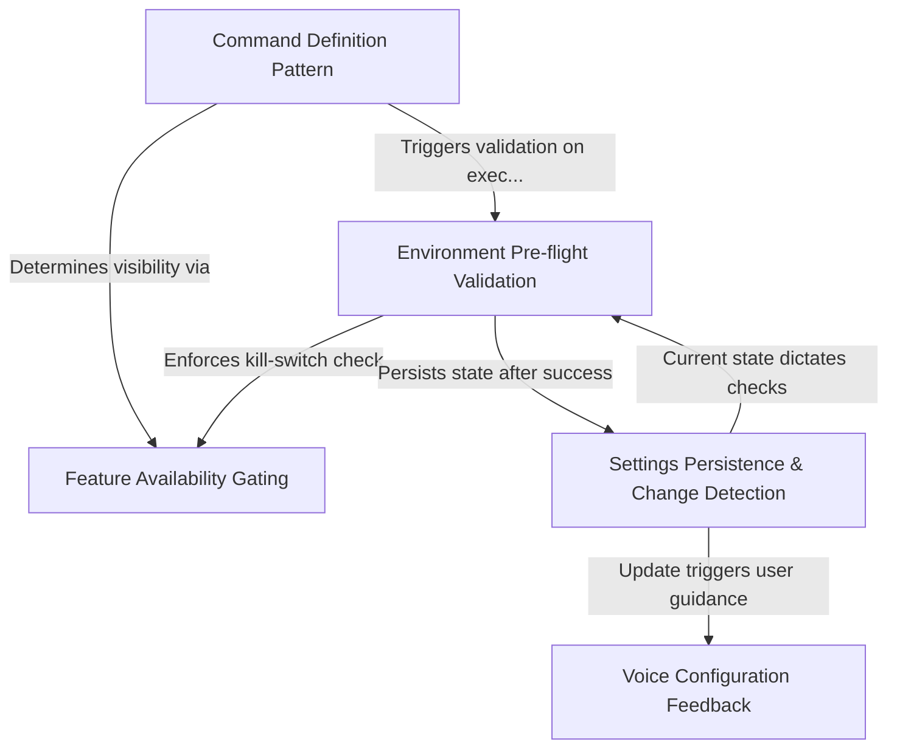

# Tutorial: voice

This project implements a **voice mode** for a CLI application, allowing users to toggle dictation features. It handles the complete lifecycle of the feature, including **environment validation** (checking microphone and dependencies), **settings persistence**, and **feature gating** via remote flags to ensure a stable and secure user experience.

## Chapters

1. [Command Definition Pattern](01_command_definition_pattern.md)
2. [Settings Persistence & Change Detection](02_settings_persistence___change_detection.md)
3. [Environment Pre-flight Validation](03_environment_pre_flight_validation.md)
4. [Voice Configuration Feedback](04_voice_configuration_feedback.md)
5. [Feature Availability Gating](05_feature_availability_gating.md)

---

Generated by [Code IQ](https://github.com/adityasoni99/Code-IQ)