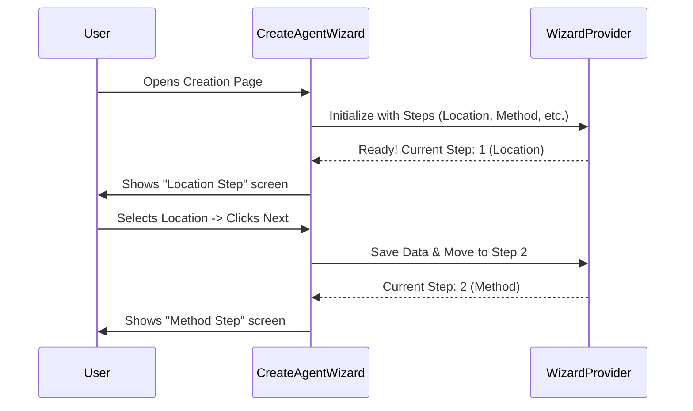

# Chapter 1: agents/new-agent-creation/CreateAgentWizard.tsx

Welcome to the first chapter of the **components** project tutorial! We are going to start with a very exciting feature: building the tool that allows users to create new AI Agents.

## The Motivation: Why do we need a Wizard?

**The Use Case:** Imagine you want to create a helper bot called "Chef Bot." To make Chef Bot work, you need to define many things:
1.  Where does it live?
2.  What is its name?
3.  What AI model does it use (e.g., GPT-4)?
4.  What tools can it use (e.g., Google Search)?
5.  What is its personality?

**The Problem:** If we put all these settings on one giant form, it would look like a tax return document—scary, confusing, and overwhelming!

**The Solution:** We use a **Wizard**.
Think of a Wizard like a friendly tour guide. Instead of asking you 20 questions at once, the guide asks, "First, what is the name?" followed by "Great! Now, what tools should it use?" This component, `CreateAgentWizard.tsx`, is the master blueprint for that tour.

---

## Key Concepts

Before we look at code, let's understand the pieces involved.

1.  **The Wizard:** This is the overall container. It manages the timeline of creation.
2.  **The Steps:** These are the individual screens (e.g., the screen where you pick a color).
3.  **The Provider:** Think of this as the "backpack" or "memory" of the wizard. It holds onto the data (like the Agent's name) as you move from Step 1 to Step 2.

### Analogy: The Sandwich Assembly Line
Imagine `CreateAgentWizard` is the manager of a sandwich shop.
*   **The Steps** are the stations: Bread Station -> Meat Station -> Veggie Station -> Sauce Station.
*   **The Provider** is the tray sliding down the line, holding your sandwich together as it gets built.
*   You (the user) just walk down the line making one choice at a time.

---

## How to Use It

Using this component is actually very simple because it is a self-contained "smart" component. It brings its own logic with it.

If you were building the page that lets users create agents, you would simply drop this component into your layout.

```tsx
import React from 'react';
// We import the Wizard component
import CreateAgentWizard from './agents/new-agent-creation/CreateAgentWizard';

const CreatePage = () => {
  // We simply place the Wizard in our page
  return (
    <div className="page-container">
       <CreateAgentWizard />
    </div>
  );
};
```

**What happens here?**
By simply rendering `<CreateAgentWizard />`, the application starts the multi-step process. The user will immediately see the first step of the creation flow.

---

## Under the Hood: How it Works

Now, let's look inside `CreateAgentWizard.tsx` to see how it organizes the assembly line.

### The Logic Flow

When this component loads, it does two main things:
1.  It defines the **Order of Operations** (which step comes first, second, etc.).
2.  It wraps everything in a **WizardProvider** so the steps can talk to each other.

Here is a sequence diagram of how the Wizard interacts with the user and the internal logic:



### Implementation Details

Let's look at how the code is structured inside. We'll break it down into small pieces.

#### 1. Defining the Steps
First, the component needs a list of all the stops on our tour. This is usually an array of objects, where each object represents a screen.

```tsx
// Inside CreateAgentWizard.tsx

const steps = [
  { id: 'location', label: 'Location', component: <LocationStep /> },
  { id: 'method',   label: 'Method',   component: <MethodStep /> },
  { id: 'identity', label: 'Identity', component: <AgentIdentityStep /> },
  { id: 'tools',    label: 'Tools',    component: <ToolsStep /> },
  // ... and so on for Model, Memory, etc.
];
```

*Explanation:* We create a list called `steps`. Each item has an `id` and the actual `component` (the React code) that should show up on the screen for that step.

#### 2. The Return Statement (The Wrapper)
Finally, the component returns the JSX (UI). It wraps the steps in the `WizardProvider`.

```tsx
// The component output
return (
  <WizardProvider steps={steps} initialStep={0}>
    <div className="wizard-layout">
        {/* Components here display the current step and buttons */}
        <WizardStepDisplay /> 
        <WizardNavigationButtons />
    </div>
  </WizardProvider>
);
```

*Explanation:*
*   `<WizardProvider>`: This is the "brain." We feed it the `steps` list we created above. It handles the logic of "Next," "Back," and saving data.
*   `<WizardStepDisplay />`: This is a placeholder for the part of the code that asks the Provider, "Which component should I show right now?"
*   `<WizardNavigationButtons />`: These are your "Next" and "Previous" buttons.

### Summary of Internal Logic

1.  **Configuration:** The file hardcodes the sequence: Location -> Method -> Generate -> Type -> Prompt -> Description -> Tools -> Model -> Color -> Memory.
2.  **State Management:** It relies on `WizardProvider` to keep track of the form data (like the agent's name) so it doesn't get lost when you switch to the "Tools" screen.
3.  **Composition:** It combines many smaller components (like `LocationStep` or `ColorStep`) into one cohesive flow.

---

## Conclusion

In this chapter, we explored **`agents/new-agent-creation/CreateAgentWizard.tsx`**.

We learned that:
*   It acts as a **conductor** for the agent creation process.
*   It solves the problem of overwhelming forms by breaking them into a **step-by-step wizard**.
*   It uses a **Provider** pattern to manage the list of steps and the data collected along the way.

You now understand the high-level entry point for creating agents!

[Next Chapter: Coming Soon](02_coming_soon.md)

---

Generated by [Code IQ](https://github.com/adityasoni99/Code-IQ)