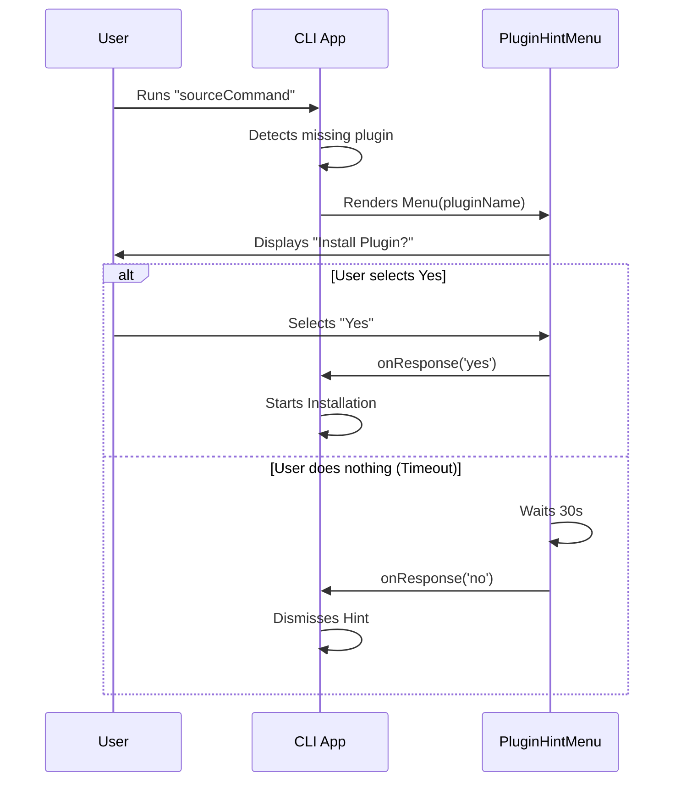

# Chapter 1: Plugin Hint System

Welcome to the first chapter of our journey into building a smart Command Line Interface (CLI)!

We are going to start with a feature that makes your tool feel intelligent: the **Plugin Hint System**.

### The Motivation: A Helpful Assistant

Imagine you are in a kitchen trying to open a can of soup, but you are holding a spoon. A helpful assistant taps you on the shoulder and says: *"I see you are trying to open a can. Would you like me to hand you the Can Opener tool?"*

This is exactly what the **Plugin Hint System** does for your code.

When a user runs a command (like `sourceCommand`) but lacks the specific tool to handle it perfectly, this system steps in. It presents a menu suggesting a specific extension (Plugin) from a marketplace that can do the job.

### Key Concepts

To make this work, we need three main ingredients:

1.  **The Trigger**: The user tries to do something (e.g., "Run Python script").
2.  **The Suggestion**: We know the name of the plugin that helps (e.g., "Python Executor").
3.  **The Interaction**: We need to ask the user if they want to install it, and handle their answer.

---

### Using the Plugin Hint Menu

The core of this system is a React component called `PluginHintMenu`. It handles the display and the user's choice.

Here is a high-level look at how we use it in our application code.

#### 1. Defining the Component
We pass the details of what we are recommending.

```tsx
<PluginHintMenu
  pluginName="Data Viewer"
  marketplaceName="Official Store"
  sourceCommand="view-data"
  onResponse={(choice) => handleUserChoice(choice)}
/>
```

#### 2. What the User Sees
When this code runs, the user sees a neat dialog box in their terminal:

> **Plugin Recommendation**
> The **view-data** command suggests installing a plugin.
> Plugin: Data Viewer
> Marketplace: Official Store
>
> **Would you like to install it?**
> [>] Yes, install Data Viewer
> [ ] No
> [ ] No, and don't show plugin installation hints again

---

### Code Walkthrough

Let's look under the hood of `PluginHintMenu.tsx`. We will break it down into small, easy-to-understand pieces.

#### Part 1: The Setup (Props)
First, we define what information the menu needs to function.

```tsx
// We define what data we need from the parent
type Props = {
  pluginName: string;         // The name of the tool to install
  marketplaceName: string;    // Where it comes from
  sourceCommand: string;      // What the user typed to trigger this
  // The function to call when the user picks an option
  onResponse: (response: 'yes' | 'no' | 'disable') => void;
};
```
*Explanation*: These `Props` act like the configuration settings for our menu. The `onResponse` is crucial—it's how the menu talks back to the main application.

#### Part 2: The Options
We need to define what choices the user can make.

```tsx
const options = [{
  label: <Text>Yes, install <Text bold>{pluginName}</Text></Text>,
  value: 'yes'
}, {
  label: 'No',
  value: 'no'
}, {
  label: "No, and don't show plugin installation hints again",
  value: 'disable'
}];
```
*Explanation*: We create an array of options. Notice that for the "Yes" option, we use `<Text>` components to make the plugin name bold. This formatting relies on [Ink UI Components](02_ink_ui_components.md).

#### Part 3: Handling the Selection
When the user picks an option, we need to process it.

```tsx
function onSelect(value: string): void {
  switch (value) {
    case 'yes':
      onResponse('yes');
      break;
    case 'disable':
      onResponse('disable');
      break;
    default:
      onResponse('no');
  }
}
```
*Explanation*: This function acts as a middleman. It takes the raw value selected by the user and ensures the correct `onResponse` callback is fired.

#### Part 4: Rendering the UI
Finally, we put it all together inside a dialog wrapper.

```tsx
return (
  <PermissionDialog title="Plugin Recommendation">
    <Box flexDirection="column" paddingX={2}>
      <Text>
        The <Text bold>{sourceCommand}</Text> suggests a plugin.
      </Text>
      {/* ... details regarding plugin name ... */}
      <Select 
        options={options} 
        onChange={onSelect} 
      />
    </Box>
  </PermissionDialog>
);
```
*Explanation*:
1.  We wrap everything in a `PermissionDialog` to give it a nice border and title (see [Permission Dialog Wrapper](03_permission_dialog_wrapper.md)).
2.  We use `Box` and `Text` to layout the description.
3.  We use the `Select` component to let the user choose an answer (see [Custom Selection Input](04_custom_selection_input.md)).

---

### Internal Implementation Logic

How does the data flow when this hint appears? Let's visualize the process.



#### The Auto-Dismiss Feature
You might have noticed in the diagram above that if the user does nothing, the menu disappears.

The `PluginHintMenu` includes a built-in timer. If the user doesn't interact within 30 seconds (`AUTO_DISMISS_MS`), the menu automatically selects "No" to keep the terminal clean.

```tsx
React.useEffect(() => {
  // Set a timer to auto-dismiss after 30 seconds
  const timeoutId = setTimeout(
    ref => ref.current('no'), 
    AUTO_DISMISS_MS, 
    onResponseRef
  );
  // Clean up the timer if the user answers manually
  return () => clearTimeout(timeoutId);
}, []);
```
*Explanation*: This uses React's `useEffect` to start a countdown the moment the menu appears. We will cover the specific mechanics of this timer logic in detail in [Time-Limited Interactions](05_time_limited_interactions.md).

---

### Conclusion

You have now learned how to create a **Plugin Hint System**! This component is a friendly way to bridge the gap between what a user *wants* to do and the tools they *need* to do it.

Key takeaways:
1.  **Context is key**: Always tell the user *why* you are suggesting a plugin (using the `sourceCommand`).
2.  **Clear choices**: Offer a clear "Yes", "No", and a way to opt-out ("Disable").
3.  **Clean up**: Use auto-dismiss timers so the interface doesn't get stuck waiting forever.

To make this menu look good, we relied heavily on basic building blocks. In the next chapter, we will learn exactly how those blocks work.

[Next Chapter: Ink UI Components](02_ink_ui_components.md)

---

Generated by [Code IQ](https://github.com/adityasoni99/Code-IQ)