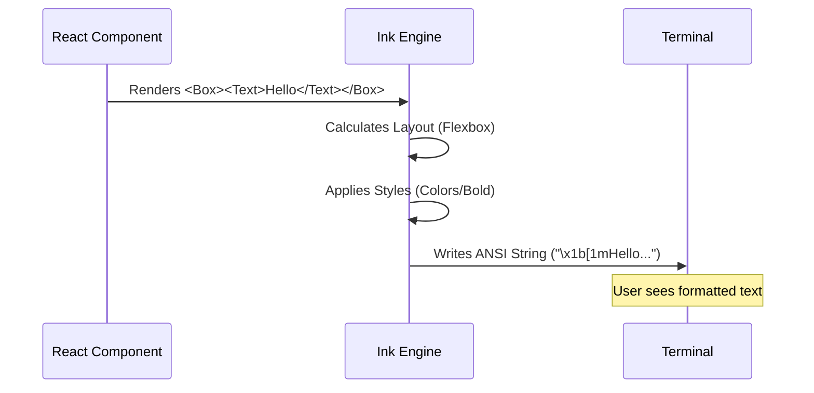

# Chapter 2: Ink UI Components

Welcome back! In the previous chapter, [Plugin Hint System](01_plugin_hint_system.md), we built a smart assistant that suggests plugins to the user.

You might be wondering: **"How did we make that menu look so nice?"**

Most command line tools just spit out plain text. But our tool renders a structured, colorful interface. In this chapter, we will learn about **Ink UI Components**, the building blocks that make this possible.

### The Motivation: HTML for the Terminal

If you have ever built a website, you know that `<div>` is used for layout and `<span>` is used for text.

Building a UI in a terminal usually involves messy calculations to figure out where to put the cursor. We want to avoid that.

We use a library called **Ink**. It lets us use **React components** to build terminal user interfaces. It handles all the hard work of rendering text, keeping layouts aligned, and adding colors.

### Key Concepts: The Two Main Bricks

We primarily use two components. Think of these as the Lego bricks for our entire application.

#### 1. `<Text>`
This is like the `<span>` tag in HTML. It displays strings, but with superpowers like colors and font weights.

```tsx
// Simple text
<Text>Hello World</Text>

// Styled text
<Text color="green" bold>Success!</Text>
```

#### 2. `<Box>`
This is like the `<div>` tag in HTML. It is an invisible container used for layout. It uses **Flexbox** logic (just like CSS) to arrange items in rows or columns.

```tsx
// Stack items vertically
<Box flexDirection="column">
  <Text>Item 1</Text>
  <Text>Item 2</Text>
</Box>
```

---

### Solving the Use Case: Building the Plugin Menu

Let's look at how we built the `PluginHintMenu` from Chapter 1 using these components.

We want to display the **Plugin Name** and the **Marketplace** neatly aligned.

#### Step 1: Creating a Row
We need a container to hold the label ("Plugin:") and the value ("Data Viewer"). We use a `<Box>`.

```tsx
<Box>
  <Text dimColor>Plugin:</Text>
  <Text> {pluginName}</Text>
</Box>
```
*Explanation*: The default direction of a `Box` is a **Row**. So, "Plugin:" and the name appear side-by-side. We use `dimColor` to make the label subtle.

#### Step 2: Adding Spacing (Margins and Padding)
If we just stack lines of text, it looks cramped. We use props like `marginTop`, `paddingX` (left/right), and `paddingY` (top/bottom) to add breathing room.

```tsx
<Box marginTop={1}>
  <Text>Would you like to install it?</Text>
</Box>
```
*Explanation*: `marginTop={1}` pushes this text down by one line, separating the question from the details above it.

#### Step 3: Conditional Rendering
React allows us to only show a Box if data exists. This is great for the "Description" field, which might be empty.

```tsx
{pluginDescription && (
  <Box>
    <Text dimColor>{pluginDescription}</Text>
  </Box>
)}
```
*Explanation*: If `pluginDescription` exists, we render a Box containing the text. If it's undefined, nothing renders.

---

### Internal Implementation Logic

How does a `<Box>` actually turn into characters on your black-and-white terminal screen?

When our code runs, Ink calculates the layout similarly to a web browser, but instead of drawing pixels, it draws distinct characters.



#### Code Walkthrough: `PluginHintMenu.tsx`

Let's look at the structure of our menu file `PluginHintMenu.tsx`.

We wrap the entire content in a generic container. Note that we also wrap it in a `PermissionDialog`, which we will cover in [Permission Dialog Wrapper](03_permission_dialog_wrapper.md).

```tsx
return (
  <PermissionDialog title="Plugin Recommendation">
    {/* Main Container */}
    <Box flexDirection="column" paddingX={2} paddingY={1}>
      
      {/* 1. The Header Message */}
      <Box marginBottom={1}>
         {/* Nested Text Components */}
         <Text dimColor>
            The <Text bold>{sourceCommand}</Text> command suggests...
         </Text>
      </Box>

      {/* 2. The Details (Rows) */}
      <Box>
        <Text dimColor>Plugin:</Text>
        <Text> {pluginName}</Text>
      </Box>

      {/* ... (Marketplace and Description Boxes) ... */}

      {/* 3. The Interactive Input */}
      <Box>
        <Select options={options} onChange={onSelect} />
      </Box>

    </Box>
  </PermissionDialog>
);
```

*Explanation*:
1.  **Main Container**: We set `flexDirection="column"` so every child `<Box>` inside it stacks on top of each other (Header, then Details, then Input).
2.  **Nested Text**: You can put a `<Text>` inside another `<Text>`. This is how we made just the `{sourceCommand}` bold while the rest of the sentence remains normal.
3.  **Select**: The `Select` component (which we will build in [Custom Selection Input](04_custom_selection_input.md)) is just another child in this layout.

---

### Conclusion

You have learned that building a CLI doesn't mean manipulating raw strings. By using **Ink UI Components**, we can think in terms of **Layouts (`Box`)** and **Typography (`Text`)**.

This makes our code:
1.  **Readable**: It looks like HTML.
2.  **Maintainable**: Easy to add new rows or change colors.
3.  **Beautiful**: Automatically handles spacing and alignment.

In the code snippet above, you saw a wrapper called `<PermissionDialog>`. In the next chapter, we will see how that wrapper creates the nice border frame around our content.

[Next Chapter: Permission Dialog Wrapper](03_permission_dialog_wrapper.md)

---

Generated by [Code IQ](https://github.com/adityasoni99/Code-IQ)