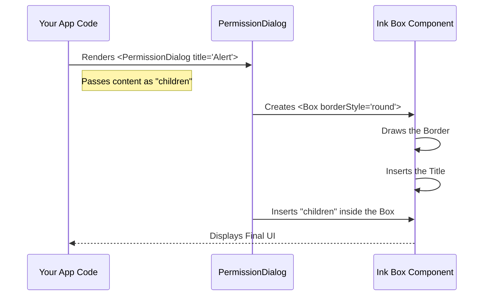

# Chapter 3: Permission Dialog Wrapper

Welcome back! In the previous chapter, [Ink UI Components](02_ink_ui_components.md), we learned how to build layouts using `<Box>` and `<Text>`.

You might have noticed that in our **Plugin Hint System**, we wrapped all our code inside a component called `<PermissionDialog>`.

In this chapter, we are going to look at **The Frame**. We will learn how to create a consistent, reusable wrapper that makes your CLI tools look professional and trustworthy.

### The Motivation: The "System Popup" Effect

Imagine you are using an app on your phone, and it wants to access your camera. You don't see a button drawn by the app itself; you see a standard **System Popup** provided by the OS (iOS or Android).

Why?
1.  **Consistency**: You immediately recognize it as a question that needs an answer.
2.  **Trust**: It looks "official."
3.  **Focus**: It visually separates the question from the rest of the messy background.

In a Command Line Interface (CLI), we face the same challenge. If we just print text, it gets lost in the logs. We need a standard **Permission Dialog Wrapper** to frame our questions.

### Key Concepts

This component is actually quite simple. It relies on a specific feature of Ink: **Borders**.

#### 1. The Container
The Wrapper is a box that holds other content. In React, we call the content inside a component its `children`.

#### 2. The Border
We draw a line around the content. This creates a visual "island" in the terminal.

#### 3. The Title
We embed a title (like "Security Alert" or "Plugin Recommendation") directly into the border frame.

---

### Using the Permission Dialog

Let's say you want to ask the user for permission to delete a file. Instead of just printing text, we wrap it in our dialog.

Here is how you use it in your code:

```tsx
import { PermissionDialog } from './permissions/PermissionDialog.js';
import { Text } from 'ink';

// Inside your component
<PermissionDialog title="Security Warning">
  <Text>
    Are you sure you want to delete database.sqlite?
  </Text>
</PermissionDialog>
```

**What the User Sees:**

The code above produces a neat box with rounded corners:

```text
╭─ Security Warning ──────────────────────────╮
│                                             │
│  Are you sure you want to delete            │
│  database.sqlite?                           │
│                                             │
╰─────────────────────────────────────────────╯
```

This draws attention immediately!

---

### Internal Implementation Logic

How does this wrapper actually work? Let's trace what happens when you use `<PermissionDialog>`.

The component acts as a **Passthrough**. It doesn't care *what* is inside it (text, menus, spinners). It just provides the frame.



### Code Walkthrough

Let's build the `PermissionDialog.tsx` file. We will use the [Ink UI Components](02_ink_ui_components.md) we learned earlier.

#### Step 1: Defining the Props
We need to know the Title of the dialog, and we need to accept the content (`children`) to put inside.

```tsx
import React from 'react';
import { Box } from 'ink';

type Props = {
  title: string;
  children: React.ReactNode;
};
```
*Explanation*: `React.ReactNode` is the standard type for "anything that React can render" (text, other components, etc.).

#### Step 2: The Component Body
We use the standard `<Box>` component from Ink, but we add specific styling props to create the border.

```tsx
export function PermissionDialog({ title, children }: Props) {
  return (
    <Box 
      borderStyle="round" 
      borderColor="gray" 
      title={title}
      paddingX={1}
    >
      {children}
    </Box>
  );
}
```

*Explanation*:
1.  `borderStyle="round"`: This tells Ink to draw the box using rounded corner characters (╭, ╮, ╯, ╰).
2.  `borderColor="gray"`: We keep the color subtle so it looks like a system prompt, not an error (red) or success (green) message.
3.  `title={title}`: Ink knows how to embed a string into the top border of the box automatically.
4.  `{children}`: This is where your specific content (like the text or the "Yes/No" menu) gets injected.

---

### Why use a Wrapper?

You might ask: *"Why create a specific component? Why not just write `<Box borderStyle="round">` every time?"*

1.  **Centralized Styling**: If you decide later that all prompts should be **Blue**, you only change it in one file (`PermissionDialog.tsx`), and every prompt in your app updates automatically.
2.  **Simplified API**: You don't have to remember which `borderStyle` you chose or how much `padding` you used. You just import `PermissionDialog` and it "just works."

### Conclusion

You have learned how to create a **Permission Dialog Wrapper**.

By creating this simple component, you have ensured that:
1.  All user interactions look consistent.
2.  Your main code stays clean (no repeating styling logic).
3.  Important questions visually "pop" out of the terminal.

Now that we have a nice frame, we need a way for the user to answer the questions inside it. In the next chapter, we will build a robust way to handle user choices.

[Next Chapter: Custom Selection Input](04_custom_selection_input.md)

---

Generated by [Code IQ](https://github.com/adityasoni99/Code-IQ)