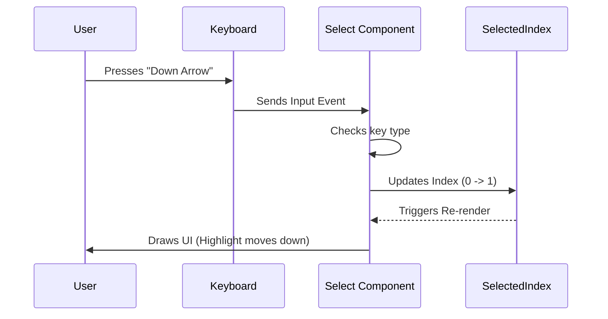

# Chapter 4: Custom Selection Input

Welcome back! In the previous chapter, [Permission Dialog Wrapper](03_permission_dialog_wrapper.md), we built a professional-looking frame for our messages.

But right now, that frame is just a static picture. We need to let the user answer our questions!

In this chapter, we will build the **Custom Selection Input**. We will turn our static text into an interactive menu that users can control with their keyboard.

### The Motivation: Ditching the Mouse

In a standard computer app, you use a mouse to click a dropdown menu.
In a terminal (CLI), **there is no mouse**.

To make a choice, users usually have to type text manually:
`Do you want to proceed? [y/n]:`

This is error-prone. What if they type "Yes" instead of "y"? What if they make a typo?

**The Solution:**
We create a component that mimics a dropdown menu. The user sees a list of options, uses the **Arrow Keys** to highlight one, and hits **Enter** to choose. It feels modern, fast, and prevents typos.

---

### The Use Case

Let's look at the "Plugin Hint" scenario from our application. We need to ask the user a specific question:

> **Would you like to install the plugin?**
> 1. Yes
> 2. No
> 3. No, and stop asking me

We want the user to navigate this list smoothly.

---

### Key Concepts

To build this, we need three ingredients:

1.  **The State (The Pointer)**: We need a variable to remember which option is currently highlighted (e.g., Option 0, 1, or 2).
2.  **The Input Listener**: We need code that listens specifically for `ArrowUp`, `ArrowDown`, and `Enter` keys.
3.  **The Visual Feedback**: We need to change the color of the text based on which item is highlighted.

---

### How to Use the Select Component

First, let's see how easy it is to use this component once it is built. This is exactly how we used it in `PluginHintMenu.tsx`.

#### Step 1: Define the Options
We create a simple list (array) of choices. Each choice has a `label` (what the user sees) and a `value` (what the code receives).

```tsx
const options = [
  { label: 'Yes, install it', value: 'yes' },
  { label: 'No', value: 'no' },
  { label: 'Disable hints',   value: 'disable' }
];
```
*Explanation*: The labels can be simple strings, or even styled [Ink UI Components](02_ink_ui_components.md) like `<Text bold>Yes</Text>`.

#### Step 2: Render the Component
We place the `<Select>` tag in our UI and tell it what to do when the user picks something.

```tsx
<Select 
  options={options} 
  onChange={(value) => {
    // value will be 'yes', 'no', or 'disable'
    console.log("User picked:", value);
  }} 
/>
```
*Explanation*: The parent component (like our Plugin Menu) doesn't worry about arrow keys. It just waits for the `onChange` event, exactly like a standard HTML form.

---

### Under the Hood: Internal Implementation

Now, let's look at how the `Select` component actually works.

When a user presses a key, the data flows in a loop.



#### Code Walkthrough

We use a special hook from the Ink library called `useInput`. This acts like a listener for the keyboard.

#### Part 1: Tracking the Highlight
We need to remember which line is active. We use a standard React state variable.

```tsx
// Inside Select.tsx
import { useState } from 'react';

// 0 means the first item is highlighted by default
const [selectedIndex, setSelectedIndex] = useState(0);
```

#### Part 2: Listening for Keys
We attach a listener to handle the navigation.

```tsx
import { useInput } from 'ink';

useInput((input, key) => {
  if (key.downArrow) {
    // Move index up by 1, but stop at the last item
    setSelectedIndex(Math.min(options.length - 1, selectedIndex + 1));
  }
  
  if (key.upArrow) {
    // Move index down by 1, but stop at 0
    setSelectedIndex(Math.max(0, selectedIndex - 1));
  }
});
```
*Explanation*:
*   `Math.min`: Ensures we don't scroll past the bottom of the list.
*   `Math.max`: Ensures we don't scroll past the top (index -1 is invalid).

#### Part 3: Handling the Selection
When the user presses **Enter**, we trigger the action.

```tsx
useInput((input, key) => {
  // ... arrow logic ...

  if (key.return) {
    // 'return' is the Enter key
    const selectedOption = options[selectedIndex];
    
    // Tell the parent component what was chosen
    onChange(selectedOption.value);
  }
});
```

#### Part 4: Rendering the List
Finally, we draw the list. We loop through the options and check if the current option matches our `selectedIndex`.

```tsx
return (
  <Box flexDirection="column">
    {options.map((option, index) => {
      const isSelected = index === selectedIndex;
      
      return (
        <Text key={option.value} color={isSelected ? 'green' : 'white'}>
          {isSelected ? '> ' : '  '} {option.label}
        </Text>
      );
    })}
  </Box>
);
```

*Explanation*:
1.  We verify: `isSelected = index === selectedIndex`.
2.  **Color**: If selected, make it green. If not, white.
3.  **Cursor**: If selected, add a `> ` arrow prefix. If not, add two spaces `  ` so the text stays aligned.

---

### Conclusion

You have now built a **Custom Selection Input**.

By abstracting the complex logic of keyboard listeners into a reusable `<Select>` component, we made our main application code much cleaner. We transformed a raw terminal stream into a friendly, navigable menu.

However, there is a risk. What if the menu appears, but the user walks away for lunch? The terminal will hang there forever, waiting for an input that never comes.

In the next chapter, we will solve this by adding a "ticking clock" to our interactions.

[Next Chapter: Time-Limited Interactions](05_time_limited_interactions.md)

---

Generated by [Code IQ](https://github.com/adityasoni99/Code-IQ)