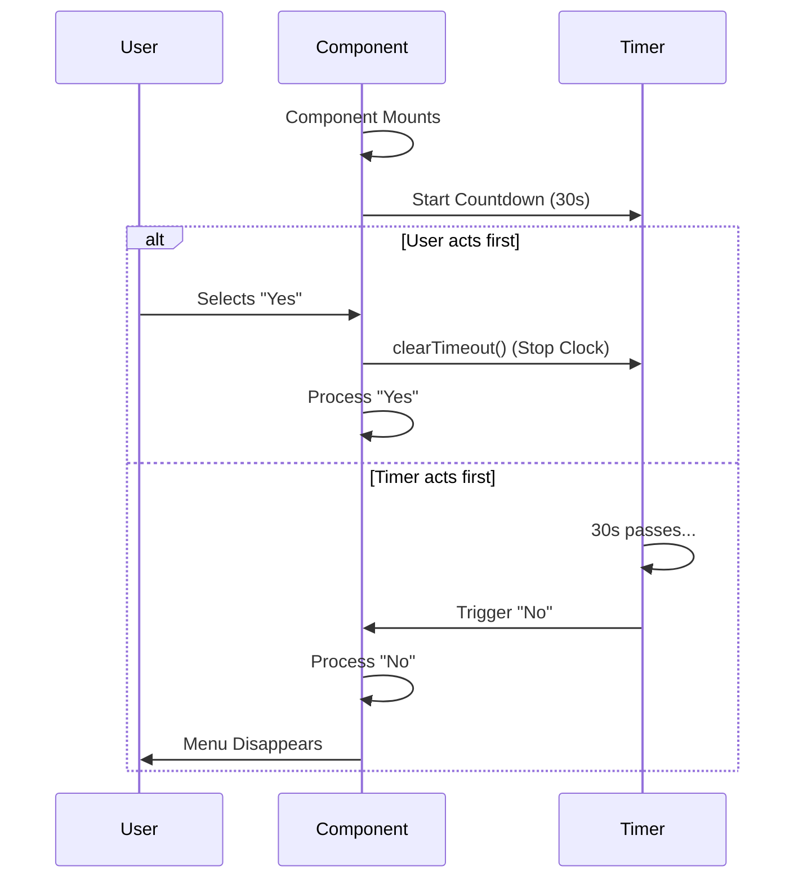

# Chapter 5: Time-Limited Interactions

Welcome to the final chapter of our tutorial series!

In the previous chapter, [Custom Selection Input](04_custom_selection_input.md), we gave the user the ability to make choices using their keyboard.

However, we have introduced a potential problem. If the user runs a command, sees our menu, and then walks away to get coffee, their terminal is **blocked**. It will wait forever for an input that isn't coming.

In this chapter, we will implement **Time-Limited Interactions**. We will create a "Self-Destruct" mechanism that automatically dismisses the menu if the user ignores it.

### The Motivation: The "Zombie" Terminal

Imagine you are playing a video game. You enter a room, and a bomb starts counting down. You have 30 seconds to cut the wire. If you do nothing, the game decides for you (BOOM).

In our CLI tool, we want a similar (but less explosive) concept.

**The Use Case:**
1.  The **Plugin Hint Menu** appears asking: *"Install this plugin?"*
2.  The user is busy or confused and does nothing.
3.  We don't want to freeze their workflow.
4.  **The Solution:** After 30 seconds, the code automatically assumes the answer is "No" and closes the menu.

---

### Key Concepts

To make this happen, we use three tools from the React toolbox.

#### 1. `setTimeout`
This is a standard JavaScript function. It allows us to say: *"Execute this code X milliseconds from now."*

#### 2. `clearTimeout`
This is the "Abort Button." If the user answers the question manually *before* the timer runs out, we must cancel the timer. If we don't, the timer will still fire later and might cause errors.

#### 3. `useEffect`
This is a React Hook. It allows us to set up the timer exactly when the component appears on the screen, and clean it up when the component goes away.

---

### Implementation Walkthrough

Let's look at how we implement this logic inside `PluginHintMenu.tsx`.

#### Step 1: Define the Limit
First, we decide how long to wait. Computers count time in milliseconds (1000ms = 1 second).

```tsx
// 30 seconds
const AUTO_DISMISS_MS = 30_000;
```

#### Step 2: The "Fresh" Reference
This part is a little tricky. React functions can sometimes get "stale" (holding onto old data). We use `useRef` to ensure our timer always calls the most current version of our response function.

```tsx
// Create a reference that always points to the current function
const onResponseRef = React.useRef(onResponse);

// Update it whenever the component renders
onResponseRef.current = onResponse;
```
*Explanation*: Think of `onResponseRef` as a whiteboard. Every time the component updates, we erase the whiteboard and write the newest version of the `onResponse` function on it. The timer just looks at the whiteboard.

#### Step 3: The Timer Logic
Now we use `useEffect` to start the countdown.

```tsx
React.useEffect(() => {
  // Start the timer
  const timeoutId = setTimeout(
    (ref) => ref.current('no'), // The Action: Answer "No"
    AUTO_DISMISS_MS,            // The Delay: 30 seconds
    onResponseRef               // The Argument passed to the action
  );

  // The Cleanup: Stop timer if user leaves
  return () => clearTimeout(timeoutId);
}, []);
```

*Explanation*:
1.  **Start**: When the menu loads, `setTimeout` starts ticking.
2.  **Action**: If time runs out, it calls `ref.current('no')`. This acts exactly as if the user selected "No".
3.  **Cleanup**: The `return` function inside `useEffect` runs if the component is removed *before* the time is up (e.g., the user pressed "Enter"). It calls `clearTimeout` to stop the clock.

---

### Visualizing the Race

This logic creates a "race" between the User and the Timer. Whoever finishes first decides the outcome.



---

### Putting it all Together

We place this logic right at the top of our `PluginHintMenu` component. It runs silently in the background while the UI waits for user input.

Here is the context within the file:

```tsx
export function PluginHintMenu({ onResponse, ...props }: Props) {
  
  // 1. Setup the Ref
  const onResponseRef = React.useRef(onResponse);
  onResponseRef.current = onResponse;

  // 2. Setup the Timer
  React.useEffect(() => {
    const timeoutId = setTimeout(
      ref => ref.current('no'), 
      AUTO_DISMISS_MS, 
      onResponseRef
    );
    return () => clearTimeout(timeoutId);
  }, []);

  // 3. Render the UI (as seen in Chapter 2 & 4)
  return (
    <PermissionDialog title="Plugin Recommendation">
       {/* ... content ... */}
    </PermissionDialog>
  );
}
```

This ensures that the [Permission Dialog Wrapper](03_permission_dialog_wrapper.md) and the [Custom Selection Input](04_custom_selection_input.md) never get stuck on the screen indefinitely.

---

### Conclusion

Congratulations! You have completed the tutorial series for **ClaudeCodeHint**.

Let's recap what you have built:
1.  **[Plugin Hint System](01_plugin_hint_system.md)**: You designed a smart assistant to recommend tools.
2.  **[Ink UI Components](02_ink_ui_components.md)**: You learned to style text and layout in the terminal using `<Box>` and `<Text>`.
3.  **[Permission Dialog Wrapper](03_permission_dialog_wrapper.md)**: You created a reusable frame to make your prompts look professional.
4.  **[Custom Selection Input](04_custom_selection_input.md)**: You built a keyboard-driven menu system.
5.  **Time-Limited Interactions**: You added a safety timer to keep the application flow moving.

By combining these concepts, you have created a CLI tool that is not only functional but also **intelligent, beautiful, and user-friendly**.

Happy Coding!

---

Generated by [Code IQ](https://github.com/adityasoni99/Code-IQ)