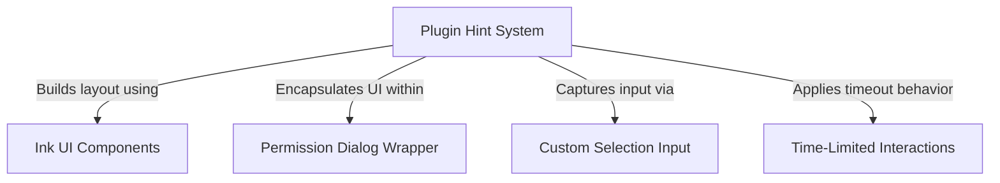

# Tutorial: ClaudeCodeHint

The project implements a **Command Line Interface (CLI)** utility for recommending and installing plugins. It features a *smart hint system* that presents **interactive prompts** to the user, managing permissions and keyboard selection while ensuring the workflow remains non-blocking through **automatic timeouts**.

## Chapters

1. [Plugin Hint System](01_plugin_hint_system.md)
2. [Ink UI Components](02_ink_ui_components.md)
3. [Permission Dialog Wrapper](03_permission_dialog_wrapper.md)
4. [Custom Selection Input](04_custom_selection_input.md)
5. [Time-Limited Interactions](05_time_limited_interactions.md)

---

Generated by [Code IQ](https://github.com/adityasoni99/Code-IQ)