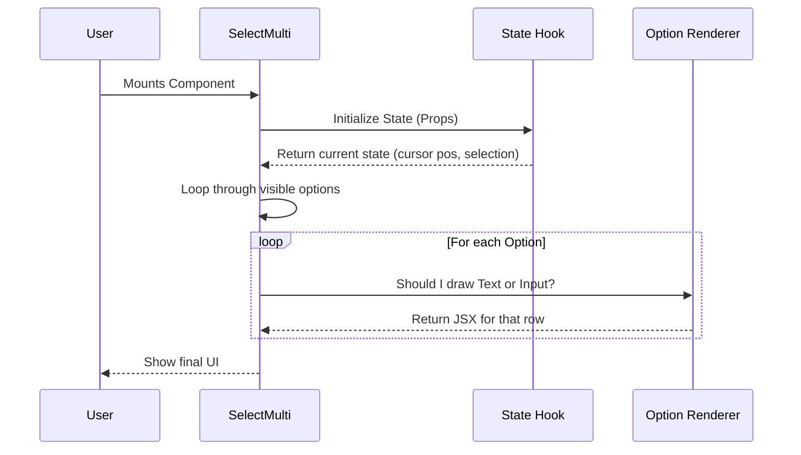

# Chapter 1: Multi-Select Container

Welcome to the **CustomSelect** project! 

In this tutorial series, we will build a powerful, interactive command-line selection tool. We are starting at the very top level: the **Multi-Select Container**.

## Motivation: The "Boss" Component

Imagine you are building a command-line tool to order a pizza. You need to ask the user to select toppings: Mushrooms, Pepperoni, Onions, etc. The user needs to scroll through the list, press `Space` to select multiple items, and press `Enter` to finish.

To make this happen, we need a "Boss" component. This component needs to:
1.  Take the list of ingredients (Data).
2.  Remember which ones are selected (State).
3.  Decide *how* to draw each line (Rendering).

In our project, this Boss is the `SelectMulti` function. It is the entry point that brings all the logic and visuals together.

## The Core Concept

The **Multi-Select Container** acts as the frame for your UI. It doesn't draw every single pixel itself; instead, it coordinates three main things:

1.  **Configuration (Props):** It receives the options and settings (like "Is this disabled?").
2.  **The Brain (State):** It connects to a logic engine to track what is focused or selected.
3.  ** The Assembly Line (Rendering):** It loops through your data and places the correct component on the screen.

### Use Case Example

Here is how a developer uses this container. We simply provide a list of `options` and tell it what to do `onSubmit`.

```tsx
// Example Usage
const toppings = [
  { label: 'Pepperoni', value: 'pep' },
  { label: 'Mushrooms', value: 'mush' },
  { label: 'Extra Cheese', value: 'cheese' },
];

<SelectMulti 
  options={toppings} 
  onSubmit={(selected) => console.log('You ordered:', selected)} 
/>
```

When you run this, `SelectMulti` takes over and renders the interactive list.

## Internal Implementation: How it Works

Let's look under the hood. When `SelectMulti` renders, it follows a specific sequence.

### The Flow

1.  **Initialize:** The container wakes up and creates the "State" (the brain).
2.  **Calculate View:** It asks the state, "Which options are currently visible on the screen?"
3.  **Loop & Decide:** It loops through those options. For each one, it checks: "Is this a text option or a text input?"
4.  **Render:** It draws the specific row using helper components.



### Code Walkthrough

Let's break down the code in `SelectMulti.tsx` into small, digestible pieces.

#### 1. Setup and The "Brain"

First, the component receives `props` (configuration). It immediately passes them to a custom hook. This hook is the "Brain" of our operation.

```tsx
export function SelectMulti(props: SelectMultiProps<T>) {
  // We use a custom hook to manage all the complex logic.
  // This handles cursor movement, selection tracking, etc.
  const state = useMultiSelectState({
    ...props,
    // defaults are handled here
  });

  // Calculate width for layout purposes
  const maxIndexWidth = props.options.length.toString().length;
```

*To learn how the "Brain" works, check out [Chapter 3: Selection Behavior Hooks](03_selection_behavior_hooks.md).*

#### 2. The Rendering Loop

The container doesn't want to render *every* option (what if there are 1000?). It only renders what is currently visible.

```tsx
  return (
    <Box flexDirection="column">
      <Box flexDirection="column">
        {/* We iterate ONLY over the visible options provided by the state */}
        {state.visibleOptions.map((option, index) => {
           // Logic to determine render details happens here...
           // ...
```

*To understand how we determine which options are visible, see [Chapter 5: Navigation Engine & Viewport](05_navigation_engine___viewport.md).*

#### 3. The Decision: Text or Input?

Inside the loop, the Container acts as a traffic controller. If an option is type `'input'`, it renders a `SelectInputOption`. Otherwise, it renders a standard `SelectOption`.

```tsx
          // ... inside the map loop ...
          if (option.type === "input") {
            return (
              <Box key={String(option.value)}>
                {/* Render a complex input row */}
                <SelectInputOption option={option} {...inputProps} />
              </Box>
            );
          }
```

*We will cover the specific renderers in [Chapter 2: Option Renderers](02_option_renderers.md).*

#### 4. The Standard Option

If it's not an input, it renders the standard text row. Notice how the Container passes down visual flags like `isFocused` or `isSelected`.

```tsx
          // Standard text option rendering
          return (
            <Box key={String(option.value)}>
              <SelectOption 
                isFocused={isOptionFocused} 
                isSelected={isSelected}
                description={option.description}
              >
                {/* Children (Label and Index) go here */}
              </SelectOption>
            </Box>
          );
        })}
```

#### 5. The Submit Button

Finally, after the loop finishes, the Container decides if it needs to draw a specific "Submit" button at the bottom of the list.

```tsx
      </Box> {/* End of options list */}
      
      {/* If submit text is provided, render the button */}
      {submitButtonText && onSubmit && (
        <Box marginTop={0}>
           <Text color={state.isSubmitFocused ? "suggestion" : undefined}>
             {submitButtonText}
           </Text>
        </Box>
      )}
    </Box>
  );
}
```

## Summary

The **Multi-Select Container** (`SelectMulti`) is the orchestrator. 

1.  It accepts **Props** to know what to display.
2.  It uses **Hooks** to track what is going on (selection, focus).
3.  It loops through data and delegates the actual drawing to **Child Components**.

It essentially says: *"I have a list of 50 items. The state tells me items 5 through 10 are visible. Item 7 is an input field, the rest are text. Renderers, get to work!"*

Now that we understand the Container, let's look at the workers responsible for drawing the individual rows.

[Next Chapter: Option Renderers](02_option_renderers.md)

---

Generated by [Code IQ](https://github.com/adityasoni99/Code-IQ)