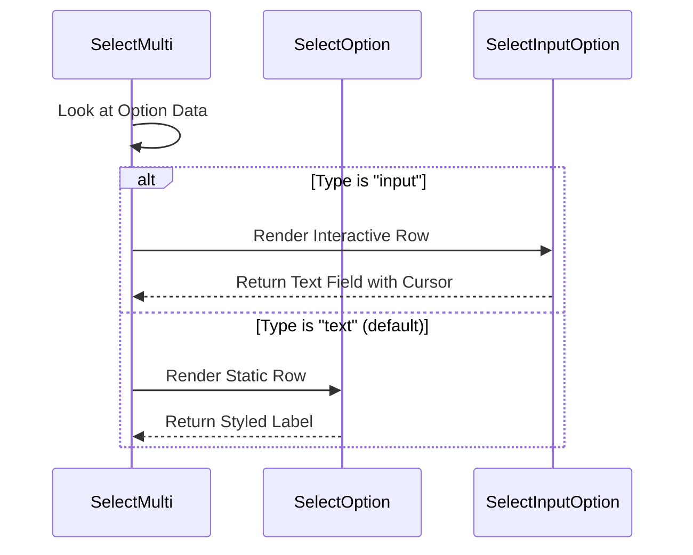

# Chapter 2: Option Renderers

Welcome back! In the previous chapter, [Chapter 1: Multi-Select Container](01_multi_select_container.md), we built the "Boss" of our application—the container that organizes our data.

Now, we need to meet the **Workers**. The Boss (Container) knows *what* to list, but it doesn't know *how* to draw a beautiful, interactive row on the terminal screen. That is the job of the **Option Renderers**.

## Motivation: The "Painter" Component

Imagine you are scrolling through a list of files in your terminal.
1.  One file is highlighted because your cursor is on it.
2.  Another file is green because you selected it.
3.  A third item isn't a file at all—it's a text box where you can type a search query.

We need components that can look at a piece of data (like `{ label: "Pizza" }`) and a status (like `isFocused: true`) and "paint" the correct text colors and symbols to the screen.

In **CustomSelect**, we have two distinct painters:
1.  **`SelectOption`**: The Standard Painter. Draws simple text rows.
2.  **`SelectInputOption`**: The Specialist. Draws an interactive text box you can type into.

## 1. The Standard Renderer: `SelectOption`

This component is simple. Its job is to display information. It acts like a smart label.

### How it looks
If the user hovers over it, it might show a `>` arrow or turn blue. If selected, it might turn green.

### Usage Example
Here is how the Container uses it. It simply passes "flags" (booleans) to tell the renderer how to behave.

```tsx
<SelectOption 
  isFocused={true}       // "The user is looking at me!"
  isSelected={false}     // "I am not chosen yet."
  description="Tasty"    // "Here is a subtitle."
>
  Pepperoni              {/* The main label */}
</SelectOption>
```

When `isFocused` is true, `SelectOption` handles drawing the specialized background or text color that indicates focus.

## 2. The Specialist Renderer: `SelectInputOption`

Sometimes, a list item isn't just for reading—it's for writing. Imagine a "Other: _____" option where you need to type in a custom topping.

The `SelectInputOption` is complex. It is a mini-application inside a single row.

### What it does
1.  **Displays Text:** When you aren't looking at it.
2.  **Captures Typing:** When you focus it, it becomes a text box.
3.  **Manages Cursor:** It remembers where your blinking cursor is (`|`).

### Usage Example

```tsx
<SelectInputOption 
  option={{ label: "Custom" }}
  inputValue="Pineap"    // What the user has typed so far
  isFocused={true}       // It is active!
  onInputChange={(val) => console.log(val)} 
/>
```

## Internal Implementation: Under the Hood

How does the code actually switch between these two? And how does the input handle typing?

### The Rendering Decision

The decision process happens inside the Container, but understanding it helps us see why these Renderers exist.



### Deep Dive: `SelectOption.tsx`

The code for the standard option is very lightweight. It wraps a design system component called `ListItem`.

```tsx
// select-option.tsx
export function SelectOption(props) {
  const { isFocused, isSelected, children } = props;

  // Simply pass the state down to the UI primitive
  return (
    <ListItem 
      isFocused={isFocused} 
      isSelected={isSelected}
    >
      {children}
    </ListItem>
  );
}
```

This separation ensures that if we want to change how *all* focused items look (e.g., change blue to red), we only change `ListItem`, and `SelectOption` updates automatically.

### Deep Dive: `SelectInputOption.tsx`

This file is much larger because it has to handle user behavior. Let's look at the critical logic: **Switching between Display and Edit mode.**

#### 1. The State of the Cursor
React needs to know where the blinking cursor is inside the string.

```tsx
// select-input-option.tsx
export function SelectInputOption(props) {
  // We track the cursor position locally
  const [cursorOffset, setCursorOffset] = useState(props.inputValue.length);
  
  // ... rest of component
```

#### 2. The View Logic
The component decides what to show based on `isFocused`.

If the user is **NOT** focusing on this row, we just show plain text:

```tsx
  if (!props.isFocused) {
    return (
      <Text color="inactive">
        {props.inputValue || props.option.placeholder}
      </Text>
    );
  }
```

If the user **IS** focusing on it, we render the `TextInput` component (the complex editor):

```tsx
  // If focused, render the interactive input
  return (
    <TextInput 
      value={props.inputValue}
      onChange={props.onInputChange}
      showCursor={true}
      cursorOffset={cursorOffset} // Tell it where to blink
    />
  );
}
```

By swapping these components, `SelectInputOption` creates a seamless experience where a list item transforms into an editor the moment you scroll to it.

## Summary

In this chapter, we learned about the **View** layer of our selection tool:

1.  **`SelectOption`**: The standard row. It takes `isFocused` and `isSelected` props and styles the text accordingly.
2.  **`SelectInputOption`**: The complex row. It handles text editing, cursor positioning, and swaps between a static label and an active input field.

The renderers are responsible for **Display**. But who tells them *when* they are focused or selected? That logic lives in the "Brain" of our application.

[Next Chapter: Selection Behavior Hooks](03_selection_behavior_hooks.md)

---

Generated by [Code IQ](https://github.com/adityasoni99/Code-IQ)